## 形式语言定义
- 研究语言语法的数学和计算机科学分支叫做形式语言理论，不致力于语言的语义研究。
- 数学术语
	- Union: AUB
	- Intersection：An B
	- ·Complement取反:A
	- Cartesian Product: AxB
	- ·Power set:P(A)或2^A幂集、超集
- 研究方面
	- 表示
	- 有穷描述：可数无穷语言的有穷描述
	- 结构
		- 文法描述语言的结构特征
### 文法
- 定义语言的数学模型
- 定义2.1
一个文法G是一个四元组G=（V,T,P,S）,
其中
> 1. V（Variables）是==变元==的有限集。
> 2. T （Terminal symbols）是==终结符==的有限集。
> 3. P（Productions）是==产生式==的有限集，其中每个产生式都是$\alpha \rightarrow \beta$的形式，其中$\alpha \in (V \cup T)^+$且其中至少有一个V中的符号,$\beta \in (V \cup T)^+$，。$\alpha$称为产生式的左部，$\beta$称为产生式的右部。
> 4. $S\in V$，称为文法G的==开始符号== (Start variable）

例子：G=({A,B,C},{a,b},{A→aBC,B→b,→C→a},A)
- 约定
> 1. 大写拉丁字母A,B.C,D.E和S等等表示变元，除非另做说明，S表示开始符号。
>2. 小写拉丁字母a,b,c,d,e数字等等表示终结符。
>3. 小写拉丁字母u,v,w,x,y,z等等表示终结符串
>4. 小写希腊字母a，β，y等等表示变元和终结符共同组成的串

- 可以只用T表示一个文法（根据T可以找到V,T）
	- 例子：
> 1）S→0A1 | 10(| 表示或，指S→0A1和S→10)
> 	2）0 A→00A1
> 		3）A→$\alpha$
> 			可知V=｛S,A｝,T={0,1}

- 推导
> 接上例子：S → 0A1 → 00A11 → 000A111 → 000111(利用A→$\alpha$,终止符即代表不可推，000111是句子，其他是句型)

#### 文法产生的语言
- 定义2.3给出文法G=(V,T,P,S），它所产生的语言记作L（G)，定义如下：
- $L(G)=\{w|S \rightarrow w, w \in T\}$
- 例子
> S → aSb S→ab
> 得$L(G)=\{a^nb^n|n>0\}$
> 等价于文法：S→ aSb S→$\alpha$

- 等价：两个文法推导出的语言相同则文法等价
### 文法的乔姆斯基体系
- 分类
- 0 型文法
	- 短结构文法：P中产生式无另外的限制
- 1型文法
	- 上下有关文法：$\alpha \rightarrow \beta , 满足 |\alpha| \leq |\beta|$
- 2型文法
	- 上下无关文法：$A\rightarrow \beta , \beta \in (V \cup T),A \in V$
- 3型文法
	- 正则文法：P中产生式$A \rightarrow a 或 A \rightarrow aB , a \in T \cup \{终止符\},A,B \in V$
	
#### 总结
![[Pasted image 20241225151402.png]]
![[Pasted image 20241225175704.png]]
有穷自动机是一种计算装置（结构、计算机理）、一种计算 模型（表示、计算方法）、与语言（文法、性质）相关
FA（DFA/NFA）接受的语言是正则语言（Regular Language）。 4. 如果两个FA接受的语言相同，那么，这两个FA是等价 的。 5. 将NFA转化为DFA的方法有两种，即子集构造法和基于 定理3.1（NFA和DFA等价）的方法，两者是等价的。 6. Moore机和Mealy是带输出的有穷自动机

| 抽象模型         | 对应语言            | 相当于程序或算法                | 文法  |
| ------------ | --------------- | ----------------------- | --- |
| 有穷自动机（FA）    | 正则语言（RL）3型      | If, case, goto, 无变量（内存） |     |
| 下推自动机（PDA）   | 前后文无关语言（CFL），2型 | 增加：堆栈。仍无变量（内存）无数组       |     |
| 线性界限自动机（LBA） | 前后文有关语言（CSL），1型 |                         |     |
| 图灵机（TM）      | 递归可枚举（r.e.），0型  | 输入在语言外时，可能死循环           |     |
**区别：产生式的形式**
- 自动机实质：现状＋输入→ 下一状态
	- 只读，不写， 无内存，无变量，无数组，无堆栈 ，无推理，无想象力
	- 只有寄存器，能记住状态（ 窍门： 造自动机时遇到困难加状态，等于是加寄存器扩大了记忆力
#### 字母表

**字母表** 是符号的有穷非空集合，记为 $\Sigma$。

#### 串

**串（单词）** 是从某个字母表中选择的符号组成的有穷序列。

- 串的长度 表示|x|
  选择出来的符号个数被称为串的长度。
- 空串 $\varepsilon$
  它的长度为 $0$，是可以从任何字母表中选择的串。**但它不属于任何字母表**。$\varepsilon \not\in \Sigma$。
- 字母表的幂
  如果 $\Sigma$ 是一个字母表，则 $\Sigma^k$ 表示这个字母表长度为 $k$ 的所有串所组成的集合。
$$
\begin{aligned}
  \Sigma^0 &= \{\varepsilon\} \\
  \Sigma^{+} &= \Sigma^1\cup\Sigma^2\cup\Sigma^3\cdots （正闭包）\\
  \Sigma^{*} &= \Sigma^{+} \cup \{\varepsilon\}（克林闭包）
\end{aligned}
$$

#### 语言

设 $\Sigma$ 为一个字母表，$L \subseteq \Sigma^{*}$ 被称为 $\Sigma$ 上的 **语言**。
- 空语言 $\varnothing$ 与只包含空串的语言 $\{\varepsilon\}$
  $\varnothing$ 和 $\{\varepsilon\}$ 都是任意字母表上的语言，但 $\varnothing \neq \{\varepsilon\}$，前者没有串，后者有一个串。
- 若 $L$ 是 $\Sigma$ 上的语言，则 $L$ 是任何是 $\Sigma$ 的超集的字母表上的语言。
- 语言连接!=笛卡尔积，语言每一个都不一样
#### 问题

在自动机理论中，一个 **问题** 就是 “判定一个给定的串是否属于某个具体语言” 这一行为。
问题和语言是可以相互等价的。如果 $\Sigma$ 是字母表，$L$ 是 $\Sigma$ 上的语言，则问题 $L$ 就是“给定 $\Sigma^{*}$ 中的一个串 $w$，判断 $w$ 是否属于 $L$。这说明 $L$ 是一个语言，也可以被看成是一个问题。

## 有穷自动机的形式化定义

#### 确定性有穷自动机（DFA）

通常使用一个五元组 $A = (Q, \Sigma, \delta, q_0, F)$ 来表示一个 DFA。其中 $A$ 是 DFA 的名称，$Q$ 是状态集合，$\Sigma$ 是输入符号，$\delta$ 是转移函数，$q_0$ 是初始状态，$F$ 是接受状态集合。
- 一个条件下，只能转移为一种状态

##### DFA 的表示方法

- 转移图

  ```mermaid
  graph LR

  style Start fill:none,stroke-width:0px

  Start --> A((q_0))
  A --> |0| C((q_2))
  A --> |1| A
  C --> |0| C
  C --> |1| B(((q_1)))
  B --> |0, 1| B
  ```

  初始状态用 `Start` 指示，接受状态用双圆圈标记（例如 $q_1$）。

- 转移表

  我们也可以使用转移表来直观地表示一个 DFA，着重强调它的转移函数 $\delta$。

| | $0$ | $1$ |
|-:|:-:|:-:|
| $\to q_0$ | $q_2$ | $q_0$ |
| $*q_1$ | $q_1$ | $q_1$ |
| $q_2$ | $q_2$ | $q_1$ |

  初始状态用箭头标记，接受状态用星号标记。
一串字符是否接受即看最后停留的状态为接受状态还是拒绝状态
##### 转移函数 $\delta$

本质上就是转移图上的有向边，边权为字母表中的字符。

- 扩展转移函数 $\hat\delta$

  感性地说，就是 **让转移函数的自变量不再限于单个字符**，而是可以给定一个串，它能在自动机上从给定状态开始，沿着转移图的边走，一直走到它最终对应的状态。

  形式化的定义如下：

  > 基础：$\hat\delta(q, \varepsilon) = q$。
  >
  > 归纳：$\hat\delta(q, w) = \delta(\hat\delta(q, x), a)$，其中 $w = xa$。

##### DFA 的语言

定义 DFA $A = (Q, \Sigma, \delta, q_0, F)$ 的语言 $L(A)$ 如下：

$$
L(A) = \{w | \hat\delta(q_0, w) \in F\}
$$

$L(A)$ 是 $A$ 的 **所有可接受的串** 所组成的集合。如果对于某个 DFA $A$ 来说 $L$ 是 $L(A)$，则我们称 $L$ 是一个 **正则语言**。
- 即正则语言， 3型语言 <→被FA接受的语言
#### 非确定性有穷自动机（NFA）

~~NFA 就是多线程 DFA（确信）~~

在读入每个串的时候，NFA 在同一条件下，可以向多个方向同时转移，最后只取可接受状态组成的状态集合。

##### NFA 的表示方法

转移表既可以表示 NFA 的转移函数，也可以用来规定 DFA 的转移函数，区别在于，NFA 转移表中的 **每一项都是集合**，即使是单元素集合；如果在某个状态上不存在向其他状态的转移时，应该填入 $\varnothing$。

##### 转移函数 $\delta$

- 扩展转移函数 $\hat\delta(q, w)$

  形式化的表述如下：
  
  > 基础：$\hat\delta(q, \varepsilon) = \{q\}$。
  >
  > 归纳：$\hat\delta(q, w) = \bigcup\limits_{p \in \hat\delta(q, x)}\delta(p, a)$，其中 $w = xa$。

##### NFA 的语言

相应地，由于 NFA 可以同时向多个方向转移，所以对于一个串来说，只要存在一个状态使得 NFA 能接受该串，那么这个串就属于这个 NFA 对应的语言。

$$
L(A) = \{w | \hat\delta(q_0, w) \cap F \neq \varnothing\}
$$
- 工作模式
![[1728298354096-screenshot.png]]
#### DFA 和 NFA 的区别与联系

DFA 和 NFA 之间的唯一区别在于，$\delta$ 在 DFA 的情况下，返回的是 **单个状态**；而在 NFA 的情况下，返回的是一个 **状态集合**。
- NFA一入多出
- NFA中ε可作为条件，即某些状态可无条件跳转
- NFA works as a tree
#####  NFA转换为DFA：**子集构造**  

显然一个 DFA 可以转化成一个 NFA，只需要把状态中的每个元素写成其对应的单元素集合即可。重点在于怎么通过一个 NFA $N = (Q_N, \Sigma, \delta_N, \{q_0\}, F_N)$ 开始，描述一个 DFA $D = (Q_D, \Sigma, \delta_D, q_0, F_D)$ 使得 $L(N) = L(D)$。可以采用 **子集构造** 的方式来解决此问题。

- $Q_D = P(Q_N)$，即 $Q_D$ 是 $Q_N$ 的幂集合。但值得注意的一点是，虽然它们是“集合”，但它们是单个状态，而不是状态的集合。换句话说，构造出来的 $D$ 中，每个状态本身都是集合。
- $F_D = \{S \subseteq Q_N | S \cap F_N \neq \varnothing\}$。也就是说，$F_D$ 是所有至少含有一个 $N$ 的接受状态的 $N$ 的状态集合的集合。
- 对于每个集合 $S \subseteq Q_N$ 以及 $a \in \Sigma$，构造转移函数如下：
  $$
  \delta_D(S, a) = \bigcup_{p \in S}\delta_N(p, a)
  $$
  也就是说，对于 $S$ 中所有状态 $p$，在 $N$ 中从 $p$ 上通过输入 $a$ 进入的状态，这些状态的并集，就是 $\delta_D(S, a)$。

**定理**：如果 $D = (Q_D, \Sigma, \delta_D, \{q_0\}, F_D)$ 是用子集构造从 NFA $N = (Q_N, \Sigma, \delta_N, q_0, F_N)$ 构造出来的 DFA，那么 $L(D) = L(N)$。

**证明**：只需证明 $\hat\delta_D(\{q_0\}, w) = \hat\delta_N(q_0, w)$。

基础：设 $|w| = 0$，则 $w = \varepsilon$，显然有 $\hat\delta_D(\{q_0\}, \varepsilon) = \hat\delta_N(q_0, \varepsilon)$。

归纳：设 $|w| = n + 1$，且命题对 $|v| = n$ 的所有 $v$ 均成立。记 $w = xa$，假设 $\hat\delta_D(\{q_0\}, x) = \hat\delta_N(q_0, x) = \{p_1, p_2, \cdots, p_k\}$。

由 NFA 的 $\hat\delta$ 的定义的归纳部分说明 $\hat\delta(q_0, w) = \cup_{i = 1}^k\delta_N(p_i, a)$。另一方面，子集构造说明 $\delta_D(\{p_1, p_2, \cdots, p_k\}, a) = \cup_{i = 1}^k\delta_N(p_i, a)$。因此

$$
\hat\delta_D(\{q_0\}, w) = \delta_D(\hat\delta_D(\{q_0\}, x), a) = \delta_D(\{p_1, p_2, \cdots, p_k\}, a) = \bigcup_{i = 1}^k\delta_N(p_i, a) = \hat\delta(q_0, w)
$$

所以对于某个串 $w$ 而言，它在 $D$ 和 $N$ 中的可达性是相同的。

因此 $\hat\delta_D(\{q_0\}, w)q_{n - 1} = \hat\delta_N(q_0, w) \iff L(D) = L(N)$。命题得证。

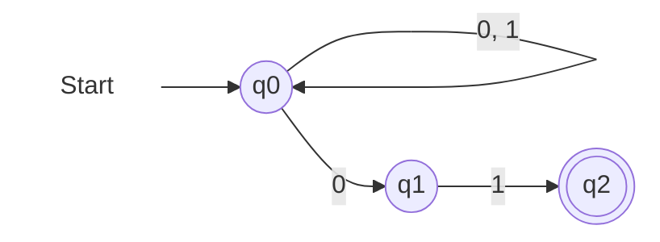

这是一个接受所有以 `01` 结尾的 01 串的 NFA。它所对应的 DFA 为

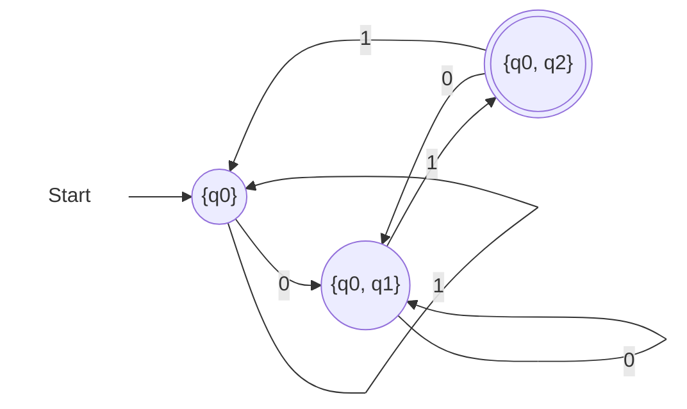

转移表如下：

|                      |      $0$       |      $1$       |
| -------------------: | :------------: | :------------: |
|        $\varnothing$ | $\varnothing$  | $\varnothing$  |
|        $\to \{q_0\}$ | $\{q_0, q_1\}$ |   $\{q_0\}$    |
|            $\{q_1\}$ | $\varnothing$  |   $\{q_2\}$    |
|           $*\{q_2\}$ | $\varnothing$  | $\varnothing$  |
|       $\{q_0, q_1\}$ | $\{q_0, q_1\}$ | $\{q_0, q_2\}$ |
|      $*\{q_0, q_2\}$ | $\{q_0, q_1\}$ |   $\{q_0\}$    |
|      $*\{q_1, q_2\}$ | $\varnothing$  |   $\{q_2\}$    |
| $*\{q_0, q_1, q_2\}$ | $\{q_0, q_1\}$ | $\{q_0, q_2\}$ |

##### 子集构造的最劣情形

考虑 $L(N)$ 是所有使得倒数第 $n$ 位是 $1$ 的 01 串集合。

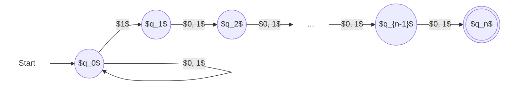

这个 NFA 没有少于 $2^n$ 个状态的等价 DFA。这很好理解，因为你最少要存下来每个 01 串的最后 $n - 1$ 位，所以会导致 DFA 的状态数<span style="background:#b1ffff">指数型增长</span>。

### $\varepsilon$ 转移

$\varepsilon$ 转移可以理解成边权为空串 $\varepsilon$ 的边。

#### $\varepsilon$ - NFA 的形式化定义

只有转移函数 $\delta$ 与 NFA 不同。在 $\varepsilon$ - NFA 中，$\delta$ 的定义域被拓展为 $Q \times \left(\Sigma \cup \{\varepsilon\}\right)$，它需要包含所有通过 $\varepsilon$ 边转移的信息。

#### $\varepsilon$ 闭包

这就有点类似于在有向图中缩点了。$\varepsilon$ 闭包就是能被缩成一个点的块儿，消除 $\varepsilon$ 转移就是缩点的过程。

递归地定义 $q$ 的 $\varepsilon$ 闭包如下：

> 基础：$q \in \text{ECLOSE}(q)$
> 归纳：若 $p \in \text{ECLOSE}(q)$，且存在 $p$ 到 $r$ 的 $\varepsilon$ 转移，则 $r \in \text{ECLOSE}(q)$。

- 扩展转移函数 $\hat\delta(q, w)$
  形式化的定义如下：
 > 基础：$\hat\delta(q, \varepsilon) = \text{ECLOSE}(q)$。  >
  > 归纳：$\hat\delta(q, w) = \bigcup\limits_{p \in \hat\delta(q, x)}\text{ECLOSE}(\delta(p, a))$，其中 $w = xa$。

用通俗的话说，通过 $\varepsilon$ 的边将状态 $q$ 和它周围的状态联系起来，它们本质上是“同一个状态”，“同一个状态”对应的就是 $\text{ECLOSE}(q)$。

#### 消除 $\varepsilon$ 转移

给定一个 $\varepsilon$ - NFA $E = (Q_E, \Sigma, \delta_E, q_0, F_E)$，求满足 $L(E) = L(D)$ 的 DFA $D = (Q_D, \Sigma, \delta_D, q_D, F_D)$。

- $Q_D = \{S \subseteq Q_E | S = \text{ECLOSE}(S)\}$
- $q_D = \text{ECLOSE}(q_0)$
- $F_D = \{S \subseteq Q_D | S \cap F_E \neq \varnothing\}$
- $\delta_D$ 满足
  $$
  \delta_D(S, a) = \bigcup_{p \in S}\text{ECLOSE}(\delta(p, a))
  $$

对于 $E$ 和其对应的 $D$，也有

**定理**：$L$ 被 $\varepsilon$ - NFA $E$ 接受，当且仅当 $L$ 被 DFA $D$ 接受。

定理的证明与 NFA 和 DFA 的等价性处的证明类似。
### 设计FA
1. 逐个读取字符，判断至今是否属于给定的语言
2. 列出关键信息，每个信息关键对应一个状态
3. 给出transitions
4. 将没有输入或输入为ε的状态，指定为start state
5. 将对应可接受的输入作为accept state
## 第三章 正则表达式与正则语言

### 正则表达式的运算符

#### 并与连接

- 并
  $$
  L \cup M = \{w | w \in L \lor w \in M\}
  $$

- 连接
  $$
  LM = \{w = uv | u \in L \land v \in M\}
  $$

#### 闭包

语言 $L$ 的闭包记作 $L^*$。形式化的定义是：

$$
L^* = \bigcup_{i \ge 0}L^i
$$

其中 $L^0 = \{\varepsilon\}, L^1 = L$，$L^i(i \ge 2)$ 表示 $i$ 个 $L$ 的连接。

对于绝大多数语言 $L$ 而言，$L^*$ 通常是无穷的。**仅有两个** 特殊的语言，它们的闭包是有限的。

- $\varnothing^*$
  注意到对于 $i \ge 1$，$\varnothing^i$ 是空集，而 $\varnothing^0 = \{\varepsilon\}$。故 $\varnothing^* = \{\varepsilon\}$。
- $\{\varepsilon\}^*$
  注意到 $\{\varepsilon\}$ 无论连接多少次都不会改变它是 $\{\varepsilon\}$ 的事实，所以 $\{\varepsilon\}^* = \{\varepsilon\}$。

### 正则表达式的定义RE

正则表达式仍然采用递归的定义方法：
**基础**：
1. $\varepsilon$ 和 $\varnothing$ 是正则表达式，分别表示语言 $\{\varepsilon\}$ 和 $\varnothing$。也就是说，$L(\varepsilon) = \{\varepsilon\}, L(\varnothing) = \varnothing$。
2. 若 $a$ 是任意 **符号**，则 $\textbf{a}$ 是正则表达式。这个表达式表示语言 $\{a\}$。也就是说，$L(\textbf{a}) = \{a\}$。

**归纳**：
1. 如果 $E$ 和 $F$ 都是正则表达式，则 $E + F$ 是正则表达式，表示 $L(E)$ 和 $L(F)$ 的并。也就是说，$L(E + F) = L(E) \cup L(F)$。
2. 如果 $E$ 和 $F$ 都是正则表达式，则 $EF$ 是正则表达式，表示 $L(E)$ 和 $L(F)$ 的连接。也就是说，$L(EF) = L(E)L(F)$。
3. 如果 $E$ 是正则表达式，则 $E^*$ 是正则表达式，表示 $E$ 的闭包。也就是说，$L(E^*) = (L(E))^*$。
4. 如果 $E$ 是正则表达式，则 $(E)$ 是正则表达式，表示和 $E$ 相同的语言。也就是说 $(L(E)) = L(E)$。

### 自动机与正则表达式间的关系

DFA、NFA、$\varepsilon$ - NFA 和正则表达式之间是等价的，它们都能表示相同的正则语言。
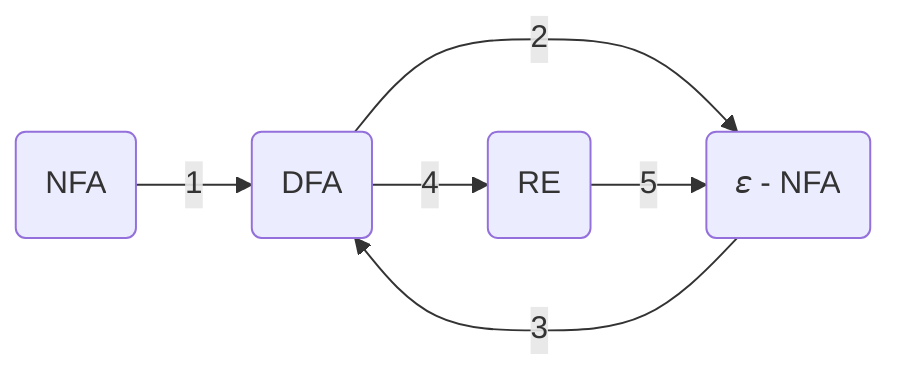
其中 1、2、3 都已经被证明了。现在只需要证明 4 和 5。
#### 由 DFA 构建正则表达式

我们想要解决的问题是：给定一个 DFA $A$，记 $L = L(A)$，求一个正则表达式 $R$，使得 $L = L(R)$。

重新编号 $A$ 的状态为 $\{1, 2, \cdots, n\}$，使得 $1$ 为初始状态。设 $R_{ij}^{(k)}$ 表示满足以下条件的串 $w$ 所组成的集合：$w$ 是 $A$ 中从状态 $i$ 到状态 $j$ 的路径的标记，而且这条路径没有编号大于 $k$ 的 **中间顶点**。因此 $i$ 和 $j$ 没有必要不大于 $k$。

最终的 $R$，是所有 $R_{1j}^{(n)}$ 的并，使得状态 $j$ 为一个接受状态。

仍然考虑使用递归的思路来推导 $R_{ij}^{(k)}$。

**基础**：当 $k = 0$ 时，这条路径中不能包含除了 $i, j$ 以外的其他状态。也就是说，这条路径上最多只会包含两个状态。

- 如果 $i = j$，则 $R_{ii}^{(0)} = \varepsilon + \textbf{a}_1 + \textbf{a}_2 + \cdots + \textbf{a}_r$，其中状态 $i$ 有自环 $\textbf{a}_1, \textbf{a}_2, \cdots, \textbf{a}_r$ 的弧。
- 如果 $i \neq j$，则 $R_{ij}^{(0)} = \textbf{a}_1 + \cdots + \textbf{a}_r$，其中状态 $i$ 到状态 $j$ 有 $\textbf{a}_1, \textbf{a}_2, \cdots, \textbf{a}_r$ 的弧。

**归纳**：假设有 $R_{ij}^{(k)}$，那么这条路径有两种情况：

1. 这条路径根本不经过状态 $k$。
   这种情况下 $R_{ij}^{(k)} \gets R_{ij}^{(k-1)}$。

2. 这条路径经过状态 $k$ 至少一次。
   于是我们可以把整个路径分成几段：

  ```mermaid
  graph LR

  style ... fill:none,stroke-width:0px

  A((i)) --> |"属于 $R_{ik}^{(k-1)}$"| B((k))
  subgraph "属于 $R_{kk}^{(k-1)}$ 的零个或多个串"
  B((k)) --> C((k))
  C((k)) --> ...
  ... --> E((k))
  end
  E((k)) -->|"属于 $R_{kj}^{(k-1)}$"| F((j))
  ```

  那么这种路径可以表示成正则表达式 $R_{ik}^{(k - 1)}(R_{kk}^{(k - 1)})^*R_{kj}^{(k - 1)}$。

结合起来就有 $R_{ij}^{(k)} = R_{ij}^{(k - 1)} + R_{ik}^{(k - 1)}(R_{kk}^{(k - 1)})^*R_{kj}^{(k - 1)}$。这是一个递推式，所以我们可以从基础已知递推到所有的 $R_{1j}^{(n)}$。

比如考虑下图表示的 DFA：

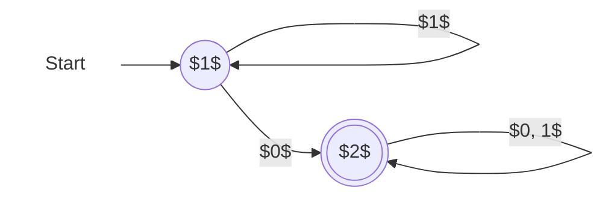

由 **基础** 部分可得：

|     表达式     |                   值                    |
| :------------: | :-------------------------------------: |
| $R_{11}^{(0)}$ |       $\varepsilon + \mathbf{1}$        |
| $R_{12}^{(0)}$ |              $\mathbf{0}$               |
| $R_{21}^{(0)}$ |              $\varnothing$              |
| $R_{22}^{(0)}$ | $\varepsilon + \mathbf{0} + \mathbf{1}$ |

然后通过 **归纳** 部分递推得出 $R_{ij}^{(1)}$：

$$
R_{ij}^{(1)} = R_{ij}^{(0)} + R_{i1}^{(0)}(R_{11}^{(0)})^*R_{1j}^{(0)}
$$

因此可以得到：

|     表达式     |                         通过直接带入                         |               化简后的值                |
| :------------: | :----------------------------------------------------------: | :-------------------------------------: |
| $R_{11}^{(0)}$ | $\varepsilon + \mathbf{1} + (\varepsilon + \mathbf{1})(\varepsilon + \mathbf{1})^*(\varepsilon + \mathbf{1})$ |             $\mathbf{1}^*$              |
| $R_{12}^{(0)}$ | $\mathbf{0} + (\varepsilon + \mathbf{1})(\varepsilon + \mathbf{1})^*\mathbf{0}$ |        $\mathbf{1}^*\mathbf{0}$         |
| $R_{21}^{(0)}$ | $\varnothing + \varnothing(\varepsilon + \mathbf{1})^*(\varepsilon + \mathbf{1})$ |              $\varnothing$              |
| $R_{22}^{(0)}$ | $\varepsilon + \mathbf{0} + \mathbf{1} + \varnothing(\varepsilon + \mathbf{1})^*\mathbf{0}$ | $\varepsilon + \mathbf{0} + \mathbf{1}$ |

又有

$$
R_{ij}^{(2)} = R_{ij}^{(1)} + R_{i2}^{(1)}(R_{22}^{(1)})^*R_{2j}^{(1)}
$$

因此可以得到：

|     表达式     |                         通过直接带入                         |                     化简后的值                      |
| :------------: | :----------------------------------------------------------: | :-------------------------------------------------: |
| $R_{11}^{(1)}$ | $\mathbf{1}^* + \mathbf{1}^*\mathbf{0}(\varepsilon + \mathbf{0} + \mathbf{1})^*\varnothing$ |                   $\mathbf{1}^*$                    |
| $R_{12}^{(1)}$ | $\mathbf{1}^*\mathbf{0} + \mathbf{1}^*\mathbf{0}(\varepsilon + \mathbf{0} + \mathbf{1})^*(\varepsilon + \mathbf{0} + \mathbf{1})$ | $\mathbf{1}^*\mathbf{0}(\mathbf{0} + \mathbf{1})^*$ |
| $R_{21}^{(1)}$ | $\varnothing + (\varepsilon + \mathbf{0} + \mathbf{1})(\varepsilon + \mathbf{0} + \mathbf{1})^*\varnothing$ |                    $\varnothing$                    |
| $R_{22}^{(1)}$ | $\varepsilon + \mathbf{0} + \mathbf{1} + (\varepsilon + \mathbf{0} + \mathbf{1})(\varepsilon + \mathbf{0} + \mathbf{1})^*(\varepsilon + \mathbf{0} + \mathbf{1})$ |            $(\mathbf{0} + \mathbf{1})^*$            |

在此例中，$1$ 是初始状态，$2$ 是唯一一个接收状态，则整体的正则表达式为 $R_{12}^{(2)} = \mathbf{1}^*\mathbf{0}(\mathbf{0} + \mathbf{1})^*$。

它表示的是“至少含有一个 0 的 01 串”组成的集合。

#### 消除状态法

上述方法的复杂度太高，我们可以使用 **消除状态** 的方式来化简自动机。考虑下图中即将被消除的状态 $s$：

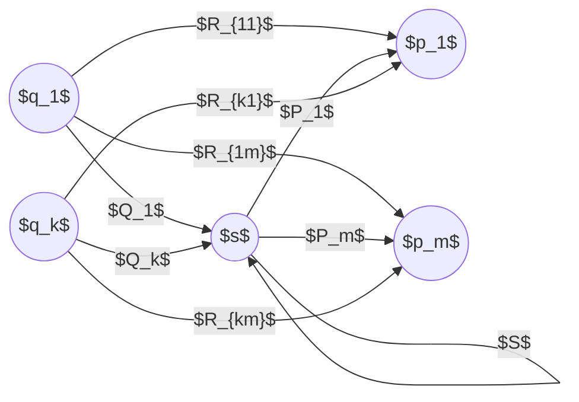

消除状态 $s$ 时需要清除掉所有与状态 $s$ 相关的转移边。消除状态 $s$ 后如下：

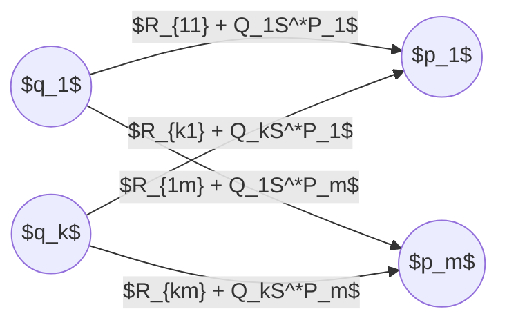

从有穷自动构造正则表达式的策略如下：

1. 对于每个接受状态 $q$，应用上面的消除过程，消除除了 $q$ 和初始状态 $q_0$ 之外的所有其余状态，产生一个等价的自动机，转移边上带有正则表达式标记。

2. 如果 $q \neq q_0$，则剩下一个两状态自动机。可以用多种方法来描述所接受的串的正则表达式。一种方式是 $(R + SU^*T)^*SU^*$。

  ```mermaid
  graph LR
  style Start fill:none,stroke-width:0px

  Start --> A((" "))
  A --> |$R$| A
  A --> |$S$| B(((" ")))
  B --> |$T$| A
  B --> |$U$| B
  ```

3. 如果初始状态也是接受状态，则必须去掉除了初始状态意外的所有其余状态。这样做了之后，只剩下一个单状态自动机，表示所接受的串的正则表达式是 $R^*$。

  ```mermaid
  graph LR
  style Start fill:none,stroke-width:0px

  Start --> A(((" ")))
  A --> |$R$| A
  ```

4. 所求的正则表达式是对每个接受状态进行步骤 2 和步骤 3 所得出的所有表达式之和（并）。

#### 由正则表达式构造 $\varepsilon$ - NFA

构造出来的自动机都是 **具有单个接受状态** 的 $\varepsilon$ - NFA。

**基础**：先构造 $\{\varepsilon\}, \varnothing, \mathbf{a}$ 对应的三个自动机：

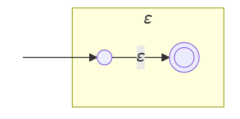

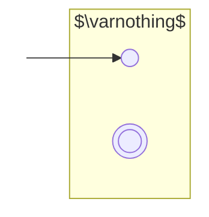

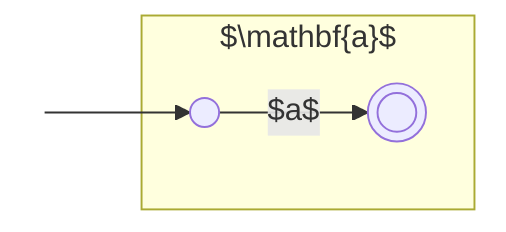

**归纳**：接着，我们构造 $R + S, RS, R^*$：

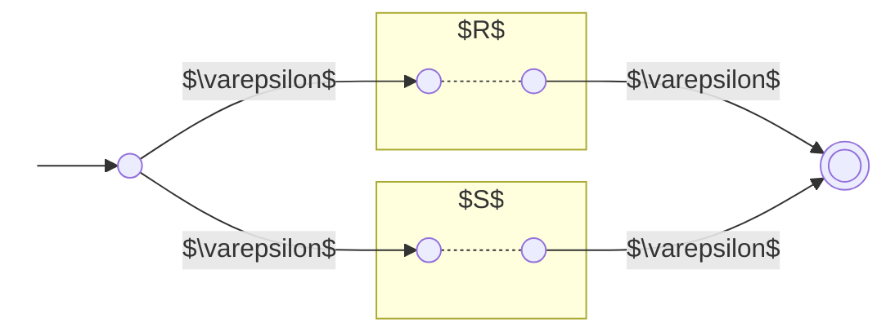

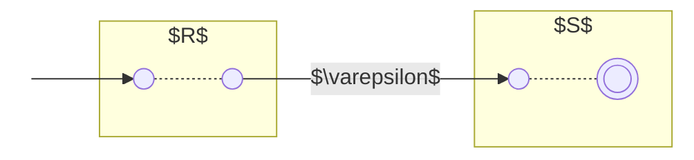

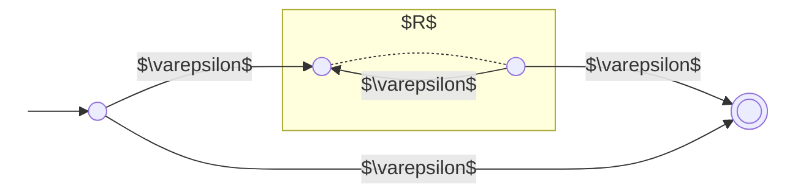

通过自动机结构上的归纳法，我们可以得到与正则表达式表示相同语言的 $\varepsilon$ - NFA。

#### 消除 $\varepsilon$ 转移时的注意事项

在上述构造中，有些地方可以化简：

1. 对于并运算符，不是构造新的初始状态和接收状态，而是把两个初始状态合并成一个具备两个初始状态的所有转移的状态。同样，合并两个接受状态，让所有的转移相应的地进入合并状态。

  ```mermaid
  graph LR

  style Start fill:none,stroke-width:0px

  Start((" ")) --> A((" "))

  subgraph " "
  A -.- | $R$ | B(((" ")))
  A -.- | $S$ | B
  end
  ```

2. 对于连接运算符，把第一个自动机的接受状态与第二个自动机的初始状态合并。

  ```mermaid
  graph LR
  style Start fill:none,stroke-width:0px

  Start((" ")) --> A((" "))

  subgraph " "
  A -.- | $R$ | B((" "))
  B -.- | $S$ | C(((" ")))
  end
  ```

3. 对于闭包运算符，只是增加从接受状态到初始状态的以及反方向的 $\varepsilon$ 转移。

  ```mermaid
  graph LR
  style Start fill:none,stroke-width:0px

  Start((" ")) --> A((" "))

  subgraph " "
  B(((" "))) --> | $\varepsilon$ | A
  A --> | $\varepsilon$ | B
  A -.- | $R$ | B
  end
  ```

每一个这种化简 **本身** 仍然产生正确的构造，但它们 **组合在一起** 有时会产生错误的构造（例如 $R + S^*$）。

### 正则表达式代数定律

**定理**：设 $E$ 是带变量 $L_1, L_2, \cdots, L_m$ 的正则表达式。对于 $i = 1, 2, \cdots, m$，通过把 $L_i$ 的每次出现都换成符号 $a_i$ 形成具体的正则表达式 $C$。则 $\forall w = w_1w_2\cdots w_k \in L(E)$，其中每个 $w_i$ 都属于任意的语言之一（如 $L_{j_i}$），都有 $w$ 对应的正则表达式 $a_{j_1}a_{j_2}\cdots a_{j_k}$ 属于语言 $L(C)$。

这个定理揭示了语言和正则表达式的内蕴的等价性。

~~附赠一个可能会有用的公式~~ $(R^*S^*)^* = (R + S)^*$
## 第四章 正则语言的性质

### 泵引理

**定理**：设 $L$ 是正则语言，则存在与 $L$ 相关的正整数 $n$ 满足：$\forall w \in L$ 满足 $\left|w\right| \ge n$，均 $\exists x, y, z$ 满足 $w = xyz$ 且：

1. $y \neq \varepsilon$
2. $\left|xy\right| \le n$
3. $\forall k \ge 0, xy^kz \in L$

**证明**：假设 $L$ 是正则语言，则存在 DFA $A$ 使得 $L = L(A)$。设 $A$ 有 $n$ 个状态，考虑 $w = a_1a_2\cdots a_m(m \ge n)$，其中 $a_i$ 为输入符号。

设 $p_i = \hat\delta(q_0, a_1a_2\cdots a_i)$，定义 $p_0 = q_0$ 为 $A$ 的初始状态。则 $p_0, p_1, \cdots, p_n$ 不可能两两不同，因此存在 $0 \le i < j \le n$ 使得 $p_i = p_j$。

所以可以画出如下的转移图：

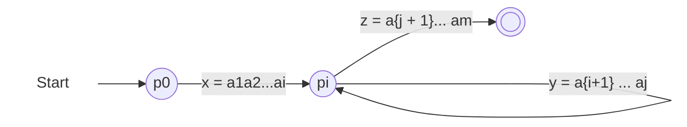

由 $i < j$ 得 $y \neq \varepsilon$，由 $j \le n$ 得到 $\left|xy\right| \le n$。$k \ge 0$ 就是可以绕着 $p_i$ 得自环多走几圈。
#### example
- 证明下列语言都不是正则的：由 0 和 1 构成的 𝑤𝑤 形式的串的集合，也就是某个串重复的串集合。
	- <font color="#d99694">设一个泵长度，这个泵长度可为任意值，设置的目的为后面构造串：</font>假设该语言 𝐿 是正则的，则存在一常数n使得𝐿满足泵引理即 𝐿的泵长度为 n 。
	- <font color="#d99694">构造一个串，包含泵长度，在泵长度内可以用有限的形式划分为2串：</font>构造串$0^n10^n1$,$|0^n10^n1|\geq n$
	- s 前n 个字符串都是0 ，所以根据泵引理，y 必然由0组成。
		- $x=0^{n-m},y=0^m,z=10^n1,xyyz=0^{n+m}10^n1$不属于𝐿
	- 所以该语言 𝐿 不是正则的
-  证明由 0 和 1 构成的 $𝑤𝑤^𝑅$ 形式的串的集合，也就是由某个串后面跟着它的反转所构成的串的集合不是正则语言。
	- - 假设该语言 𝐿 是正则的，则存在一常数n使得𝐿满足泵引理即 𝐿的泵长度为 n 。
	- 构造串$0^n110^n$,$|0^n110^n|\geq n$
	- s 前n 个字符串都是0 ，所以根据泵引理，y 必然由0组成。
		- $x=0^{n-m},y=0^m,z=110^n,xyyz=0^{n+m}110^n$不属于𝐿
	- 所以该语言 𝐿 不是正则的
证明下列语言都不是正则的： 
- a） 所有满足以下条件的串的集合：由 0 和 1 构成，开头的是 1，并且当我们把该串看作是一个整数时该整数是一个素数。
	- 设字符串L=xyz,|y|=l,|z|=m,则L可以看作$2^{l+m}x+2^my+z=q$
	- $xy^kz$可以看作$2^{kl+m}x+\sum_{j=0}^{k-1}2^{m+jl}y+z=p$
	- 证明L不是正则语言即证，q为素数情况下，存在k，p不为素数
	- 考察k=q
	- $\sum_{j=0}^{q-1}2^{m+jl}=2^m\frac{2^{lq}-1}{2^l-1}$
	- $p=q+\left(2^{q l}-2^{l}\right) 2^m\cdot x + 2^{m} \cdot \left(\frac{2^{q l}-1}{2^{l}-1}-1\right) \cdot y$
		- $=q+\left(2^{(q-1) l}-1\right) 2^{m+l}\cdot x + 2^{m} \cdot \left(\frac{2^{q l}-1}{2^{l}-1}-1\right) \cdot y$
	- 由费马小定理知$2^{q-1}\equiv 1 \mod q$
	- 得$(2^{(q-1) l}\equiv 1 \mod q$
	- 得$\left(2^{(q-1) l}-1\right)|p$即$\left(2^{q l}-2^{l}\right)|p$
	- 又：
	
	$$
	\frac{2^{q l}-1}{2^{l}-1}-1 = \frac{2^{q l}-2^1}{2^{l}-1} =\frac{k^{\prime} q}{2^{l}-1}  =+ 2^{l} + \cdots + 2^{(q-1) l}
	$$
	
	由于等式右侧为整数，可得
	$$
	\frac{k^{\prime} q}{2 l-1} \in \mathbb{Z}
	$$
	又因为  q 为素数，因此 \( q \) 与 $2^{l} - 1$ 互质，从而
	$$
	\frac{k^{\prime}}{2 ^l-1} \in \mathbb{Z}
	$$
	因此有：
	$$
	\frac{k^{\prime} q}{2^ l-1} |q 即 (\frac{2^{q l}-1}{2^{l}-1}-1) |q
	$$
	- 综上，p|q
	- 因此，𝑝 是合数不属于正则语言 𝐿。综上所述，𝐿不是正则语言。
-  b） 所有满足以下条件的 $0^𝑖 1^𝑗$ 形式的串的集合： 𝑖 和 𝑗 的最大公约数是 1。
	- 假设该语言 𝐿 是正则的，则存在一常数n使得𝐿满足泵引理即 𝐿的泵长度为 n 。
	- 构造$n<=q,s=0^q1^{(q-1)!},q为素数$
	- q与(q-1)!互质，$s\in  𝐿$
	- s 前n 个字符串都是0 ，所以根据泵引理，y 必然由0组成。
		- $x=0^{n-m},y=0^m,z=0^{q-n}1^{(q-1)!},xy^qz=0^{qm+q}1^{(q-1)!}$
		- $m+1 \in [2,q-1]$
		- $(q(m+1),(q-1)!)=m+1\neq 1$
		- s不属于𝐿
	- 所以该语言 𝐿 不是正则的


### 正则语言的封闭性

#### 交运算的乘积构造法

已知正则语言 $L, M$，设 $A_L = \{Q_L, \Sigma, \delta_L, q_L, F_L\}$，$A_M = \{Q_M, \Sigma, \delta_M, q_M, F_M\}$，满足 $L = L(A_L), M = L(A_M)$。构造他们的乘积（笛卡尔积）：

$$
A = (Q_L \times Q_M, \Sigma, \delta, q_L \times q_M, F_L \times F_M)
$$

其中 $\delta$ 满足 $\delta((p, q), a) = (\delta_L(p, a), \delta_M(q, a))$，返回一个二元组。$A$ 接受 $w$ 当且仅当 $\hat\delta((q_L, q_M), w)$ 是一对接受状态。这等价于 $\hat\delta(q_L, w)$ 和 $\hat\delta(q_M, w)$ 均为接受状态。所以说 $A$ 只接受 $L\cap M$。

#### 逆同态

定义 $L$ 对于 $h$ 的逆同态 $h^{-1}$ 如下：

$$
h^{-1}(L) = \{w \in \Sigma^* | h(w) \in L\}
$$

需要注意的是，$h(h^{-1}(L)) \subset L$，**并不一定等于** $L$！

---

**定理**：已知 $t$，其中 $L$ 是 t 上的正则语言，求证 $h^{-1}(L)$ 是 $\Sigma$ 上的正则语言。

**证明**：设 $L$ 有一个 DFA $A = (Q, \tau, \delta, q_0, F)$，现在的目标是用 $A$ 和 $h$ 构造 $h^{-1}(L)$ 的 DFA $B = (Q, \Sigma, \gamma, q_0, F)$。

定义 $\gamma(q, a) = \hat\delta(q, h(a))$，然后扩展 $\hat\gamma(q, w) = \hat(q, h(w))$。由于 $B$ 接受 $w$ 当且仅当 $A$ 接受 $h(w)$，故 $B$ 就是 $h^{-1}(L)$ 的 DFA。

注意 $\gamma(q, a)$ 是 $\hat\delta(q, h(a))$ 而非 $\delta(q, h(a))$，这是因为 $h(a)$ 有可能是一个串而非字符。

### 自动机的等价性和最小化

#### 测试状态的等价性

我们称 DFA 中的两个状态 $p, q$ 是 **等价的**，如果 $\hat\delta(p, w)$ 是可接受当且仅当 $\hat\delta(q, w)$ 是可接受的。

注意到这个定义并不要求 $\hat\delta(p, w) = \hat\delta(q, w)$，它仅仅要求二者要么同时都是可接受的，要么同时都是不可接受的。

我们称 DFA 中的两个状态 $p, q$ 是 **可区分的**，如果它们不是等价的。

---

至此，我们可以构造 **填表算法**，来测试状态的等价性：

**基础**：如果 $p$ 和 $q$ 一个是可接受的，一个是不可接受的，那么 $p, q$ 是可区分的。

**归纳**：设 $p, q$ 满足 $\exists a$ 使得 $r = \delta(p, a)$ 与 $s = \delta(q, a)$ 是已知可区分的。假设 $w$ 可以区分 $r$ 和 $s$，那么 $aw$ 一定可以区分 $p, q$。按照归纳的步骤一步一步递推，则可得知所有状态两两间是否等价。

---

接下来，我们需要证明填表算法的正确性。

**定理**：如果通过填表算法不能区分两个状态，则这两个状态等价。

**证明**：使用反证法证明。我们称状态对 $\{p, q\}$ 为 *坏对*，如果 $\exists w \in L$，满足 $\hat\delta(p, w)$ 和 $\hat\delta(q, w)$ 本应可区分，但填表算法没有发现它们可区分。

设 $w = a_1a_2\cdots a_n$ 是所有可以区分坏对（无论区分的是哪一对坏对）的串中最短的那一个，且它区分的是 $\{p, q\}$。则 $\hat\delta(p, w)$ 和 $\hat\delta(q, w)$ 必恰有一个可接受。

注意到一个事实，$w \neq \varepsilon$，这是因为填表算法的基础部分对应的就是 $w = \varepsilon$ 的情况，可接受状态和不可接受的状态一定是可以区分的。接下来，考虑 $r = \delta(p, a_1), s = \delta(q, a_1)$，则串 $w' = a_2a_3 \cdots a_n$ 可区分 $r$ 和 $s$。

如果 $\{r, s\}$ 是坏对，则 $w'$ 比 $w$ 更短且能区分坏对，则产生矛盾。如果 $\{r, s\}$ 不是坏对，则 $\{r, s\}$ 一定是可区分的。此时算法已经发现 $\{r, s\}$ 是可区分的，那么一定会进行下去并计算出 $\{p, q\}$ 也是可区分的，这也产生矛盾。

所以填表算法是正确的。

#### 测试正则语言的等价性

至此，我们已经能够测试同一个 DFA 中的两个状态是否等价。对于两个正则语言 $L$ 和 $M$ 而言，构造 DFA $A, B$ 使得 $L = L(A), M = L(B)$。

设 $A$ 的初始状态为 $p_0$，$B$ 的初始状态为 $q_0$。构造 DFA $A' = A \cup B$，只需要判断 $p_0$ 和 $q_0$ 是否等价即可。

#### DFA 的最小化

用以下流程可以最小化一个 DFA：

1. 排除所有不能从初始状态到达的状态
2. 找出所有不等价的状态，剩下的为等价状态
	1. 可接受与不可接受不等价
	2. 同样条件到达2个不等价状态的状态不等价：$qi \neq qj ,𝛿(q_a,x)=q_i,𝛿(q_b,x)=q_j \iff q_a \neq q_b$
3. 将所有等价的状态划分到同一个连通块

需要注意一点的是，如果 $p, q$ 等价，$r, s$ 等价，且

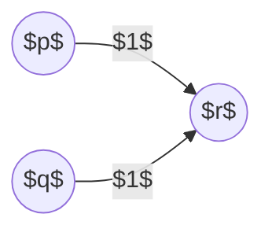

即使此时无论是 $p$ 还是 $q$ 都不会通过 $1$ 转移到 $s$，我们仍然需要用上述算法划分等价类：

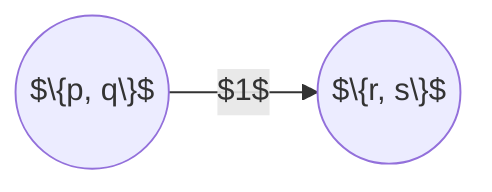
### Myhill–Nerode 定理

#### 等价  Myhill-Nerode 关系
设串$x,y,z⊆Σ^∗$ ，L为 $Σ^*$上语言，
- $xz \in L,yz \in L \rightarrow x,y右不变的等价关系，$用字母R表示
- $\delta(q_i,x)=\delta(q_i,y) \iff x,y等价$
证x,y不等价
- $xz_1 \in L,yz_1 \notin L$
设字母表Σ,R是$Σ^∗$上的等价关系,则称$|\frac{Σ^∗}{R}|$是R关于$Σ^∗$的**指数**,简称R的指数.$\frac{Σ^∗}{R}$中的每个元素是R的一个等价类
- 对于DFA，最小化和指数=状态数
#### 定理
 - x,y等价，则称他们属于同一个等价类
 - 对于语言L，右不变等价类有限(称为RL)$\iff$L为正则语言
\[**例6.2.2**\] 下图所示的DFA M的所确定的等价关系R的指数为6.  


R将Σ∗分为6个等价类:

(1)$set(q_0)=\{(00)^n| n\geq 0\}$
(2)$set(q_1)=\{0(00)^n\mid n\geq0\}$
(3)$set(q_2)=\{(00)^n 1\mid n\geq 0\}.$
(4)$set(q_3)=\{0(00)^n 1\mid n\geq 0\}.$
(5)$set(q_4)=\{0^n 1 0^k\mid n\geq 0,k\geq 1\}.$
(6)$set(q_5)=\{x\mid x\text{至少包含两个}1\}.$
#### 扩充泵引理
根据扩充泵引理，存在只依赖于 𝐿𝐿的正整数 𝑘，对于任何串 𝑥, 𝑦, 𝑧（这里 𝑥yz ∊ 𝐿），只要 |𝑦| ≥ 𝑘，就可以将 𝑦 写成 𝑦= 𝑢vw（这里 𝑣≠ 𝜀, |𝑢v| ≤ 𝑘），使得对于任意 𝑖 ≥ 0，都有$𝑥u𝑣^𝑖𝑤z ∊ 𝐿$。

## 第五章 上下文无关文法及上下文无关语言

### 上下文无关文法

#### 上下文无关文法的定义

一个上下文无关文法（CFG）由四个重要部分组成：

1. 一个有穷字母表 $T$，由 $T$ 中的字母构成了这个文法所定义的语言中的串，这个字母表称为 **终结符**（Terminal）。
2. 一个 **非终结符** （Variable）的有穷集合 $V$。
3. 有一个非终结符 $S$ 称为 **初始符号**（Start Symbol），它代表语言开始被定义的地方。
4. 一个 **产生式** （Production）的有穷集合 $P$，它用来表示语言的递归定义。每个产生式被定义为 `<head> -> <body>`，具体的构造过程是，保持终结符不变，把任何所有的 `<head>` 替换成 `<body>`。

一个上下文无关文法可以表示为 $G = (V, T, P, S)$。

---

以下是可以表示语言 $(\textbf{a} +\textbf{b})(\textbf{a} + \textbf{b} + \textbf{0} + \textbf{1})^*$ 的一个上下文无关文法。
$$
\begin{aligned}
E & \to I \\
E & \to E + E \\
E & \to E * E \\
E & \to (E) \\
I & \to a \\
I & \to b \\
I & \to Ia \\
I & \to Ib \\
I & \to I0 \\
I & \to I1
\end{aligned}
$$
产生式可以使用简捷表示法，比如上面的产生式可以化简为：
$$
\begin{aligned}
E & \to I | E + E | E * E | (E) \\
I & \to a | b | Ia | Ib | I0 | I1
\end{aligned}
$$
- 上下文有关CSG(Context Sensitive Grammar)
	- 组成同CFG：G = (V, T, P, S)
	- CSG 的 P 的规则都是如下形式：$w1Vw2 →w1(V ∪ T )^*w2 ， (w1,w2 ∈ T^*)$(产生式规则和上下文有关，并且规定了在什么情况下变量能够推导)
#### 推导与递归推理

**推导** 的过程通过符号 $\implies$ 表示。设 $G = (V, T, P, S)$ 为一个 CFG，$\alpha A \beta$ 是一个包含终结符和非终结符的串，其中 $A$ 是一个非终结符，而 $\alpha, \beta \in (V \cup T)^*$。设 $A \to \gamma$ 是一个产生式，则我们称 $\alpha A \beta \underset{G}{\implies} \alpha\gamma\beta$。通常省略掉 $G$，而仅仅记作 $\alpha A \beta \implies \alpha\gamma\beta$。 多步推导则使用 $\overset{*}{\implies}$ 来表示。

**递归推理** 的过程类似于推导的逆过程，是从具体的 **产生式的体** 递归到抽象的 **产生式的头** 的过程。

#### 最左与最右推导

在每一步推导中，如果要求只讲最左边的非终结符替换成该非终结符的某个产生式的体，那么这种方式的推导称为 **最左推导**。类似地可以定义 **最右推导**。最左推导和最右推导分别用 $\underset{lm}{\implies}, \underset{lm}{\overset{*}{\implies}}$ 和 $\underset{rm}{\implies}, \underset{rm}{\overset{*}{\implies}}$ 表示。

个人认为，如果每次推导的时候按照随机的顺序来替换，那么整个推导的逻辑就会变得杂乱无章。最左推导和最右推导就限制了替换产生式的头的顺序：前者是从左往右，后者是从右往左。

#### 文法的语言

对于 CFG $G = (V, T, P, S)$，它的语言 $L(G)$ 被定义为所有终结符串的集合：
$$
L(G) = \{w \in T^* | S \underset{G}{\overset{*}{\implies}}w\}
$$
如果我们要证明某个文法 $G$ 确实定义了某个已经非形式化定义好的语言 $L$，通常需要分两步：

1. 充分性：如果一个串 $w \in L$ 满足这个非形式化定义的性质，那么 $S \overset{*}{\implies}w$，来说明 $w \in L(G)$。通常，我们通过 **对 $w$ 的长度** 进行归纳证明。
2. 必要性：如果 $S \overset{*}{\implies}w$，那么 $w$ 应该满足这个非形式化定义的性质，来说明 $w \in L$。通常，我们需要 **对推导的步数** 进行归纳证明。

#### 句型

由初始符号推导出来的串称为 **句型**（Sentence）。$G = (V, T, P, S)$ 的所有句型 $\alpha$ 组成的集合是
$$
\{\alpha \in (V \cup T)^* | S \overset{*}{\implies}\alpha\}
$$
另外，如果 $S \underset{lm}{\overset{*}{\implies}} \alpha$ 则 $\alpha$ 是左句型，如果 $S \underset{rm}{\overset{*}{\implies}} \alpha$ 则 $\alpha$ 是右句型。句型可以包含非终结符。语言 $L(G)$ 是由所有属于 $T^*$ 的句型组成的。

### 语法分析树

#### 语法分析树的构造

对于 CFG $G = (V, T, P, S)$，$G$ 的 **语法分析树** 是满足下列条件的树：

1. 每个内部节点的标号是 $V$ 中的一个非终结符。
2. 每个叶节点的标号可以是一个非终结符，一个终结符，或者 $\varepsilon$。但是，如果叶节点的标号是 $\varepsilon$，那么它一定是其父节点唯一的子节点。
3. 如果某个内部节点的标号是 $A$，并且它的子节点的标号从左到右分别为 $X_1, X_2, \cdots, X_k$，那么 $A \to X_1X_2\cdots X_k$ 一定是 $P$ 中的一个产生式。注意：如果其中某个 $X$ 为 $\varepsilon$，那么 $X$ 一定是 $A$ 唯一的子节点，并且 $A \to \varepsilon$ 是 $G$ 的一个产生式。
最重要的语法分析树，是那些 **所有叶节点的标号都是终结符或 $\varepsilon$，且根节点的标号是初始符号** 的语法分析树。

例子：,F——>bEE,E——>abc|EE,串babcabc的语法分析数如下，需要3步推理后得出（后两步一样，语法树有几个变元就推导几步）
1. F——>bEE
2. E——>abc
3. E——>abc
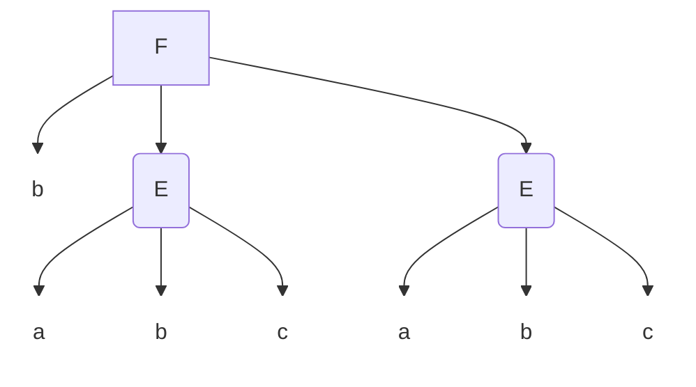

此CFG还能产生其他串，但一个语法分析树只对应一个属于此CFG的串


#### 递归推理、推导与语法分析树的等价性

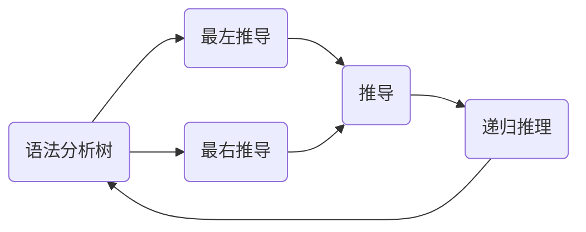

其中从最左推导到推导是显然的，而最右推导相关箭头都与最左推导类似，因此我们只需要证明以下三个等价性：

##### 从递归推理到语法分析树

**定理**：设 CFG $G = (V, T, P, S)$。如果通过递归推理过程得出终结符串 $w$ 在非终结符 $A$ 的语言中，则一定存在一棵根为 $A$、产物为 $w$ 的语法分析树。

**证明**：对推理的步数进行归纳。

基础：如果该推理只有一步，则该推理过程只需要基础，因此一定存在产生式 $A \to w$。这样就能构造出：

```mermaid
graph TD

style A stroke:none,fill:none
style B stroke:none,fill:none
style C stroke:none,fill:none
style D stroke:none,fill:none

A --> B($w_1$)
A --> C(...)
A --> D($w_k$)
```

其中 $w = w_1w_2 \cdots w_k$。

归纳：假定在 $n + 1$ 个推理步骤之后能够得出 $w$ 在 $A$ 的语言里这个事实，并且这个定理对于使得 $B$ 的语言中的 $x$ 成员用小于等于 $n$ 步推理推得的所有串 $x$ 和非终结符 $B$ 成立。考虑得出 $w$ 在 $A$ 的语言里的这个推理的最后一步，这一步使用了 $A$ 的某个产生式，不妨设为 $A \to X_1X_2 \cdots X_k$，其中 $X_i$ 是一个终结符或非终结符。

- 如果 $X_i$ 是终结符，那么 $X_i = w_i$。
- 如果 $X_i$ 是非终结符，那么 $w_i$ 是一个先前推理出在 $X_i$ 语言中的串，而由于 $A \to X_1X_2 \cdots X_k$ 消耗了 $1$ 步，所以 $w_i$ 在 $X_i$ 中的推导最多只会有 $n$ 步，根据归纳假设则可得出存在一个根为 $X_i$，产物为 $w$ 的语法分析树。

```mermaid
graph TD

style A stroke:none,fill:none
style B stroke:none,fill:none
style C stroke:none,fill:none
style D stroke:none,fill:none
style E stroke:none,fill:none
style F stroke:none,fill:none

A --> B($X_1$)
A --> C(...)
A --> D($X_k$)
B -.- E($w_1$)
D -.- F($w_k$)
```

##### 从语法分析树到推导

**定理**：设 CFG $G = (V, T, P, S)$，假设有一棵语法分析树，它的根的标号为非终结符 $A$，产物为 $w \in T^*$。那么一定存在一个 $G$ 中的最左推导 $A \underset{lm}{\overset{*}{\implies}}w$。

**证明**：对树的高度进行归纳。设 $w = w_1w_2\cdots w_k$。

基础：如果树高为 $1$，那么 $G$ 一定包含 $A \to w$ 这一产生式，最左推导可以单步完成，即为 $A \underset{lm}{\implies}w$。

归纳：如果树高为 $n$，其中 $n > 1$，且定理对所有树高小于 $n$ 的树成立。考虑树：

```mermaid
graph TD

style A stroke:none,fill:none
style B stroke:none,fill:none
style C stroke:none,fill:none
style D stroke:none,fill:none

A --> B($X_1$)
A --> C(...)
A --> D($X_k$)
```

- 如果 $X_i$ 是终结符，那么定义 $w_i$ 为只包含 $X_i$ 的串。
- 如果 $X_i$ 是非终结符，那么 $X_i$ 一定是一个树高小于 $n$ 的子树的根节点，因此通过归纳假设，存在一个最左推导 $X_i \underset{lm}{\implies}w_i$。

##### 从推导到递归推理

**定理**：设 CFG $G = (V, T, P, S)$，假设有一个推导 $A \underset{G}{\overset{*}{\implies}}w$，其中 $w \in T^*$。那么应用于 $G$ 的递归推理过程决定了 $w$ 在非终结符 $A$ 的语言中。

**证明**：对推导 $A \overset{*}{\implies}w$ 的步数进行归纳。

基础：如果该推导只有一步，那么 $A \to w$ 一定是一个产生式。由于 $w$ 只包含终结符，因此 $w$ 一定在 $A$ 的语言中。

归纳：假设该推导包含 $n + 1$ 步，并且假定对于所有少于或等于 $n$ 步的推导来说命题都成立。把推导写为 $A \implies X_1X_2\cdots X_k \overset{*}{\implies}w = w_1w_2\cdots w_k$。

- 如果 $X_i$ 是终结符，那么 $w_i = X_i$。
- 如果 $X_i$ 是非终结符，那么有 $X_i \overset{*}{\implies}w_i$，这是因为这个推导的步数少于或等于 $n$ 步。

现在已经有了产生式 $A \to X_1X_2\cdots X_k$，且对于 $w = w_1w_2\cdots w_k$ 有 $w_i$ 在 $X_i$ 的语言中。下一步即得 $w = w_1w_2\cdots w_k$ 在 $A$ 的语言中。
### 文法与语言的歧义性

#### 歧义文法

一个 CFG $G = (V, T, P, S)$ 是 **歧义的**，如果 $\exists w \in T^*$ 使得有两棵不同的语法分析树满足根为 $S$ 且产物为 $w$。

正如这篇博文最初给的例子，当产物 $w = a + a * a$ 时，有两棵语法分析树：

```mermaid
graph TD


style S1 stroke:none,fill:none
style A1 stroke:none,fill:none
style B1 stroke:none,fill:none
style C1 stroke:none,fill:none
style D1 stroke:none,fill:none
style E1 stroke:none,fill:none
style F1 stroke:none,fill:none
style G1 stroke:none,fill:none
style H1 stroke:none,fill:none
style I1 stroke:none,fill:none
style J1 stroke:none,fill:none
style K1 stroke:none,fill:none
style L1 stroke:none,fill:none

S1(E) --> A1(E)
S1 --> B1(+)
S1 --> C1(E)
A1 --> D1(I)
D1 --> E1(a)
C1 --> F1(E)
C1 --> G1(*)
C1 --> H1(E)
F1 --> I1(I)
I1 --> J1(a)
H1 --> K1(I)
K1 --> L1(a)
```

```mermaid
graph TD
style S2 stroke:none,fill:none
style A2 stroke:none,fill:none
style B2 stroke:none,fill:none
style C2 stroke:none,fill:none
style D2 stroke:none,fill:none
style E2 stroke:none,fill:none
style F2 stroke:none,fill:none
style G2 stroke:none,fill:none
style H2 stroke:none,fill:none
style I2 stroke:none,fill:none
style J2 stroke:none,fill:none
style K2 stroke:none,fill:none
style L2 stroke:none,fill:none

S2(E) --> A2(E)
S2 --> B2(*)
S2 --> C2(E)
A2 --> D2(E)
A2 --> E2(+)
A2 --> F2(E)
D2 --> G2(I)
G2 --> H2(a)
F2 --> I2(I)
I2 --> J2(a)
C2 --> K2(I)
K2 --> L2(a)


```

这说明该文法是歧义的。

---

注意，并不是多种推导导致了歧义性，而是存在多棵不同的语法分析树导致的。比如

1. $E \implies E + E \implies I + E \implies a + E \implies a + I \implies a + b$
2. $E \implies E + E \implies E + I \implies E + b \implies I + b \implies a + b$

这两个推导所提供的结构并没有本质的区别，它们对应同一棵语法分析树。

#### 去除文法的歧义性

**不存在算法能够判定某个文法的歧义性**而且，存在一些文法，对它们而言只存在歧义的文法（即 [固有歧义](#固有歧义) 的文法）。对于这篇博文最初给的例子而言，有两个缺陷导致了文法的歧义性：

1. 没有考虑运算符的优先级。我们需要使所有的 $*$ 操作在 $+$ 操作之前被结合。
2. 一系列运算符既可从左到右也可以从右到左地结合。事实上，即使我们正确地保持了运算符优先级，$E+E+E$ 仍然会得到两棵不同的语法分析树。一个习惯的做法是坚持从左到右地结合，我们需要通过一些结构来固定这个顺序。

有三种常用策略来解决文法歧义性的问题：**运算符优先级联**、**左结合** 和 **最近嵌套匹配**。

事实上，我们可以引入几个不同的非终结符，来解决强制优先级的问题：

1. **因子**（Factor）是不能被相邻的运算符（包括 $*$ 和 $+$）打断的表达式。在此例中，因子只会是标识符 $I$ 以及任何被括号括起来的表达式。
2. **项**（Term）是不能被相邻的 $+$ 打断的表达式。在此例中，项只会是一个或多个因子的乘积。
3. **表达式**（Expression）是指任何可能得串，其中包含可以被相邻的 $*$ 或 $+$ 打断的表达式。在此例中，表达式就是一个或多个项的和。

上述方法采用了 **运算符优先级联** 和 **左结合** 的方法。具体而言，前者是指 $*$ 和 $+$ 的优先级的区别；后者是指相同优先级的 $*$ 和 $*$、$+$ 和 $+$ 的优先级应为从左到右。 

修改之后的 CFG 如下：

$$
\begin{aligned}
I & \to a | b | Ia | Ib | I0 | I1 \\
F & \to I | (E) \\
T & \to F | T * F \\
E & \to T | E + T
\end{aligned}
$$

**最近嵌套匹配** 是指类似于括号匹配的题目中，$($ 只与最近的 $)$ 进行匹配的过程。此时需要一个非终结符来生成 $($ 和 $)$ 完全匹配的串。

例如 $S \to \varepsilon | iS | iSeS$ 这个生成所有合法 if-else 语法结构的 CFG。我们可以去除它的歧义：
$$
\begin{aligned}
S & \to \varepsilon | iS | iMeS \\
M & \to \varepsilon | iMeM
\end{aligned}
$$
其中 $M$ 是完全匹配的 if-else 对。$S$ 中的 if 要么是孤立的，要么一定与第一个需要匹配的 else 相匹配。

再例如 $L = \{a^nb^m| m \ge n \ge 0\}$ 的 CFG：
$$
\begin{aligned}
S & \to AB \\
A & \to aAb | \varepsilon \\
B & \to bB | \varepsilon
\end{aligned}
$$
这里也保证了每个 $a$ 与左侧最近的一个 $b$ 进行匹配。

#### 固有歧义

如果一个上下文无关语言 $L$ 的所有文法都是歧义的，那么我们称它是 **固有歧义** 的。

### 练习题

**习题 1** 求 CFG，所有不是 $ww$ 形式的由 $a$ 和 $b$ 构成的串的集合，即不是把某个串重复一遍的串。

**解答** 首先，奇数长度的串都不是 $ww$ 的形式，这个容易处理。其次，偶数长度的串分成两个长度相等的段，不妨设每段的长度为 $n$；因为不具有 $ww$ 的形式，所以 $\exists i \in [1, n]$，该串第 $i$ 位和第 $n + i$ 位不同；分别以第 $i$ 位和第 $n + i$ 位为中心将该串重新划分为两段，长度分别为 $2(i - 1) + 1$ 和 $2(n - i) + 1$；这两段的中心不同，而围绕中心的其它位可以任意。
$$
\begin{aligned}
S & \to E | O \\
O & \to a | b | COC \\
E & \to AB | BA \\
A & \to CAC | a \\
B & \to CBC | b \\
C & \to a | b
\end{aligned}
$$
其中，开始符号为 $S$；非终结符 $O$ 负责产生奇数长度的串；非终结符 $E$ 负责产生偶数长度的串；非终结符 $A$ 负责产生以 $a$ 为中心的串；非终结符 $B$ 负责产生以 $b$ 为中心的串。  

**习题 2** 设 $G = (\{S, A, B\}, \{a, b\}, P, S)$ 为一上下文无关文法，其中 $P$ 如下：
$$
\begin{aligned}
S & \to \varepsilon | aB | bA \\
A & \to a | aS | bAA \\
B & \to b | bS | aBB
\end{aligned}
$$
试证明 $L(G) = \{w | w \in \{a, b\}^*, \text{occur}(w, a) = \text{occur}(w, b)\}$。

**思路** 采用互归纳法，证明 $A$ 产生的串组成的语言，是 $\text{occur}(w, a) = \text{occur}(w, b) + 1$ 的语言； $B$ 产生的串组成的语言，是 $\text{occur}(w, b) = \text{occur}(w, a) + 1$ 的语言。

## 第六章 下推自动机

### 下推自动机的定义

#### 下推自动机的形式化定义

一个下推自动机（PDA）由七个部分组成：
$$
P = (Q, \Sigma, \Gamma, \delta, q_0, Z_0, F)
$$

1. $Q$：状态的有穷集合。

2. $\Sigma$：输入符号的有穷集合。

3. $\Gamma$：有限的堆栈字母表，该部分是能够被推入堆栈的符号的集合。

4. $\delta$：转移函数，自变量为一个三元组 $\delta(q, a, X)$，其中

   - $q \in Q$
   - $a \in \Sigma$ 或 $a = \varepsilon$
   - $X \in \Gamma$

   $\delta$ 的输出是有序对 $(p, \gamma)$ 的有穷集合，其中 $p$ 是新状态，$\gamma$ 是堆栈符号串，$\gamma$ 用来代替栈顶符号 $X$。

5. $q_0$：初始状态。

6. $Z_0$：初始堆栈中的符号。

7. $F$：接受状态的集合。

PDA 相较于 DFA 的区别是引入了一个栈用于存储数据，以及多了一个参数（栈顶元素）来控制转移方向。

#### 下推自动机的瞬时描述

使用 $(q, w, \gamma)$ 三元组来表示 PDA 的配置，其中 $q$ 是状态，$w$ 是剩余的输入串，$\gamma$ 是堆栈的内容。这样的一个三元组被称为下推自动机的一个 **瞬时描述**。

我们定义 $\vdash_P$（如果 $P$ 已知，那么简写为 $\vdash$）为：假设 $(p, \alpha) \in \delta(q, a, X)$，那么对于所有 $\Sigma^*$ 中的串 $w$ 和 $\Gamma^*$ 中的串 $\beta$ 都有：
$$
(q, aw, X\beta) \vdash (p, w, \alpha\beta)
$$
这相当于处理了输入串 $aw$ 中最前面的一个字符 $a$，并且用 $\alpha$ 来替换栈顶的 $X$，这导致了一次从状态 $q$ 到状态 $p$ 的转移。
一个状态转移到另一个状态需要的条件：一个可接受字符+要消去的栈顶（可无，栈顶必须为此才可转移）+新入栈的东西（可无，可多个）

同样地，我们也使用符号 $\vdash_P^*$ 来表示 PDA 的零步或多步转移。
状态转移图例子：$\{ 0^n1^n | n≥1\}$
![[Pasted image 20241218203320.png]]

#### 输入串与栈底串的简化

**定理**：如果 $P = (Q, \Sigma, \Gamma, \delta, q_0, Z_0, F)$ 是一个 PDA，并且 $(q, x, \alpha) \vdash_P^* (p, y, \beta)$，那么对于所有 $\Sigma^*$ 中的串 $w$ 和 $\Gamma^*$ 中的串 $\beta$ 都有
$$
(q, xw, \alpha\gamma) \vdash_P^* (p, yw, \beta\gamma)
$$
**证明**：由于 $(q, x, \alpha) \vdash_P^* (p, y, \beta)$ 的过程中都没有使用与 $w$ 和 $\gamma$ 相关的转移，所以只需要对 $(q, x, \alpha) \vdash_P^* (p, y, \beta)$ 进行转移步数上的归纳即可得证。

**补充 1**：定理的逆定理关于栈的简化的那一部分不成立。原因很好理解，因为我们在转移的过程中~~偷偷地~~从 $\gamma$ 中弹出一些符号，再在之后的过程中压回去，效果仍然是 $\gamma$ 不变，但是转移的过程改变了。

**补充 2**：定理的逆定理关于输入串的简化的那一部分成立。原因是输入串被消耗后没法重新添加回去。

**定理**：如果 $P = (Q, \Sigma, \Gamma, \delta, q_0, Z_0, F)$ 是一个 PDA，并且 $(q, xw, \alpha) \vdash_P^* (p, yw, \beta)$，那么对于所有 $\Sigma^*$ 中的串 $w$ 和 $\Gamma^*$ 中的串 $\beta$ 都有有 $(q, x, \alpha) \vdash_P^* (p, y, \beta)$。

### 下推自动机的语言

#### 以终结状态方式接受

设 $P = (Q, \Sigma, \Gamma, \delta, q_0, Z_0, F)$ 是一个 PDA，那么 $P$ **以终结状态方式接受的语言** $L(P)$ 是：
$$
\{w | (q_0, w, Z_0) \vdash_P^* (q, \varepsilon, \alpha)\}
$$
其中 $q \in F$ 为某个接受状态，$\alpha \in \Gamma^*$ 是任何堆栈符号串。

也就是说，以 $w$ 为等待输入的串从初始状态 $q_0$ 出发，消耗完了 $w$ 后进入了接受状态，**无论此时堆栈中的状态如何**。

#### 以空栈方式接受

设 $P = (Q, \Sigma, \Gamma, \delta, q_0, Z_0, F)$ 是一个 PDA，我们定义 $P$ **以空栈方式接受的语言** $N(P)$ 是
$$
N(P) = \{w | (q_0, w, Z_0) \vdash_P^* (q, \varepsilon, \varepsilon)\}
$$
其中 $q \in Q$ 为**任意状态**。

也就是说，$N(P)$ 中的元素 $w$ 能在被 $P$ 消耗完的同时使堆栈为空。事实上，由于我们只关心堆栈是否为空而不关心接受状态，故我们可以去掉 PDA $P$ 的描述中的最后一个分量，而写成一个六元组 $(Q, \Sigma, \Gamma, \delta, q_0, Z_0)$。

#### 两种接受方式的等价性

##### 从空栈方式到终结状态方式

```mermaid
graph LR
style Start fill:none,stroke:none

Start --> A(($p_0$))
A --> | $\varepsilon, X_0/Z_0X_0$ | B(($q_0$))

subgraph $P_N$
B -.- C((" "))
B -.- D((" "))
B -.- E((" "))
end
B --> | $\varepsilon, X_0/\varepsilon$ | F((($p$)))
C --> | $\varepsilon, X_0/\varepsilon$ | F((($p$)))
D --> | $\varepsilon, X_0/\varepsilon$ | F
E --> | $\varepsilon, X_0/\varepsilon$ | F
```

构造初始状态 $p_0$，并且在堆栈中初始状态下压入不属于 $\Gamma$ 的符号 $X_0$。这样，在 $P_F$ 中不会弹出 $X_0$；且如果栈顶为 $X_0$，则说明此时 $P_F$ 的栈为空，因此 $P_F$ 接受该状态。在 $P_N$ 中，不仅包含所有 $P_F$ 中的转移，还要加上 $Q$ 中的任意状态 $q$，对 $P_F$ 的唯一接受状态 $p$ 的 $\varepsilon$ 转移：这样当 $P_F$ 中堆栈为空时，$P_N$ 能经过这条 $\varepsilon$ 转移边，弹出栈顶的标记符号 $X_0$，使得$P_N$ 能接受该状态。

$P_F$ 保证了，在$P_N$ 中使栈为空的输入串 $w$，才会使得栈顶为标记符号 $X_0$，然后经过 $\varepsilon$ 转移将 $X_0$ 弹出，转移到接受状态 $p$ 被 $P_F$ 接受；而无法使 $P_N$ 中栈为空的串 $w$，一定无法使栈底的 $X_0$ 被暴露出来，从而也不会经过 $\varepsilon$ 转移将 $X_0$ 弹出，转移到接受状态 $p$ 被 $P_F$ 接受。

##### 从终结状态方式到空栈方式

```mermaid
graph LR
style Start fill:none,stroke:none

Start --> A(($p_0$))
A --> | $\varepsilon, X_0/Z_0X_0$ | B(($q_0$))

subgraph $P_F$
B -.- C(((" ")))
B -.- D(((" ")))
end

C --> | $\varepsilon, any/\varepsilon$ | E(($p$))
D --> | $\varepsilon, any/\varepsilon$ | E
E --> | $\varepsilon, any/\varepsilon$ | E
```

构造初始状态 $p_0$，并且在堆栈中初始状态下压入不属于 $\Gamma$ 的符号 $X_0$。这是为了防止在 $P_F$ 中出现栈被清空但又不是接受状态的情况。在 $P_F$ 中，不仅包含所有 $P_N$ 中的转移，还要加上 $P_F$ 的所有接受状态 $q$，对 $p$ 的 $\varepsilon$ 转移：这个 $\varepsilon$ 转移清空栈上的所有东西，使得输入串能够以空栈方式被接受。

$P_N$ 保证了，能在 $P_F$ 中达到接受状态的串 $w$，在达到接受状态后一定能将栈清空被空栈方式接受；而未达到接受状态的串，在转移过程中栈底一定有标记符号 $X_0$ 未被弹出，而不会被空栈方式接受。

### PDA 和 CFG 的等价性
一个语言是上下文无关的，当且仅当存在一台下推自动机识别它。
#### 由 CFG 得 PDA

考虑这个 CFG 的最左推导。构造一个 PDA，使得每一次推导的过程都是弹出栈顶上的非终结符（产生式的头），然后以产生式的体代替。此后，如果栈顶为终结符，则不断弹出直至暴露出第一个非终结符。继续上述过程直至栈被清空，以空栈方式接受。

形式化地，设 $G = (V, T, Q, S)$ 是一个 CFG，构造以空栈方式接受 $L(G)$ 的 PDA $P$ 如下：
$$
P = (\{q\}, T, V \cup T, \delta, q, S)
$$
其中转移函数 $\delta$ 的定义是：

1. 对于每一个非终结符 $A$，
   $$
   \delta(q, \varepsilon, A) = \{(q, \beta) | A \to \beta \text{ 是 } G \text{ 的一个产生式}\}
   $$
   这对应着弹出栈顶的产生式的头并以产生式的体代替的过程。

2. 对于每一个终结符 $a$，
   $$
   \delta(q, a, a) = \{(q, \varepsilon)\}
   $$
   这对应着将栈顶的终结符不断弹出的过程。

#### 由 PDA 得 CFG
如图所示，从堆栈中弹出一系列的符号 $Y_1, Y_2, \cdots, Y_k$。当弹出 $Y_1$ 时读入了某个输入 $x_1$。应该注意的是这里的“弹出”实际上是许多移动的 **净效应**。例如，第一步移动也许会把 $Y$ 变为其他的符号 $Z$，接下来的移动也许会用 $UV$ 来替换 $Z$，后面的一些移动的效应是弹出了 $U$，再后面的一些动作的效应是弹出了 $V$。所有这些移动的净效应是把 $Y$ 用空来替换，即把它弹出，而在这个过程中所消耗的输入就是 $x_1$。这样的计算会不断继续下去，直到堆栈中的每一个符号都被去掉为止。

设 $P = (Q, \Sigma, \Gamma, \delta, q_0, Z_0)$ 是一个 PDA，构造 CFG $G = (V, \Sigma, R, S)$ 满足 $L(G) = N(P)$。其中非终结符的集合 $V$ 包含：

1. 特殊的符号 $S$ 表示初始符号。

2. 所有 $[pXq]$ 形式的符号，其中 $p$ 和 $q$ 是 $Q$ 中的状态，$X$ 是 $\Gamma$ 中的堆栈符号。

$G$ 的产生式的集合 $R$ 如下：

- 对于每个状态 $p$，$G$ 都有产生式 $S \to [q_0Z_0p]$。 

  考虑 $w = [q_0Z_0p]$ 的作用，它将栈底 $Z_0$ 弹出，说明此时栈被清空，并且从状态 $q_0$ 转到状态 $p$。因此，初始符号 $S$ 生成所有导致 $P$ 在初始瞬时状态出发之后能进入空栈状态的串 $w$。

  为什么对于 $S$ 来说，要考虑所有的 $p$？这是因为 PDA 以空栈方式接受，可能到达任意状态，必须列举所有状态。

- 令 $\delta(q, a, X)$ 包含有序对 $(r_0, Y_1Y_2\cdots Y_k)$，其中：

  1. $a$ 是 $\Sigma$ 中的一个符号，或者 $a = \varepsilon$。

  2. $k$ 可以是任何数。包括 $0$，此时 $(r_0, Y_1Y_2\cdots Y_k) = (r_0, \varepsilon)$。

  那么对 **所有的** 序列 $r_1, r_2, \cdots, r_k$，$G$ 都有产生式
  $$
  [q X r_k] \to a[r_0 Y_1 r_1][r_1Y_2r_3]\cdots[r_{k-1}Y_kr_k]
  $$
  这样的产生式有 $n^k$ 个。它的意思是，在栈顶弹出 $X$ 并且从 $q$ 转移到 $r_k$ 的一种方法是：读入 $a$ 并把状态转移到 $r$；接着通过消耗某个输入从堆栈中弹出 $Y_1$，同时从状态 $r$ 转移到状态 $r_1$；然后读入另一个输入来从堆栈中弹出 $Y_2$，同时从状态 $r_1$ 转到状态 $r_2$；依此类推。

### 确定性下推自动机（DPDA）
- 非确定性
	- 对于同一个δ(q, a, A)（q∈Q，a∈∑∪{ε}，A∈Г），可以有多个或0个转移 
	- 对于同样的q和A，δ(q,a,A)（a∈∑）和δ(q,ε,A)可以都有定义。
- 确定性
	- 一个下推自动机M= (Q, Σ, Γ, δ, q0, Z0 , F)，如果满足下列条件：
		- 1.对于∀q∈Q， ∀ a∈∑ ε ， ∀ A∈Г，δ(q,a,A)至多有一个转移。
		- 2.对于∀ a∈∑，若δ(q,a,A)非空，则δ(q,ε,A)为空。
	- 则称M为确定的下推自动机（Deterministic PushDown Automaton），简记为DPDA。确定的下推自动机接受的语言称为确定的上下文无关语言，简记为DCFL。
- DCFL的重要应用
	- 非固有歧义语言的真子集
	-  程序设计语言的语法分析器
	- LR(k) 文 法 ， Yacc 的基础
例子![[Pasted image 20241218204136.png]]
#### 正则语言与 DPDA

**定理**：如果 $L$ 是正则语言，则对于某个 DPDA $P$ 有 $L = L(P)$。

这就是显然的，因为 DFA 是一个没有使用堆栈的 DPDA。我们只需要额外设计一个初始状态来压入标记符号 $X_0$，一个 $\varepsilon$ 转移来弹出 $X_0$ 并连接 DFA 的接受状态和 DPDA 的接受状态即可。

另外，语言 $L$ 是某个 DPDA $P$ 的 $N(P)$ 当且仅当 $L$ 有 **前缀性质** 且 $L$ 是某个 DPDA $P'$ 的 $L(P')$。前缀性质是指 $L$ 中不存在不相等的两个串 $w_1, w_2$ 使得 $w_1$ 是 $w_2$ 的前缀。

#### 上下文无关语言与 DPDA

**定理**：DPDA 以终结状态方式接受的语言 **真包含于**  CFL。

例如 $L_{wwr}$，DPDA 为了判断是否回文，需要将串的对称部分的前半部分存放在栈里，然后对后半部分进行比较。**比较完一个回文串后一定会使栈清空。** 所以，类似于 $\{0^n10^n0^m10^m | n, m \in \mathbb{N}\}$ 的串，读完第一个回文串 $0^n10^n$ 后栈为空，接着读第二个回文串，读完第二个回文串后 DPDA 并不能确定 $m$ 是否等于 $n$，因为关于第一个回文串的信息都已经被弹出了。

#### DPDA 与歧义文法

**定理 1**：如果对于某个 DPDA $P$ 有 $L = N(P)$，则 $L$ 有无歧义的 CFG。

已经知道 PDA 可以生成一个 CFG，接下来只需要证明该文法的最左推导是唯一的即可。这几乎是显然的，因为 $P$ 是一个 **确定型** 下推自动机，对某个可被接受的串 $w$，$w$ 在上面进行的移动序列是唯一的，所以对应的最左推导也都是唯一的。因此该 CFG 是无歧义的。

**定理 2**：如果对于某个 DPDA $P$ 有 $L = L(P)$，则 $L$ 有无歧义的 CFG。

在 $L$ 的串的末尾全部加上不在字母表中出现的符号（例如 $\$$）作为终止符。令 $L' = L\$$，显然 $L'$ 具有前缀性质，则存在一个 DPDA $P'$，使得 $L' = N(P')$。由定理 1 知存在一个 CFG $G$，使得 $G$ 能产生 $N(P') = L'$。

接下来构造 CFG $G$ 使得 $L(G) = L$。在 $G'$ 中引入产生式 $\$ \to \varepsilon$ 成为 $G$，则 $L(G') = L' \implies L(G) = L$。而且 $G$ 中的最左推导恰好也是 $G'$ 中的最左推导，因为 $\$$ 在串的最右侧，一定是最后一个被替换的变元。

### 练习题

**习题 1** 构造接受下列语言的一个 PDA：$L = \{w \in \{a, b\}^*| w \text{ 中任何前缀中 } a \text{ 的数量至少 } 2 \text{ 倍于 } b \text{ 的数量}\}$。

在设计这道题的 PDA 的时候，一个重要的事情是，如果处理一个 $b$，需要连续弹出两个 $a$。我们可以引入辅助状态，加入 $\varepsilon$ 的转移边来连续弹出两次。


**习题 2** 构造接受下列语言的一个 PDA：$L = \{w \in \{a, b\}^*| w \text{ 中 } a \text{ 的数量不等于 } b \text{ 的数量}\}$。

有的时候并不一定需要空栈接受，虽然空栈接受可能是更直观的“停止”的状态。因此，最后只要有剩余的 $X$ 或 $Y$ 作为栈顶符号，只需要弹出一个，即可转入终结状态（而非继续把栈中所有符号全部弹出，然后空栈接受）。

**习题 3** 构造接受下列语言的一个 PDA：$L = \{w \in \{a, b\}^*| w \text{ 中 } a \text{ 的数量是 } b \text{ 的 } 2 \text{ 倍}\}$。

要么可以类似于习题 1 中的策略，引入一些辅助状态；而我选择添加栈中符号 $C$ 表示“半个 $B$”。转移表如下：
$$
\begin{aligned}
a,& Z_0/AZ_0 & b,& Z_0/BZ_0 \\
a,& A/AA & b,& A/C \\
a,& B/C & b,& B/BB \\
a,& C/\varepsilon & b,& C/CB\\
\end{aligned}
$$
其中 $b,C/CB$ 是为了让“半个 $B$”一直处于栈顶，这样就避免了栈中同时出现两个“半个 $B$”的情况。
