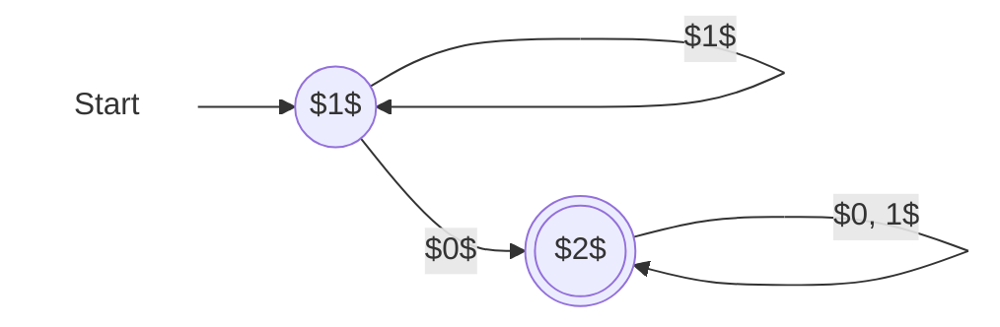

## 概念
### 语言
语言就是字符串的集合
### 文法
一个文法G是一个四元组G=（V,T,P,S）,
其中
> 1. V（Variables）是==变元==的有限集。
> 2. T （Terminal symbols）是==终结符==的有限集。
> 3. P（Productions）是==产生式==的有限集，其中每个产生式都是$\alpha \rightarrow \beta$的形式，其中$\alpha \in (V \cup T)^+$且其中至少有一个V中的符号,$\beta \in (V \cup T)^+$，。$\alpha$称为产生式的左部，$\beta$称为产生式的右部。
> 4. $S\in V$，称为文法G的==开始符号== (Start variable）
### 文法的乔姆斯基体系
- 分类
- 0 型文法
	- 短结构文法：P中产生式无另外的限制
- 1型文法
	- 上下有关文法：$\alpha \rightarrow \beta , 满足 |\alpha| \leq |\beta|$
- 2型文法
	- 上下无关文法：$A\rightarrow \beta , \beta \in (V \cup T),A \in V$
- 3型文法
	- 正则文法：P中产生式$A \rightarrow a 或 A \rightarrow aB , a \in T \cup \{终止符\},A,B \in V$
![[Pasted image 20241226014156.png]]
![[Pasted image 20241225151402.png]]
![[Pasted image 20241225175704.png]]

| 抽象模型         | 对应语言            | 相当于程序或算法                | 文法  |
| ------------ | --------------- | ----------------------- | --- |
| 有穷自动机（FA）    | 正则语言（RL）3型      | If, case, goto, 无变量（内存） |     |
| 下推自动机（PDA）   | 前后文无关语言（CFL），2型 | 增加：堆栈。仍无变量（内存）无数组       |     |
| 线性界限自动机（LBA） | 前后文有关语言（CSL），1型 |                         |     |
| 图灵机（TM）      | 递归可枚举（r.e.），0型  | 输入在语言外时，可能死循环           |     |
### 有穷自动机
- 是一种计算装置（结构、计算机理）、一种计算 模型（表示、计算方法）、与语言（文法、性质）相关
- FA（DFA/NFA）接受的语言是正则语言（Regular Language）。
	- DFA： 一个条件下，只能转移为一种状态
	- NFA：可以同时向多个方向转移
	- DFA 和 NFA 之间的唯一区别在于，$\delta$ 在 DFA 的情况下，返回的是 **单个状态**；而在 NFA 的情况下，返回的是一个 **状态集合**。
		- NFA一入多出
		- NFA中ε可作为条件，即某些状态可无条件跳转
		- NFA works as a tree
- 如果两个FA接受的语言相同，那么，这两个FA是等价 的。 
- 将NFA转化为DFA的方法有两种，即子集构造法和基于 定理3.1（NFA和DFA等价）的方法，两者是等价的。 
- Moore机和Mealy是带输出的有穷自动机
### 正则语言
![[Pasted image 20241225192356.png]]
- Language & Regular language 
	- A language is a set of strings; 
	- language is called a regular language if some finite automaton recognizes it. 
- Regular Operations
	- • Theorem 4.1,4.2 , 4.2.
-  Regular Expressions 
	- The value of a Regular expression is a language. 
	- Theorem 4.4 RL RE ( describes it) 
	- Lemma 4.5 If a language is described by a regular expression , then it is regular 
	- Lemma 4.6 If a language is regular, then it is described by a regular expression
	- $(R^*S^*)^* = (R + S)^*$
- 有限语言符合泵引理，有两种说法： 
	- a) 有限语言没有泵，泵长度p=0；
	- b) 有限语言存在泵，泵长度p≥|Q|；
- ①两个正则语言的并是正则语言。
- ②两个正则语言的连接是正则语言。
- ③正则语言的闭包是正则语言。
- ④两个正则语言的交是正则语言。
- ⑤正则语言（对全集）的补是正则语言。
- ⑥两个正则语言的差是正则语言。
- ⑦正则语言的逆转是正则语言。 
- ⑧正则语言的同态是正则语言。
- ⑨正则语言的逆同态是正则语言。
- 判断下列命题，并证明你的结论
- 正则语言的任意子集都是正则语言。
	- 错误
	- $(0+1)^*$为正则语言,上题(1)(2)(3)为其子集但并非正则语言
- 正则语言的补也是正则语言。
	- 正确
	- 设L为正则语言，由 Myhill-Nerode 定理可得，$𝑅_𝐿$ 具有有穷指数
	- 记 𝐿 的补为 $\bar{𝐿}$则 $∀𝑥 ∈ Σ^∗, 𝑥 ∈ 𝐿 ⇔ 𝑥 ∉ \bar{L}$
	- $x,y,z \in Σ^*,x R_L y \iff$
	- $(xz \in L \iff yz \in L) \iff$
	- $(xz\notin \bar{L}\iff yz \notin \bar{L})$
	- 逆反命题为$(xz\in \bar{L}\iff yz \in \bar{L})$
	- 及$xR_{\bar{L}}y$
	- 因此$\bar{L}$有有穷个等价类
- 无穷多个正则语言的并不一定是正则语言。
	- 正确
	- 如正则语言{01}，$\{0011\}$,$\dots \{0^n1^n\} \dots$
	- 并为$\{x|x=0^i1^i\}$,
	- 可以构造如下类
		-    \[1\]: 0
		-    \[2\]: $0^2$
		-    \[3\]: $0^3$
		- ......
		- \[n\]: $0^n$
	- 任取其中的$[i]=0^i,[j]=0^j ,i \neq j$,
		- $0^i1^i \in L ,0^j1^i\notin L$
		- $0^i,0^j$不是等价类
		- 对于任意个数的0的串都不等价
	- 不是正则语言
### CFG
- 运用
	- 1. 语法分析器：生成描述语言结构特征的语法树 （parse tree）。 
	1. 描述文档格式：如XML中的DTD（描述Web上的 信息交换格式）。 
	2. CFG描述语法结构，RL适用于词法
1. 上下文无关文法CFG的定义，与上下文有关文法CSG的主要区别。
	1. 产生式规则
2. 语法分析树（Parse Tree）充分体现了CFL的结构特征（递归）。
3. 最左派生（leftmost derivation）与最右归约(rightmost reduction)对应，最右派生（rightmost derivation）与最左归约 (leftmost reduction) 对应。 
4. 文法的歧义性由语法分析树决定，与推导无关。有些文法是固有歧义的。 
5. PDA = NFA + Stack，PDA是非确定性的。PDA可以按终态接受方式定 义，也可以按空栈接受方式定义，两者是等价的。 
6. 一个语言是上下文无关的，当且仅当存在一台下推自动机识别它。
7. DPDA接受的语言DCFL是无歧义的，广泛应用于语法分析器。
8. (1) 泵引理：与RL的泵引理类似，CFL的泵引理用来 证明一个语言不是 CFL。
9. (2) CFL 在并、乘、闭包、代换、同态映射、逆同态 映射等运算下是封闭的。 
10. (3) CFL在交、补运算下是不封闭。
11. (4) 存在判定CFG产生的语言是否为空、是否有穷、 是否无穷，以及一个给定的符号串是否为该文法产 生的语言的一个句子的算法。
### 图灵机
	   
- **图灵机基础**
	
	- 图灵机的引入及与其他概念的关系
		- ```
- **示意图**：由控制单元、无限长磁带和读写头组成。读写头可在磁带上移动并读写，控制单元根据当前状态和读取字符决定操作。
- **状态转移图**：用节点表示状态，有向边表示转移，标注读取、写入字符及读写头移动方向。
- **形式化定义**：由 7 元组$(Q,\Sigma,\Gamma,\delta,q_0,q_{accept},q_{reject})$定义，其中\(Q\)为状态集，$\Sigma$为输入字符集，$\Gamma$为带字符集(带上的字符，包括输入字符，但还包括如空格之类的其他符合），$q_0$为开始状态，$q_{accept}$为接受状态，$q_{reject}$为拒绝状态，$\delta$为转移函数。
- **high-level 描述**：用自然语言描述操作逻辑，忽略实现细节。		
	
		
	- 格局的概念、种类及作用
		
- **图灵机的计算与语言识别**
	
	- 计算过程及语言识别的定义
		
	- 图灵可识别与图灵可判定语言的区别
	
		
- **图灵机变种**
	- ```
- **多带图灵机**：有\(k\)条磁带和读写头，由 7 元组$(Q,\Sigma,\Gamma,\delta,q_0,q_{accept},q_{reject})$定义，与单带机等价，可简化计算。
	- 对于每个多磁带 TM M，都有一个单磁带 TM M'，使得  L(M)=L(M’)，对于每个多磁带 TM M，都有一个等效的单磁带 TM M'。
- **非确定性图灵机**：每步有多种选择，由 7 元组$(Q,\Sigma,\Gamma,\delta,q_0,q_{accept},q_{reject})$定义，计算过程用格局树表示，与确定性图灵机等价。
	- 每个非确定性图灵机都有一个等效的确定性
- **枚举器**：由图灵机和打印机组成，是 7 元组$(Q,\Sigma,\Gamma,\delta,q_0,q_{accept},q_{reject})$，若语言可被枚举则图灵可识别。
	
	- 多带图灵机的定义及与单带机的等价性
		
	- 非确定性图灵机的定义及相关定理
		
	- 枚举器的定义及与图灵机识别的关系
		
- **相关理论与问题**
	
	- 与其他计算模型的等价性及丘奇-图灵论题
		
	- 希尔伯特第10问题及相关探讨
		
- **算法描述与可判定性**	
	- 算法描述的三个层次
		- **formal**：用状态图、文法等形式化工具，详细规定状态、转移函数等。
		- **implementation**：用伪代码（如伪 Pascal）描述读写头和磁带操作。
		- **high-level**：用英语抽象描述算法核心思想，忽略细节。
		
	- 可判定性问题的转化及相关讨论
### 计算复杂性
各问题：
![[Pasted image 20241225231644.png]]
1. **时间复杂度基础概念**
    - **运行时间与渐近分析**：确定性图灵机  的运行时间  是其在长度为  的输入上的最大步数。渐近分析中， 表示存在正的常数  和 ，使得  时 ， 是  的渐近上界。例如 ，多项式  满足 （），且指数函数  总是强于多项式，对数函数  且 （）12。
    - **小 o 记号**： 当且仅当 ，与大  记号相比，它表示严格小于的关系3。
2. **不同计算模型下的算法分析**
    - **单带与多带图灵机**：对于判定语言 ，单带图灵机  判断一个串需  时间， 需  时间且此结果在单带机上不可再优化，而多带图灵机  只需  时间。一般来说，每一个  时间的多带图灵机都有一个等价的  时间的单带图灵机45。
    - **确定性与非确定性图灵机**：对于非确定性图灵机 ，其运行时间  是在长度为  的输入的任何计算分支上的最大步数。每一个  时间的非确定性单带图灵机都有一个等价的  时间的确定性单带图灵机67。
3. **问题复杂度类**
    - **多项式时间类** ： 是可以由单带图灵机在多项式时间内判定的语言类，即 。许多常见问题如 （通过宽度优先搜索可在多项式时间内判定有向图中是否存在从  到  的路径）和 （利用欧几里德算法可在多项式时间内判定两个数是否互素）都属于  类。 类具有稳健性，不依赖于特定的计算模型8。
    - **NP 类**：NP 是具有多项式时间验证器的语言类。对于语言 ，验证器  满足  接受  对于某些 ，其中  是证明  的证书。例如 （判定有向图中是否存在哈密顿路径）、（判定一个数是否为合数）、（判定图中是否存在 - 团）和 （子集和问题）等都属于 NP 类。一个语言在 NP 中当且仅当它可以由某个非确定性多项式时间图灵机判定910。
4. **NP 完全性**
    - **定义与性质**：语言  是 NP 完全的，如果满足  且对于每个  都有 。NP 完全问题是 NP 中最难的问题，如果一个 NP 完全问题 ，那么 。如果  是 NP 完全的且 （），那么  是 NP 完全的11。
    - **重要定理与证明**：Cook - Levin 定理证明了  是 NP 完全的。通过构造一个多项式时间的规约函数 ，将任意 NP 问题  规约到 ，即对于每个输入  构造合取范式 ，使得 ，并且从  计算  只需要多项式时间。在此基础上，可进一步证明  也是 NP 完全的，并且  可多项式时间规约到  等问题，从而繁衍出许多其他 NP 完全问题12。
## ⾃动机期末大题 

全是⼤题，5个以内（有⼩题1、2）  

1、给⼀个语⾔，画出⾃动机 P15、23、26、36

- p15
	- 设计一台确定性有穷自动机M，M识别语言 L(M)={ω∈{0,1} * | ω中0的个数是偶数（含０）｝。
	- ![[Pasted image 20241226004734.png]]
- p23
	- 构造一个接受“含有子串011或001”的NFA，字母表为 {0,1}。
	- ![[Pasted image 20241226004934.png]]
- p26
	- 设计一个NFA 识别语言L={ w | w 要么以01开头，要么以01 结尾，w∈{0,1}* }。
- p36
	- 设计一台识别单词web和ebay的NFA
	- ![[Pasted image 20241226005405.png]]

\*2、NFA转DFA（两种⽅法）P32步骤1 - P41 2 - P37 P40 （⼦集构造法） P59 http://blog.csdn.net/aspirinLi/article/details/83959040  
子集构造法
- p41
	- ![[Pasted image 20241226005526.png]]
- 把下列 NFA 转化为 DFA，并且非形式化地描述它接受的语言：

|     | 0      | 1   |
| --- | ------ | --- |
| —>p | {p, q} | {p} |
| q   | {r, s} | {t} |
| r   | {p, r} | {t} |
| `*S`  | ∅      | ∅   |
| *t  | ∅      | ∅   |

- 解答
	- 转为DFA

|             | 0          | 1     |
| ----------- | ---------- | ----- |
| —>{p}       | {p, q}     | {p}   |
| {p,q}       | {p,q,r, s} | {p,t} |
| \*{p,q,r,s} | {p,q,r,s}  | {p,t} |
| \*{p,t}     | {p,q}      | {p}   |


- 它接受倒数第二个字符为“0”的语言。
![[Pasted image 20241010150637.png]]


3 、正则表达式和 NFA/DFA 的 相互转换  

- Regular Expressions Example 4.5  Σ is {0,1}. 
1. 0 ∗10∗ = {w| w contains a single 1}. 
2. Σ ∗1Σ∗ = {w| w has at least one 1}. 
3. Σ ∗001Σ∗ = {w| w contains the string 001 as a substring}. 
4. 1 ∗ (01+ ) ∗ = {w| every 0 in w is followed by at least one 1}. 
5. (ΣΣ)∗ = {w| w is a string of even length}. 
6. (ΣΣΣ)∗ = {w| the length of w is a multiple of 3}. 
7. 01 + 10 = {01, 10}.
8. 0Σ∗0 + 1Σ∗1 + 0 + 1 = {w| w starts and ends with the same symbol}. 
9. (0 + ε)1 ∗ =01∗ ∪1 ∗ .
10. (0 + ε)(1 + ε) = {ε,0,1,01}. 
11. 1 ∗∅ = ∅. 
12. ∅∗ = { ε }. 
13. R + ∅ = R. 
14. R • ε = R. 
15. R • ∅ = ∅.
- 状态消除合并
	- 消除状态 $s$ 时需要清除掉所有与状态 $s$ 相关的转移边。
  

补充：第4章 - P16  
重新编号 $DFA A$ 的状态为 $\{1, 2, \cdots, n\}$，使得 $1$ 为初始状态。设 $R_{ij}^{(k)}$ 表示满足以下条件的串 $w$ 所组成的集合：$w$ 是 $A$ 中从状态 $i$ 到状态 $j$ 的路径的标记，而且这条路径没有编号大于 $k$ 的 **中间顶点**。因此 $i$ 和 $j$ 没有必要不大于 $k$。

最终的 $R$，是所有 $R_{1j}^{(n)}$ 的并，使得状态 $j$ 为一个接受状态。



由 **基础** 部分可得：

|     表达式     |                   值                    |
| :------------: | :-------------------------------------: |
| $R_{11}^{(0)}$ |       $\varepsilon + \mathbf{1}$        |
| $R_{12}^{(0)}$ |              $\mathbf{0}$               |
| $R_{21}^{(0)}$ |              $\varnothing$              |
| $R_{22}^{(0)}$ | $\varepsilon + \mathbf{0} + \mathbf{1}$ |

然后通过 **归纳** 部分递推得出 $R_{ij}^{(1)}$：

$$
R_{ij}^{(1)} = R_{ij}^{(0)} + R_{i1}^{(0)}(R_{11}^{(0)})^*R_{1j}^{(0)}
$$

因此可以得到：

|     表达式     |                         通过直接带入                         |               化简后的值                |
| :------------: | :----------------------------------------------------------: | :-------------------------------------: |
| $R_{11}^{(0)}$ | $\varepsilon + \mathbf{1} + (\varepsilon + \mathbf{1})(\varepsilon + \mathbf{1})^*(\varepsilon + \mathbf{1})$ |             $\mathbf{1}^*$              |
| $R_{12}^{(0)}$ | $\mathbf{0} + (\varepsilon + \mathbf{1})(\varepsilon + \mathbf{1})^*\mathbf{0}$ |        $\mathbf{1}^*\mathbf{0}$         |
| $R_{21}^{(0)}$ | $\varnothing + \varnothing(\varepsilon + \mathbf{1})^*(\varepsilon + \mathbf{1})$ |              $\varnothing$              |
| $R_{22}^{(0)}$ | $\varepsilon + \mathbf{0} + \mathbf{1} + \varnothing(\varepsilon + \mathbf{1})^*\mathbf{0}$ | $\varepsilon + \mathbf{0} + \mathbf{1}$ |

又有

$$
R_{ij}^{(2)} = R_{ij}^{(1)} + R_{i2}^{(1)}(R_{22}^{(1)})^*R_{2j}^{(1)}
$$

因此可以得到：

|     表达式     |                         通过直接带入                         |                     化简后的值                      |
| :------------: | :----------------------------------------------------------: | :-------------------------------------------------: |
| $R_{11}^{(1)}$ | $\mathbf{1}^* + \mathbf{1}^*\mathbf{0}(\varepsilon + \mathbf{0} + \mathbf{1})^*\varnothing$ |                   $\mathbf{1}^*$                    |
| $R_{12}^{(1)}$ | $\mathbf{1}^*\mathbf{0} + \mathbf{1}^*\mathbf{0}(\varepsilon + \mathbf{0} + \mathbf{1})^*(\varepsilon + \mathbf{0} + \mathbf{1})$ | $\mathbf{1}^*\mathbf{0}(\mathbf{0} + \mathbf{1})^*$ |
| $R_{21}^{(1)}$ | $\varnothing + (\varepsilon + \mathbf{0} + \mathbf{1})(\varepsilon + \mathbf{0} + \mathbf{1})^*\varnothing$ |                    $\varnothing$                    |
| $R_{22}^{(1)}$ | $\varepsilon + \mathbf{0} + \mathbf{1} + (\varepsilon + \mathbf{0} + \mathbf{1})(\varepsilon + \mathbf{0} + \mathbf{1})^*(\varepsilon + \mathbf{0} + \mathbf{1})$ |            $(\mathbf{0} + \mathbf{1})^*$            |

在此例中，$1$ 是初始状态，$2$ 是唯一一个接收状态，则整体的正则表达式为 $R_{12}^{(2)} = \mathbf{1}^*\mathbf{0}(\mathbf{0} + \mathbf{1})^*$。

它表示的是“至少含有一个 0 的 01 串”组成的集合。

DFA 转 language exp4.8 要么直接过去，要么借助要删的那个点过去  
- 给定一个DFA M，按照证明方法二 构造一个正则表 达式代表L(M)
- ![[Pasted image 20241226010805.png]]
- 分析： 1. 共3个状态，n=3；k＝0，1，2，3； 2. 根据递归公式求，其中k=0，1，2
- ![[Pasted image 20241226011251.png]]
- ![[Pasted image 20241226012222.png]]

### 泵引理证明⼀个语⾔不是正则语⾔
证明下列语言都不是正则的：
- e） 由 0 和 1 构成的 𝑤𝑤 形式的串的集合，也就是某个串重复的串集合。
- f） 由 0 和 1 构成的 $𝑤𝑤^𝑅$ 形式的串的集合，也就是由某个串后面跟着它的反转所构成的串的集合。（一个串的逆的形式化定义见 4.2.2 节。）
- g） 由 0 和 1 构成的 $w\overline{w}$ 形式的串的集合，其中  $w\overline{w}$  是把 𝑤中所有的 0 都换成 1 同时把所有的 1 都换成 0 而得到的串，例如，$\overline{011} = 100$，因此 011100 是该语言中的一个串。
- h） 所有由 0 和 1 构成的 $𝑤1^𝑛$ 形式的串的集合，其中 𝑤是由 0 和 1 构成的长度为 𝑛 的 串。
### e)
- 假设该语言 𝐿 是正则的，则存在一常数n使得𝐿满足泵引理即 𝐿的泵长度为 n 。
- 构造串$0^n10^n1$,$|0^n10^n1|\geq n$
- s 前p 个字符串都是0 ，所以根据泵引理，y 必然由0组成。
	- $x=0^{n-m},y=0^m,z=10^n1,xyyz=0^{n+m}10^n1$不属于𝐿
- 所以该语言 𝐿 不是正则的
### f）
- 假设该语言 𝐿 是正则的，则存在一常数n使得𝐿满足泵引理即 𝐿的泵长度为 n 。
- 构造串$0^n110^n$,$|0^n110^n|\geq n$
- s 前p 个字符串都是0 ，所以根据泵引理，y 必然由0组成。
	- $x=0^{n-m},y=0^m,z=110^n,xyyz=0^{n+m}110^n$不属于𝐿
- 所以该语言 𝐿 不是正则的
### g）
- 假设该语言 𝐿 是正则的，则存在一常数n使得𝐿满足泵引理即 𝐿的泵长度为 n 。
- 构造串$0^n11^n0$,$|0^n11^n0|\geq n$
- s 前p 个字符串都是0 ，所以根据泵引理，y 必然由0组成。
	- $x=0^{n-m},y=0^m,z=11^n0,xyyz=0^{n+m}11^n0$不属于𝐿
- 所以该语言 𝐿 不是正则的
### h）
-  假设该语言 𝐿 是正则的，且 𝐿的泵长度为 p。
- 构造串s=$1^{2n}$,
-  s 前p 个字符串都是1 ，所以根据泵引理，y 必然由1组成。
-  $x=1^{p-m},y=1^m,z=1^{2n-p},xyyz=1^{n+m}1^n$, $w=1^{n+m},|w|大于 n$，s不属于𝐿
- 所以该语言 𝐿 不是正则的

第5章 - P15eg1.  $0\!\sim\!\mathrm{i}\!\uparrow\!\sim\!\mathrm{j}(\!\mathrm{i}\!=\!\mathrm{j})$  eg2.  $0{\sim}(\mathsf{n}{\sim}2)(\mathsf{n}{>}{=}0)$  eg3.  ${0}^{\wedge}{\mathsf{p}}$  (p is prime) eg4. ww  $\scriptstyle\left(\mathsf{W}=\{0,1\}^{*}\right)$   (let  ${\mathsf{W}}{=}0{\land}{\mathsf{p}}1$   to separate 0s) eg5. xy(  $\rvert\lvert\mathsf{x}\rvert=\rvert\mathsf{y}\rvert$   and  $\mathsf{x t}\!\!:\!\!\mathsf{=}\!\mathsf{y}$  )  
\* 善于⽤ 1 对 0 串进⾏分割 再论泵引理 - P95  
### 扩充泵
用正则语言的扩充泵引理证明语言$\{0^n1^m0^m，n, m≥1\}$不是正则的。
- 考察字符串 $0^𝑛1^k0^𝑘$，其中 𝑥 = 0^𝑛, 𝑦 = 1^𝑘, 𝑧 = 0^𝑘。将 𝑦 分解为 𝑦 = 𝑢vw，则 𝑣 是由 1 构成的非空字符串。
- 因此，$𝑥u𝑣^𝑖𝑤z = 0^𝑛1^{𝑘+(𝑖−1)|𝑣|} 0^𝑘$；当 𝑖 ≠ 1 时，$𝑥u𝑣^𝑖𝑤z$ ∉ 𝐿。
- 由此可得语言$\{0^n1^m0^m，n, m≥1\}$不是正则
### ⾃动机的等价
（重点！！）P43、44？  

  
### Myhill–Nerode 定理

#### 等价  Myhill-Nerode 关系
设串$x,y,z⊆Σ^∗$ ，L为 $Σ^*$上语言，
- $xz \in L,yz \in L \rightarrow x,y右不变的等价关系，$用字母R表示
- $\delta(q_i,x)=\delta(q_i,y) \iff x,y等价$
证x,y不等价
- $xz_1 \in L,yz_1 \notin L$
设字母表Σ,R是$Σ^∗$上的等价关系,则称$|\frac{Σ^∗}{R}|$是R关于$Σ^∗$的**指数**,简称R的指数.$\frac{Σ^∗}{R}$中的每个元素是R的一个等价类
- 对于DFA，最小化和指数=状态数
#### 定理
 - x,y等价，则称他们属于同一个等价类
 - 对于语言L，右不变等价类有限(称为RL)$\iff$L为正则语言
\[**例6.2.2**\] 下图所示的DFA M的所确定的等价关系R的指数为6.  


R将Σ∗分为6个等价类:

(1)$set(q_0)=\{(00)^n| n\geq 0\}$
(2)$set(q_1)=\{0(00)^n\mid n\geq0\}$
(3)$set(q_2)=\{(00)^n 1\mid n\geq 0\}.$
(4)$set(q_3)=\{0(00)^n 1\mid n\geq 0\}.$
(5)$set(q_4)=\{0^n 1 0^k\mid n\geq 0,k\geq 1\}.$
(6)$set(q_5)=\{x\mid x\text{至少包含两个}1\}.$
![[Pasted image 20241226020154.png]]

证否：划分⽆穷等价类 $->$ 取不同类的x,y，证明存在z使xz属于L⽽yz不属于L->⽆穷性成⽴- $\cdot>$ ⾮RL  

eg. $a^mb^n(m>n)/0^n1^n(n>=0)$

证明 RL ：划分有穷等价类 / 构造 RE/ 构造 FA  
第6章P5 例 3 s->A1A1A1A,A-  $\cdot>$  0A|1A|ε      例4 s->ss|0s1|1s0|ε  

all non-palindromes string s->0s0|1s1|1x0|0x1( 两侧不对称了才能从 s 出去 ) x->0x|1x|ε(已经⾮回⽂串，中间⽆所谓)  
利用 Myhill-Nerode 定理证明下列语言是否正则语言，如果是正则语言，请构造其FA、RE 及 RG。
- 1）$\{ x|x=x^R,x \in \{0,1\}^+\}$($x^r$指x的反)
	- 可以构造如下类
		-    \[1\]: 0
		-    \[2\]: $0^2$
		-    \[3\]: $0^3$
		- ......
		- \[n\]: $0^n$
	- 任取其中的$[i]=0^i,[j]=0^j ,i \neq j$,
		- $0^i10^i \in L ,0^j10^i\notin L$
		- $0^i,0^j$不是等价类
		- 对于任意个数的0的串都不等价
	- 等价类无穷，所以不是正则语言
- 2) $\{ x| 𝑥 中 0 的个数不少于 1 的个数,x \in {0,1}^+\}$
	- 可以构造如下类
		-    \[1\]: 0
		-    \[2\]: $0^2$
		-    \[3\]: $0^3$
		- ......
		- \[n\]: $0^n$
	- 任取其中的$[i]=0^i,[j]=0^j ,i > j$,
		- $0^i1^i \in L ,0^j1^i\notin L$
		- $0^i,0^j$不是等价类
		- 对于任意个数的0的串都不等价
	- 等价类无穷，所以不是正则语言
- 3) $\{xx^Rw|x,w \in {0,1}^+\}$
	- 可以构造如下类
		-    \[1\]: 01
		-    \[2\]: $0^21^2$
		-    \[3\]: $0^31^3$
		- ......
		- \[n\]: $0^n1^n$
	- 任取其中的$[i]=0^i1^i,[j]=0^j1^j ,i \neq j$,
		- $0^i1^i1^i0^i \in L ,0^j1^j1^i0^i\notin L$
		- $0^i1^i,0^j1^j$不是等价类
		- 对于任意个数n的n个0n个1的串都不等价
	- 等价类无穷，所以不是正则语言
### 最小化
用以下流程可以最小化一个 DFA：
1. 排除所有不能从初始状态到达的状态
2. 找出所有不等价的状态，剩下的为等价状态
	1. 可接受与不可接受不等价
	2. 同样条件到达2个不等价状态的状态不等价：$qi \neq qj ,𝛿(q_a,x)=q_i,𝛿(q_b,x)=q_j \iff q_a \neq q_b$
3. 将所有等价的状态划分到同一个连通块
对下图给出的DFA，求出它的极小状态DFA，要求给出主要的求解步骤。
![[Pasted image 20241127202427.png]]
- 可接受不可接受不等价
![[1732816117154-screenshot.png|200]]
-  $qi \neq qj ,𝛿(q_a,x)=q_i,𝛿(q_b,x)=q_j \iff q_a \neq q_b$
![[1732816121041-screenshot.png | 200]]
- 得q1等价于q5,q2等价于q4
![[Pasted image 20241129012155.png]]

### 将上下⽂⽆关语⾔转化为PDA
（基本上会考）  

第6章P24 
![[Pasted image 20241226014535.png]]P25 
![[Pasted image 20241226014558.png]]
-  中间加⼀句 e,e->e 
- P34 
![[Pasted image 20241226014643.png]]
- P35 
- 作业补充题P36 例 12  
![[Pasted image 20241226014723.png]]
###  歧义
⼀个语⾔可能对应多种⽂法，只要有⼀种不歧义，语⾔就不歧义；语言中的一串对应多棵语法分析树则歧义。
- 下面的文法生成的是具有 $x$ 和 $y$ 操作数及二元运算符 $+, -, *$ 的前缀表达式:$$E → +EE | -EE | *EE | x | y$$a) 找到串 $+*-xyxy$ 的最左推导、最右推导和一棵语法分析树。
 - 最左推导(优先最左的变元)
	 - $E\implies +EE \implies +*EEE\implies +*-EEEE$
	 - $\implies +*-XEEE \implies +*-xyEE$
	 - $\implies+*-xyxE \implies +*-xyxy$
 - 最右推导(优先最右的变元)
	 - $E\implies +EE\implies+Ey\implies+*EEy$
	 - $\implies+*Exy\implies+*-EExy$
	 - $\implies+*-Eyxy\implies+*-xyxy$
 - 语法分析树
 ```mermaid
graph TD
style A stroke:none,fill:none
style B stroke:none,fill:none
style C stroke:none,fill:none
style D stroke:none,fill:none
style X stroke:none,fill:none
style Y stroke:none,fill:none
style Z stroke:none,fill:none
E--> A(+)
E--> E1
E--> E2
E1(E)--> B(*)
E1(E) --> E3(E)
E1(E) --> E4(E)
E2(E) --> Z(y)
E3(E)--> E5(E)
E4(E) --> Y(x)
E5(E) --> C(—)
E5(E) --> D(x)
E5(E) --> X(y)
```

b) 证明这个文法是无歧义的。
- 对于$E → +EE | -EE | *EE | x | y$
- 先证操作符与操作数的分组方式是唯一的
	- 前缀表达式中的操作符 +,−,∗ 必须始终**作用于**其后紧随的两个子表达式（操作数或子树）。
	- 操作符的个数与操作数的个数满足严格的关系：
	    - 操作符个数始终比操作数个数少 1。
	- 因此，对于任意字符串，操作符与操作数的分组方式是唯一的。
- 归纳证明语法分析树都是唯一
	-  **基础情况**: 若 EEE 推导出 xxx 或 yyy，则语法分析树只有一个叶子节点，结构唯一。    
	- **归纳假设**: 假设对于长度为 k 的表达式，语法分析树是唯一的。    
	- **归纳步骤**: 对于长度为 k+1的表达式：    
	    - 若 $E→+EE∣−EE∣∗EE$，操作符 +,−,∗将表达式分成两个子表达式 E和 E。
	    - 根据归纳假设，这两个子表达式的结构是唯一的。
	    - 操作符的位置固定，两个子表达式的顺序确定，因此整个表达式的语法分析树是唯一的。
根据数学归纳法，文法生成的所有表达式的语法分析树都是唯一的。因此是无歧义的

8、上下⽂⽆关⽂法的化简（转乔姆斯基范式）基本上会考这个的泵引理不考！！第7章P19 、 GNF - P22  

  
