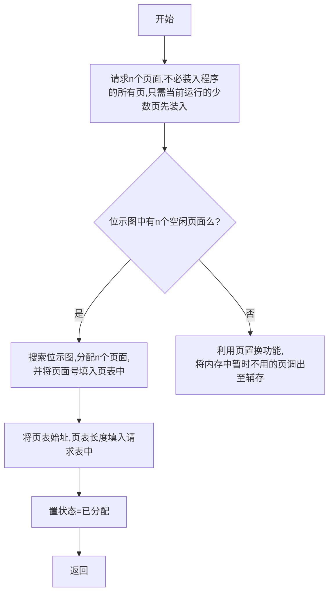

## 绪论
- 计算机组成
	- input
	- 内存
	- processing（处理器）
	- 输出
- 操作系统保证程序在CPU上高效执行
- 程序到可执行文件
	- 高级语言源代码  编译器编译
	- 汇编代码  汇编器汇编
	- 机器语言（不同CPU不同）  链接器链接
	- 可执行文件
- CPU寄存器
	- ![[Pasted image 20241031085242.png]]
- 设置操作系统的目的
	- (1)组织和管理系统中的软硬件资源;
	- (2)向应用程序提供高质量的服务;
	- 3)为用户提供易于理解和编程的接口
	### 1.操作系统的目标和功能

操作系统是控制应用程序执行的**系统程序**，并充当应用程序和计算机硬件之间的接口

-   作为用户/计算机接口
-   作为资源管理器（操作系统控制处理器使用其他系统资源，并控制其他程序的执行时机）
-   易扩展性

### 2.操作系统的发展
0. 无操作系统：人工操作
	- 用户独占全机
	- CPU等待人工操作
	- 程序和数据的输入输出在外围机控制下完成
1.  **串行处理**：程序员直接与计算机硬件打交道，因为当时还没操作系统。这些机器在一个控制台上运行，用机器代码编写的程序通过输入设备载入计算机。如果发生错误使得程序停止，错误原因由显示灯指示。如果程序正常完成，输出结果出现在打印机中
2.  **简单批处理系统**：中心思想是使用一个称为监控程序的软件。通过使用这类操作系统，用户不再直接访问机器，相反，用户把卡片或磁带中的作业提交给计算机操作员，由他把这些作业按顺序组织成一批，并将整个批作业放在输入设备上，供监控程序使用。每个程序完成处理后返回到监控程序，同时，监控程序自动加载下一个程序
	- 作业处理成批进行
	- 内存中只驻留一道作业
	- <span style="background:#b1ffff">顺序执行</span>，单道，自动
	- <span style="background:#b1ffff">封闭</span>:程序执行时独占全机,结果不受外界影响。
	- <span style="background:#b1ffff">可再现</span>:只要执行时的环境和初始条件相同,结果即相同。	- ![[Pasted image 20241031090604.png]]
1.  **多道批处理系统**：简单批处理系统提供了自动作业序列，但是处理器仍经常空闲，因为对于I/O指令，处理器必须等到其执行完才能继续。内存空间可以保持操作系统和一个用户程序，假设内存空间容得下操作系统和两个用户程序，那么当一个作业需要等到I/O时，处理器可以切换到另一个可能不需要等到I/O的作业。进一步还可以扩展存储器保存三个、四个或更多的程序，并且在他们之间进行切换。这种处理称为多道程序设计或多任务处理，是[现代操作系统](https://zhida.zhihu.com/search?q=%E7%8E%B0%E4%BB%A3%E6%93%8D%E4%BD%9C%E7%B3%BB%E7%BB%9F&zhida_source=entity&is_preview=1)的主要方案
	- 自动，并发，多道，资源共享
	- 多道性:计算机内存中同时存在多个相互独立的程序;
	- 宏观上并发执行:同时进入系统的几道程序都处于运行状态;
	- 微观上串行执行:各作业交替使用CPU。
	- 间断:相互制约导致并发程序具有“执行一暂停一执行”这种间断性的活动规律。
	- 开放:多个程序共享系统中的资源。
	- 不可再现:结果与并发程序的执行速度有关。
1.  **[分时系统](https://zhida.zhihu.com/search?q=%E5%88%86%E6%97%B6%E7%B3%BB%E7%BB%9F&zhida_source=entity&is_preview=1)**：正如多道程序设计允许处理器同时处理多个批作业一样，它还可以用于处理多个交互作业。对于后一种情况，由于多个用户分享处理器时间（**时间片轮转**），因而该技术称为分时。在分时系统中，多个用户可以通过终端同时访问系统，由操作系统控制每个用户程序以很短的时间为单位交替执行

以下为多道批处理系统与分时系统的比较

|  | 批处理多道程序设计 | 分时 |
| --- | --- | --- |
| 主要目标 | 充分使用处理器 | 减小响应时间 |
| 操作系统指令源 | [作业控制语言](https://zhida.zhihu.com/search?q=%E4%BD%9C%E4%B8%9A%E6%8E%A7%E5%88%B6%E8%AF%AD%E8%A8%80&zhida_source=entity&is_preview=1)；作业提供的命令 | 终端输入的命令 |

### 3.现代操作系统

对操作系统要求上的变化速度之快不仅需要修改和增强现有的操作系统体系结构，而且需要有新的操作系统组织方法。在实验用和商用操作系统中有很多不同的方法和设计要素，大致分为以下几类：

-   微内核体系结构
-   多线程
-   对称多处理
-   [分布式操作系统](https://zhida.zhihu.com/search?q=%E5%88%86%E5%B8%83%E5%BC%8F%E6%93%8D%E4%BD%9C%E7%B3%BB%E7%BB%9F&zhida_source=entity&is_preview=1)
-   面向对象设计

**大内核**：至今为止大多数操作系统都有一个单体内核，操作系统应该提供的大多数功能由这些大内核提供，包括调度、文件系统、网络、设备管理器、存储管理等。典型情况下，这个大内核是作为一个进程实现的，所有元素共享相同的地址空间

**微内核**：微内核体系结构只给内核分配一些最基本的功能，包括地址空间，进程间通信和基本的调度。其它操作系统服务都是由运行在用户态下且与其他应用程序类似的进程提供，这些进程可以根据特定应用和环境定制。这种方法把内核和服务程序的开发分离开，可以为特定的应用程序或环境要求定制服务程序。可以使系统结构的设计更简单、灵活，很适合于分布式环境
- 特性
	- 不确定性：走走停停，不可再现
	- 共享性：同时互斥
	- 虚拟性：物理地址，逻辑地址
	- 并发性：程序的并发执行是现代操作系统的基本特征之一，为更好描述这一特征引入进程概念
		- 多个进程实体可同时存在于内存

### UNIX系统
- 精巧的核心与丰富的实用层
	- 内核:进程管理、存储管理、设备管理、文件管理等。内核设计精干简洁。只占用很小的内存并常驻内存。
	- 核外程序:语言处理程序、编辑程序、调试程序、系统状态监控和文件管理程序、命令解释程序shell
- 使用灵活的用户界面
	- 命令程序设计语言Shell:是一种命令语言,也是一种程序设计语言。
	- 程序接口:即:系统调用,包括汇编语言和C语言的。
- 树形结构的文件系统
- 文件和设备统一看待
- 自好的移植性
![[Pasted image 20241031091901.png]]
- 硬件控制：负责处理中断和与机器通讯
## 并发
### 进程的基本概念

|     | 程序                                           | 进程                               |     |
| :-: | -------------------------------------------- | -------------------------------- | --- |
|     | 一组数据与指令代码的集合                                 | 代码段、数据段、堆栈段、 进程控制块               |     |
|     | <span style="background:#b1ffff">静态</span>存放 | <span style="background:#b1ffff">动态</span>，生命周期：**由创建而产生，由调度而执行，由撤销而消亡** |     |
**进程是程序的一次运行**
- 多个进程实体尖儿同时在内存中并发执行
- 独立运行，独立分配资源和独立接受调度的基本单位
- 按不可预知（异步）的速度向前
**进程管理**
- 每个进程具有一个<span style="background:#b1ffff">PCB（process Control Block,）</span>操作系统最重要的记录型数据结构
- 操作系统所需的、用于描述进程的当前状况以及控制进程运行的全部信息
- PCB是进程存在的唯一标志
- 进程整个生命周期中，系统通过PCB对进程进行控制
- PCB组织方式
	- 按队列方式（执行队列，就绪队列，阻塞队列，空闲队列）组织PCB
	- 按索引方式（执行指针，就绪表指针，阻塞表指针）组织PCB
![[Pasted image 20241031092626.png]]
#### 进程创建与终止
- 创建
	- 过程
		- 申请空白PCB
		- 2.为进程分配资源（内存空间
		- PCB初始化（标识、处理机状态、进程调度信息
		- 进入就绪队列（活动？静止？
	- 引起进程创建的事件
		- 用户登录
		- 作业调度
		- 提供服务
		- 应用请求
- 父子
	- 父进程创建子进程子进程拥有父进程的资源
	- 子进程撤销时，资源归还父进程
	- 父进程撤销时，撤销所有子进程
- 终止
	- 过程
		- 从PCB中读出该进程的状态
		- 2.立即终止该进程的执行
		- 3.终止其所有子孙进程
		- 4.释放全部资源
		- 5.移除该进程PCB
		- 6.进程切换调度
	- 引起进程终止的事件：
		- 正常结束
		- 异常结束
		- 外界干预（人为、父进程）
### 处理机调度
- 多道批处理技术下，作业的四个阶段：
	- 提交
	- 后备
	- 运行
		- 就绪->执行->阻塞
		- 执行：占用CPU并在CPU上运行
			- 可以申请获得其他资源
		- 就绪状态（可运行；但CPU被占用，暂时无法运行
		- 阻塞状态（无法运行，直到某一外部事件发生）
		- 非执行的进程也可占有除cpu外的资源
		- 阻塞->就绪：等待的外部事件发生被唤醒
		- 就绪->执行（上台）：进程被调度
		- 执行->阻塞（下台：非抢占式/进程主动放弃）：进程由于等待某种外部事件被阻塞
		- 执行->就绪（下台：抢占式/剥夺式调度）：将CPU让给另一个进程
			- 时间片到
			- 更高优先级进程
	- 完成
![[1726127148240-screenshot.png]]
#### 作业调度
- 作业从没被创建进程到创建进程
	- 按照一定的策略选取若干作业调入内存
	- 创建进程，分配资源
	- 如创建成功，将新创建的进程插入就绪队列
- 切换进程调度流程
	- 保存现执行进程工作现场（CPU寄存器信息）信息在其PCB中
	- 选择另一个就绪进程，状态“就绪”→“执行”
	- 用该进程PCB中的工作现场信息恢复现场
- 过程（从后备队列中选取调入就绪队列或阻塞队列）
	1. 按照一定策略选取若干作业调入内存
	2. 创建进程，分配资源
	3. 创建进程成功则将次进程加入就绪队列
三级调度队列模型
![[1726127416597-screenshot.png]]
就绪挂起即静止就绪，就绪→静止就绪：系统用挂起原语suspend主动将其挂起

- 
#### 调度算法
- 分类
	- 抢占式：进程执行中，调度程序可随时停止其执行，将处理机分配给新出现的优先级更高的进程。
		- 实时系统、交互系统
	- 非抢占式：进程一直运行到完成；或发生某事件而阻塞，系统将处理机分配给另一个优先级最高的进程。
		- 批处理系统、要求不高的实时系统
		- 由阻塞程序完成
			- 立即停止执行
			- PCB中的进程状态“执行”→“阻塞”
			- PCB进入阻塞队列
			- 由调度程序完成进程切换调度

- 选择调度算法的准则
	1. 调度算法的开销
	2. 相关数据结构的维护
	3. 不同调度对象
		1. I/O密集型
		2. CPU密集型
		3. 长作业
		4. 短作业
	4. <span style="background:#b1ffff">周转时间</span>：= 作业完成时间 – 作业提交时间= 作业运行时间 + 作业等待（后备）时间
	5. 平均带权周转时间=$\frac{\sum\frac{周转时间}{服务时间}}{作业数}$
	1. 响应速度快
	2. 截至时间保证
	3. 高优先权优先

##### FIFO 先来先服务
- 选后备队列中最先进入的一个或多个进入就绪队列
- 优点：非抢占式，实现简单。
- 缺点：
	1. 长作业（进程）有利，短作业（进程）吃亏；
	2. CPU密集型作业（进程）有利， I/O密集型作业（进程）吃亏。
##### 短作业优先SJ
- 每次选取运行时间最短的作业进入就绪队列，非抢占式（即不会打断已在CPU上的进程）
- 优点：当所有作业/进程同时到达时，平均周转时间最短
- 缺点：
	1. 短作业（进程）有利，长作业（进程）吃亏；
	2. 未考虑作业（进程）的紧迫程度
![[1726128415326-screenshot.png]]
##### 短进程优先PF
- 进程调度时，最短剩余时间优先，抢占式：正在运行的进程剩余时间大于已到达进程的剩余时间则抢占
- 优缺点同上
![[1726128770475-screenshot.png]]
##### 时间片轮转调度算法（RR）
分时系统的进程调度
- 进程调度
	- 每个进程轮流使用CPU固定时间片后将CPU让给其它进程，自己进入就绪队列等待下一轮调度。
	- 抢占
- 优点：各进程能够比较均衡地共享使用处理机。
- 缺点：统的效率与时间片的设置密切相关。
	- 时间片过大，与用户的交互性就差；
	- 时间片过小，进程间切换过于频繁，一个进程需要轮转多次才能到达终点，系统开销就会增大
![[1726129747614-screenshot.png]]
##### 多级反馈队列调度算法
- 设置多个队列，每个队列采用不同时间片，优先级越高的队列时间片越小
- 清空优先级高的的队列再调度下一优先级队列
- 一个进程若未在时间片内执行完则进入下一个优先级队列，每个队列都先来先服务
##### 最高优先权优先调度算法FPF
- 非抢占
	- 进程一直运行到完成；或发生某事件而阻塞，系统将处理机分配给另一个优先级最高的进程
	- 批处理系统、要求不高的实时系统
- 抢占
	- 进程执行中，调度程序可随时停止其执行，将处理机分配给<font color="#d99694">新出现</font>的优先级更高的进程。
	- 实时系统、交互系统
- 静态优先权：优先权在进入就绪队列后不变
	- 优点： 简单，不需要维护优先权。
	- 缺点： 高者恒高，不断地有高者转为就绪的话，低者将会“饥饿”。
	- 优先权设置
		- 进程类型：系统进程>用户进程
		- 资源需求：需求少的>需求多的
![[1726131014101-screenshot.png]]
注：优先级：C>B>A,抢占式调度
- 动态优先权：系统为刚生成的进程赋初始优先权，之后根据进程的行为动态调整优先权的值
- 防止高者恒高，低者“饥饿
- 调整方法：
	- 正在使用CPU的进程优先级下降；
	- 很久未得到CPU的进程优先级升高；
	- I/O密集型进程拥有较高的优先权
- 调整时机：
	- 间隔太短，开销太大；
	- 间隔太长，不能及时反映变化
	- 一般选择调度、 时钟中断、 陷入等时机调整

### 死锁
- 一个进程集合中的每个进程都等待着永远都不会发生的事件而形成一种永久阻塞状态
- 产生原因
	1. 资源竞争引起资源死锁
	2. 进程推进顺序不当造成死锁
例子：
![[1726131720816-screenshot.png]]
- 成环则说明死锁
- 图中圆圈表示进程，方块表示资源，
	- 箭头从进程指向资源： 进程请求该资源，
	- 箭头从资源指向进程： 进程已获得并保持该资
- 上图将第6步换成A Release S 则不会死锁
#### 产生死锁的必要条件
1. <span style="background:#b1ffff">互斥条件</span>：即在一段时间能某资源只能由一个进程占用。如果此时还有其他进程请求使用该资源，则请求者只能等待，直至占用该资源的进程用毕释放。
2. <span style="background:#b1ffff">请求和保持</span>：进程已经保持了至少一个资源，但又提出了新的资源请求，而该资源又已被其他进程占用，此时请求进程阻塞，但又对自己已获得的其他资源保持不放。
3. <span style="background:#b1ffff">不剥夺</span>：指进程已获得的资源，在未使用完之前，不能被剥夺，只能在使用完后由自己释放。
4. <span style="background:#b1ffff">环路等待/循环等待资源</span>：指在发生死锁时， 必然存在由两个或多个进程构成的环形链，环形链中的每一个进程都在等待下一个进程释放其占用的资源。
#### 预防死锁
- 通过施加限制条件，破坏死锁的四个必要条件
- 不可能破坏必要条件1：一段时间能某资源只能由一个进程占用
- 破坏必要条件2：进程已经保持了至少一个资源，但又提出了新的资源请求
	- 静态分配资源：一次性请求所有需要的资源，只有当所有资源都可用时才分配给进程
		- 缺点：资源浪费验证进程延迟执行
- 破坏必要条件3：在未使用完之前，不能被剥夺资源
	- 剥夺资源：允许系统抢占部分或全部资源，确保高优先级的讲程能够及时获得所害的资源，这可能涉及到挂起低优先级的进程，以便为高优先级进程腾出资源。
		- 缺点：实现代价大，一般适用于易保存和恢复状态的资源（CPU）
- 破坏必要条件4：循环等待：资源按序分配
	- 避免环路：
		- 首先给系统中的资源编号，规定每个进程必须按编号递增的顺序请求资源， 同类资源（即编号相同的资源）一次申请完
		- 一个进程只有已占有小编号的资源时，才有资格申请更大编号的资源。按此规则，已持有大编号资源的进程不可能逆向地回来申请小编号的资源，从而就不会产生循环等待
	- 缺点：顺序难确定，新设备加入困难
#### 避免死锁——银行家算法
- 允许进程动态地申请资源，但系统在进行资源分配之前，首先计算此次资源分配的安全性，若此次分配不会导致系统进入不安全状态，则将资源分配给进程，否则进程等待。
##### 计算是否安全——银行家算法
1. 根据目前各进程状态得到最大需求矩阵Max，已分配资源矩阵Allocation，需求矩阵Need（Max=Allocation+Need）,目前系统中可利用资源向量Available
2. 根据新的请求得到请求资源向量Request
3. 根据request更新1中矩阵
4. <span style="background:#b1ffff">查找Need中是否有某一行都＜Avaliable</span>
5. 是，则说明这一进程可执行结束，则假设其执行结束释放全部资源，更新Available
6. 重复4
7. 若每一行都可执行结束则安全。
例子：![[1726133740010-screenshot.png]]
![[1726133748815-screenshot.png]]
![[1726133758731-screenshot.png]]
![[1726133767627-screenshot.png]]
##### 检测死锁
在资源分配图中检测到环路。环路中的进程为发生死锁的进程
##### 解除死锁
• 终止所有死锁进程
• 逐个终止死锁进程，直至死锁不再存在（应从终止代价最小的进程开始）。
• 强迫死锁进程释放资源（以损失最小为依据）
- 剥夺资源
### UNIX的进程
- UNIX中进程的两种执行状态

|     | 用户态       | 核心态       |
|:---:| ------------ | ------------ |
|     |   无权执行特权指令 |  执行所有特权指令（输入输出、内存存取、寄存器读写，开关中断、停机）
|     | 执行用户程序 | 执行内核程序 |
|     | 代码段、数据段、用户栈|proc表、text表、核心栈|

>[!note]
>两态可相互转换
>内核不是与用户进程平行运行的，是孤立进程的集合

#### UNIX进程结构特征
- 磁盘中可执行文件结构
	- 文件头：
		- 申明TEXT段，Data段，BSS段长度
		- 注 bss段：存放程序中未初始化的全局变量和静态变量，可读可写，程序执行时这段自动清0
	- text段：
		- 用户创建的可执行文件中的指令代码进程用户态下执行的机器指令（不会跳转到别的进程的指令序列上），可读写自己的数据段和栈段
	- 数据段：
		- Data段：进程用户态下执行所需的数据（全局变量）
		- bss段为未初始化数据不用可执行文件记录信息
		- 二者合为数据段最小长度，数据段应该为页的大小4k的整数倍
- 可执行文件读入内存
![[1726298998559-screenshot.png]]
- 可执行文件运行
	- 产生用户栈
		- 存放局部变量，函数参数，返回地址，栈基址
		- 进程在用户态下运行时的工作区，系统自动创建，运行过程中可由内核动态调节
![[1726299910266-screenshot.png]]
#### 核心态所需内存空间
- 物理内存的0～ 4M是内核代码驻留区域（常驻内存），包括：
	- proc表：
		- 很多块，每个进程占用表中一块
		- 每一块存放一个进程中不管进程是否在处理机上，系统都需要查询和修改的控制信息
	- text表：
		- 代码控制块表，一个代码段一个
- 核心栈：
	- text表运行时使用
![[1726301716031-screenshot.png]]
#### 函数调用时的出处理方式
- 用到的寄存器
	- ebp：栈基址：存储前一栈的栈基址
	- esp：栈顶
		- esp到ebp的空间为现在这在使用的栈空间
	- eip：下一步指令地址
	- eax：存放函数返回的值
##### 过程
- 调用函数前，在被调用函数中完成：
	1.  以esp为栈顶，逆序压入参数的值（参数存放的位置在ebp往下）
	2. 压入返回地址到栈中
	3. 调用函数入口地址放入eip
- 调用函数时：
	5. 将ebp的值压入栈中
此时栈的情况
![[1726296207539-screenshot.png]]
		5.  改变ebp为esp，将esp往上移（变小），留出新的栈空间用于放调用函数内的局部变量
		6.  运行函数
![[1726296590681-screenshot.png]]
- 函数运行结束
	7. 把返回值存入eax寄存器
	8. 删除局部变量区，即移动esp至ebp处
![[1726297323423-screenshot.png]]
	10. 改变ebp的值为栈顶的值，并将此值出栈（即下移esp）
![[1726297338002-screenshot.png]]
	12. 从栈顶弹出返回地址装入EIP
	13. 删除参数（将esp下移）
![[1726297359868-screenshot.png]]
>[!note]
>esp：永远指向现在使用的栈的栈顶
>当esp和ebp相同时，说明这个函数运行完，ebp变为此时指向的地址。

### 进程图像的实现
#### process类 
- 作为进程基础控制块
- 在物理地址0-4M区
- 每个进程一个，作为pro表的一项方便访问
- 主要功能
	- 进程标识
	- 进程（可交换部分）位置信息
	- 进程调度
		- 优先级计算
		- 状态转换
	- 信号控制

| 名称         | 类型            | 含义                             |     |
| ---------- | ------------- | ------------------------------ | --- |
| p_uid      | short         | 用户ID                           |     |
| p_pid      | int           | 进程编号                           |     |
| p_ppid     | int           | 父进程编号                          |     |
| **p_addr** | unsigned long | ppda区（核心栈和user(进程扩展控制块)）物理起始地址 |     |
| p_size     | unsigned int  | 进程图像（除代码段以外部分）的长度，单位字节         |     |
| p_textp    | Text*         | 指向代码控制块的指针                     |     |
| p_state    | ProcessState  | 进程当前调度状态                       |     |
| p_flag     | int           | 进程标志位                          |     |
|            | aa            | bb                             |     |
- 进程标识
- 进程图像的位置信息
- 进程调度相关信息
	- p_flag：进程标志位
```c++
enum ProcessFlag //进程标志位（用于进程图像换进换出）
{
SLOAD = 0x1, //进程图像在内存中
SSYS = 0x2, //系统进程图像，不允许被换出
SLOCK = 0x4, //含有该标志的进程图像暂不允许换出
SSWAP = 0x8, //该进程被创建时图像就在交换区上
STRC = 0x10, // 父子进程跟踪标志， UNIX V6++未使用到
STWED = 0x20 // 父子进程跟踪标志， UNIX V6++未使用到
```

#### 执行顺序
- proc表中获取p_textp
- 通过p_textp找到text表中的项
- text表中的x_daddr/x_caddr（代码段的起始位置）找到内存中的相关部分（代码段和进程pa的可交换部分）
	- 可交换部分：user，核心栈，数据段，用户栈
	- 代码段和可交换部分不一定在内存中连续保存
	- 每一个进程都有自己的可交换部分，代码段可共享
	- 哪个进程在被cpu执行则cpu中的寄存器esp和ebp指向正在被执行的用户栈的相关部分
- 可交换部分的起始地址写入proc表中的p_addr
- 若内存满了则将可交换部分创建到盘交换区，p_addr指向盘交换区
### 中断
- 一种设备控制方式
- 一种外设的数据传输方式
- 中断号

| 中断号  | 中断源      | 中断入口程序                                         | 中断处理子程序                                                                         |
| ---- | -------- | ---------------------------------------------- | ------------------------------------------------------------------------------- |
| 0x0  | 除0错      | Exception::DivideErrorEntrance()               | Exception::DivideError(struct pt_regs* regs, struct pt_context* context);       |
| 0x1  | 调试异常     | Exception::DebugEntrance()                     | Exception::Debug(struct pt_regs* regs, struct pt_context* context);             |
| 0x2  | NMI非屏蔽中断 | Exception::NMIEntrance()                       | Exception::NMI(struct pt_regs* regs, struct pt_context* context);               |
| 0x3  | 调试断点     | Exception::BreakpointEntrance()                | Exception::Breakpoint(struct pt_regs* regs, struct pt_context* context);        |
| ...  | ...      | ...                                            | ...                                                                             |
| 0x1F | 保留异常     | -                                              | -                                                                               |
| 0x20 | 时钟中断     | Time::TimeInterruptEntrance()                  | void Time::Clock(struct pt_regs* regs, struct pt_context* context)              |
| 0x21 | 键盘中断     | KeyboardInterrupt::KeyboardInterruptEntrance() | void Keyboard::KeyboardHandler(struct pt_regs* reg, struct pt_context* context) |
| ...  | ...      | ...                                            | ...                                                                             |
| 0x2E | 硬盘中断     | void DiskInterrupt::DiskInterruptEntrance()    | void ATADriver::ATAHandler(struct pt_regs* reg, struct pt_context* context)     |
| ...  | ...      | ...                                            | ...                                                                             |
| 0x80 | 系统调用     | void SystemCall::SystemCallEntrance()          | void SystemCall::Trap(struct pt_regs* regs, struct pt_context* context)         |
#### 外设与处理器交流流程
1. I/O结束后， 设备向中断控制器<span style="background:#d3f8b6">发出中断请求</span>。中断控制器决定是否向CPU转发该请求。（<span style="background:#d3f8b6">中断仲裁</span>）
	1. 中断优先级：对不同的中断源，按重要性、紧迫程度分不同等级，并用一个正整数表示
	2. 处理机优先级：反映CPU正在执行的中断处理的优先级，未行中断服务子程序时： 0
2. 裁通过，中断控制器置INTR连线为高电平通知CPU系统发生了中断
3. 处理器在每条指令执行完毕后，立即检查INTR管脚。如果有中断请求，则立即回送ACK信号。
4. 得到ACK信号的中断控制器送中断号给CPU。清除INTR请求信号，向外设发送ACK信号表示中断请求已被处理。
5. CPU完成中断处理后，向中断控制器发送EOI。
#### 中断处理流程
![[1727072611466-screenshot.png]]
- 中断隐指令：硬件所做的事
	1. 关中断
	2. 硬件现场保护：保存中断前核心寄存器的值，最重要一组寄存器由硬件保护
		- 堆栈段寻址：ESP栈顶指针，SS堆栈段寄存器
		- CPU状态寄存器EFLASS
		- 代码段寻址：EIP程序计数器，CS代码段寄存器
	3. SS+ESP指向核心栈栈顶（中断程序执行时，将cpu中寄存器各个值存入核心栈）
		1. 中断发生时运行的进程在用户态中：esp，ss也要压入栈
		2. 中断发生时现运行进程在核心态（中断嵌套）：esp，ss不用压入栈
	4. 由中断号查询中断入口程序地址，在CPU的cs和eip寄存器中装入中断入口程序所需的CS和EIP（中断向量）
		1. 寻找中断向量：常驻内存的中断描述符表（IDT）按中断序号存有各个中断开始程序入口，cpu寄存器中有IDTR存有IDR基地址和表长，IDR基地址+中断序号×(64/8)为中断入口程序地址的地址
![[1727074404603-screenshot.png]]
	5. 程序跳转，执行中断入口程序
#### 中断入口程序执行流程
```c++
void Time::TimeInterruptEntrance()
{
/* 保存中断现场*/
SaveContext();//函数内部为汇编指令
/* 完全进入核心态 */
SwitchToKernel();//函数内部为汇编指令
/* 调用时钟中断处理程序 */
CallHandler(Time, Clock);//函数内部为汇编指令
/* 例行调度 */
……//c语言完成
/* 恢复现场 */
RestoreContext();//函数内部为汇编指令
/* 手工销毁栈帧 */
Leave();
/* 退出中断 */
InterruptReturn();//函数内部为汇编指令
}

```
![[1727675911643-screenshot.png]]
C++编写的中断入口程序编译后完成的局部变量和EBP的压栈操作，即放入上图黄色部分
1. 通过一组汇编指令，将CPU中其他的寄存器值压栈，并压入两个分别指向软件现场和硬件现场的指针（绿色部分）
2. 通过一组汇编指令，将CPU中用于寻址的段寄存器全部改为核心态（中断隐指令仅对CS赋值，指向核心态代码段的描述符
	1. 在进入中断处理程序之前，必须用指令对DS和ES赋值，所有段描述符转向核心态。
3. 通过一组汇编指令，实现指令跳转，转向不同中断处理程序
4. 访问现场信息：利用上图黄色部分
![[DADKKWPOGJKA(9).png]]
### 进程通信
- 如何确保进程之间的相互影响不会出错？ 进程互斥
- 如何确保进程按合理的速度向前推进？ 进程同步
- 同步：直接的相互制约关系 ，并发进程之间存在一种制约关系，一个进程的执行依赖另一个进程的消息。
- 互斥：间接的相互制约关系，当有若干进程都要使用某一共享资源时，任何时刻最多只允许一个进程去使用。
#### 进程互斥
- 竞争条件：多个进程同时读写共享的数据，而最终的结果取决于进程执行的时序
- <span style="background:#b1ffff">临界资源</span>：同时只允许一个进程使用的软件和硬件资源
- <span style="background:#b1ffff">临界区</span>：访问临界资源（共享变量）的<span style="background:#d3f8b6">程序段</span>。
- 相关临界区：访问同一临界资源的临界区，即一堆程序段
- 互斥：同时使用同一临界资源的进程应当互斥：
	- 保证在任何时刻，最多只有一个进程运行在临界区。
![[1727676792241-screenshot.png]]
##### 实现
- 开关中断：在<font color="#2DC26B">单处理机</font>系统中，借用中央处理机中的硬件中断开关位作为临界区的锁。
	- 中断关闭时，不会发生进程切换，只关闭了抢占调度，没有关闭非抢占调度
	- 离开临界区后开中段
	- 缺点：
		- 单处理器
		- 临界区不能包含可能进入阻塞状态的因素
		- 临界区比较长时，其他进程等待时间长
- 锁变量：为每个临界资源设置一个锁变量lock， 
	- lock=0表示锁开着；
	- lock=1表示锁关闭 （初始为0）
	- 试图进入临界区前先检测锁的状态;
		- 若锁为关闭状态，则等待。
		- 若锁为打开状态则关锁后进入临界区
			- 有可能有多个进程同时进入临界区:
				- 解决问题的关键： 锁变量的检查和置1应同时完成（关锁操作的完整性）
				- 方法：利用开关中断来保证关锁操作的完整性：即检查锁之前关中断（CPU不运行执行其他操作），检查完后或关锁后开中段

	- 退出临界区后开锁
- 信号量<span style="background:#b1ffff">（pv操作</span>）：多个同类资源
	- s.value指可用资源个数，为负数时表示等待次类资源的进程数
	- 每一组相关临界区与一个信号量对应
	- p：申请资源 -1
	- v：释放一个资源+1
	- pv操作：低级进程的通信原语
		- 原语：不可被中断的过程
```c++
void P(s)
{
	s.value = s.value-1; //用减去1的方式来申请资源
	if (s.value < 0) //如果该类资源已分配完毕，则申请资源失败
		sleep(); //本进程进入该信号量的等待队列中
}
void V(s)
{
	s.value = s.value+1; //用加上1的方式释放一个资源
	if (s.value < =0) //仍有进程在等待使用本信号量
		wakeup(); //从本信号量的等待队列中唤醒一个进
}
```
**由操作系统内核保证pv操作的原子形**
#### 进程同步
- 同步：在同步点上等待“可以继续执行”的消息
- 一个进程达到了一个确定的点<font color="#b2a2c7">（同步点）</font>后，除非另一个进程已经完成了某些操作，否则就不得不停下来以等待这些操作执行结束
- 每一个消息与一个信号对应，在不同信号上的pv操作接受发送不同消息
##### 实现
- 一个进程需要一个可以继续执行的消息
	- P操作：接受消息
		- 信号量-1
- 一个进程发送一个可以继续执行的消息
	- V操作：发送消息
		- 信号量+1
- **PV操作由不同进程实施成对使用**
- 互斥则由同一进程发出PV操作，*互斥实质上是同步的一种特殊情况*
### 经典进程通信问题
#### 生产者-消费者问题
1. 生产者进程和消费者进程通过缓冲存储区发生联系。
2. 生产者进程不断地执行“生产一个产品， 将其放入缓冲区” 的循环；消费者进程不断执行“从缓冲区取出一个产品， 消耗使用该产品” 的循环。
- note：
	- 有空缓存单元时，生产者才能放入产品，若缓存区满，需等待消费者取走产品
	- 生产者在放入一件产品前，
		- 需要“有一个空单元” 的消息p(empty)
		- 放了一个东西后发送v(full)
	- 消费者在取走一个产品后，
		- 取走前需收到p(full)
		- 取走后发送“有一个空单元” 的消息v(empty)	
	- 缓冲区为共享存储区，生产者和消费者不能同时访问
		- 发送互斥信号
		- 访问前需收到p(mutex)
		- 访问后发送v(mutex)
- 防止死锁：同步的pv操作在外，互斥的pv操作在内
	- 即先发送full、empty
	- 在发生mutex
```c
PROCESS producer
begin
11: produce item;
	p(empty);
	p(mutex);
	b[k]:=item;
	k:=(k+1) mod n;
	v(mutex);
	v(full);
	goto 11
end;

PROCESS consumer
begin
12:	p(full);
	p(mutex);
	item = b[t];
	t:=(t+1) mod n;
	v(mutex);
	v(empty);
	consume item;
	goto 12;
end;
```

#### 嗜睡理发师问题
1. 理发店有一名理发师， 一把理发椅。
2. 若干把客户等待理发的椅子， 进入理发店的客户发现没有空余的位置时离开。
3. 在没有顾客光顾时， 理发师在椅子上睡觉，等待客户将其唤醒。
注：信号量mutex用来维护waiting的访问互斥，初始值为1。
```c
void barber(void)
{
	while( TRUE ){
	p(cutomers);
	p(mutex);
	waiting = waiting-1;
	v(barbers);
	v(mutex);
	cuthair( );
	}
}
void customer(void)
{
	if ( waiting < CHAIRS) {
		waiting = waiting+1 ;
		v(cuntoners);
		v(mutex);
		p(barbers);
		get_haircut( );
	}
	else {
		v(mutex);
	}
}

```
#### 读者写者问题
用于对数据库或数据文件的并发访问建模。 读进程只进行读操作，不修改数据。 写进程有可能修改数据。读写进程可能同时存在多个

```c
void reader() {
	p(r);
	readcount++;
	if(readcount ==1) p(wmutex);
	//多个读进程可同时访问， 写进程需与所有读进程互斥访问。
	v(r);
	READUNIT();
	p(r);
	readcount--;
	if(readcount==0)V(wmutex);//readcount是被多个读进程访问的临界资源，需设置互斥信号量。
	v(r);
}
void writer(){
	p(wmutex);//进程需与所有其他写进程互斥访问数据文件。
	WTITEUNIT();
	V(wmutex);
}
```
>[!NOTE]
>在某个读者进程访问数据区时，只要有读请求，写操作将延迟到系统中所有读请求（包括写操作之后出现的读请求）全部得到满足之后。因此写操作可能会“饿死”。
#### 黑白棋问题
- 两个人下棋，一方执黑棋，一方执白棋。要求双方轮流下子。给出两种情况的解决办法：
	1. 执黑子一方先下(black.value:=1; white.value:=0)
```c
begin:
black, white : semaphore; black.value:=1; white.value:=0
cobegin:

PROCESS Black {      PROCESS White {
while ( 没结束 ){           while ( 没结束 ) {
p(black);                           p(white);
下一黑子；                            下一白子；
v(white);                            v(black);
}                                             }
}                                              }
coend
end
```
2. 双方都可先下，谁先抢到棋盘谁先下。然后轮流。
		- 谁先接受p(m)谁先下
```c
begin:
m: semaphore; m.value:=1; int turn = 0；
cobegin:
PROCESS Black {         PROCESS White {
while ( 没结束 ) {            while ( 没结束 ){
p(m);                             p(m);
if (turn != 2)；                  if (turn != 1) 
        下一黑子;                        下一白子；
turn = 2；                         turn = 1；
v(m);                              v(m);
}                                          }
}                                            }

```
## 存储管理
- 存储管理目标：将各级存储组织成一个整体
### 存储管理的主要任务
- 空闲空间的管理
	- 索引表：记录空闲去大小和起始地址
	- 链式队列
	- 位示图
- 空闲空间的分配
	- 连续分配方式：为用户程序分配一个连续的内存空间
	- 离散分配方式：用户程序散列在不连续的内存空间
- 地址变换
	- 将程序地址空间中的逻辑地址映照为内存地址（物理地址）
		- 逻辑地址：独立于机器，从0开始编址的地址空间
	- 静态地址重定位：由装配程序在装入时完成
	- 动态地址重定位：程序执行中动态完成——现代操作系统
	
| 特性             | 静态重定位           | 动态重定位           |
|------------------|----------------------|----------------------|
| 硬件支持         | 不需要硬件支持         | 需要专门的硬件支持     |
| 软件算法         | 软件算法简单           | 软件算法比较复杂       |
| 内存空间占用     | 程序必须占用连续的内存空间 | 程序不必占用连续的内存空间 |
| 程序移动性       | 程序执行过程中不能移动   | 程序执行过程可以移动   |

- 内存扩充：在逻辑上扩充内存容量，使得小内存满足大需求。
	- 覆盖：一个作业的若干程序段共享一段主存空间
		- 优点：程序无需一次性全部装入。
		- 缺点：程序员提供模块之间的覆盖关系。（不同程序公用函数）
	- 交换：进程的全部或部分图象可在内外存间移动
		- 以进程的全部图象为单位
			- 把内存中暂时不能运行的进程的全部进程图象调出到外存， 腾出足够的内存空间， 再把具备运行条件的进程调入内存。
		- 以进程的部分图象为单位
			- 如：以“页”或“段”为单位。 是请求分页和请求分段式存储管理的基础， 其目的是为了支持虚拟存储系统
			- 程序的物理地址在执行过程中改变
	- 虚拟存储器
		- 有请求调入和置换功能， 从逻辑上对内存容量加以扩充。其逻辑容量由内存容量和外存容量之和决定， 速度接近于内存速度， 成本接近于外存
		- 与覆盖类似的是：一个作业在执行时, 只需一部分地址空间在主存， 另一部分在辅存。 在辅存的地址空间将来通过请求调入功能， 陆续进入主存时， 并有可能覆盖主存中的地址空间（对程序员透明） 。
		- 与交换类似的是：一个作业在执行时， 部分地址空间可以经由置换功能， 在内存和外存之间移动（以“页”或“段”为单位， 对程序员透明）
- 信息共享：多个进程可以共享一块内存空间
- 信息保护：进程只能在分配给它的存储区内活动
### 连续分配方式
- 单一连续分配
	- 为一个用户程序分配一个连续的内存空间
	- 最简单，只适用于单用户单任务
	- 地址变换：静、动态地址重定位
	- 内存保护：越界保护或没有
		- 利用界限寄存器实现越界保护
	- 分配方式：内存用户空间划分为若干个固定大小的区域，在每个分区中装入一道作业
	- 内存扩充：采用覆盖和交换技术实现内存扩充
#### 分配算法
- 首次适应
	- 从第1个空闲区开始顺序找，直至找到一个大小满足要求的空闲分区
	- 从该分区中划一块给请求者，余下的仍留空闲分区表中
	- 缺点：
		- 矛盾和碎片集中在低地址部分
- 循环首次适应
	- 从上次找到空闲分区的下一个空闲分区开始查找（采用循环查找方式）
	- 从该分区中划一块给请求者，余下的仍留空闲分区表中
	- 缺点：
		- 缺乏大的空闲分区
- 最佳匹配法：
	- 从第1个空闲区开始顺序找，直至找到一个大小满足要求的空闲分区
	- 索引表按空闲分区大小升序排序
	- 总把能满足要求，又最小的空闲区分配给进程
	- 缺点：碎片小
- 最坏匹配法：
	- 从第1个空闲区开始顺序找总把能满足要求，又最大的空闲区分配给进程，产生碎片的几率最小
	- 按空闲分区大小降序排列
	- 优点：查找效率高
	- 缺点：但缺大分区
- 总结

| 算法类型 | 起始位置 | 结束位置 | 排序方式 |
|----------|----------|----------|----------|
| 首次适应 | 第一个 | 最后一个 | 起始地址由低到高 |
| 循环首次适应 | 上次找到的分区的下一个 | 循环到起始位置前一个 | 起始地址由低到高 |
| 最佳适应 | 第一个 | 最后一个 | 由小到大 |
| 最坏适应 | 第一个 | 第一个 | 由大到小 |
- 流程
![[1729154687146-screenshot.png]]
u.size：请求分区大小
m.size：空闲分区大小
size：不再切割的剩余分区大小
#### 内存回收
- 回收后考虑是否可以和上地址或下地址合并成一个空闲区
- 再根据所采用的分配算法，排序新的空闲区
#### 紧凑技术
- 集中空闲区
### 分页存储管理
如果可以将用户程序离散装入不连续的内存空间，就可避免紧凑这项操作！
- 程序逻辑地址空间
	- 把每个程序的连续逻辑地址空间划分成若干大小相等的页
- 内存中：主存空间划分成相同大小的块（页框）
- 分配存储空间以页为单位每页分别装入一个页框，页面与页面间不用连续
- 页表：
	- 存储在内存中，页表的写入查询硬件实现
	- 页表记录：
		- 按程序逻辑地址页号从小到大排序
		- 内存页框号
		- 特征位
			- 存取方式：对该页的访问权
			- 状态位P：该页是否在内存；
			- 修改位M：该页是否被修改过；影响是否需要重新写入磁盘
			- 访问位A：对该页的使用情况;该页是否需常驻内存。
	- 在进程控制块中存储页表的起始地址（物理），页表长度，进程上台后，放入CPU寄存器
- 查询
![[1729151898666-screenshot.png]]
- 分配

- 快表：
	- 解决访问内存慢的问题
- 虚拟内存
	- 物理内存不够大
- 基于此还需功能：
	- 扩展的页表：页表的特征位存储其在外存的起始地址
	- 地址变换机构：
		- 根据状态位判断该也是否在内存
		- 在，则修改访问位
		- 不在，则进入缺页异常（用中断方式处理换页）
	- 缺页中断机构
	- ![[1729153743044-screenshot.png]]
	- 页面置换算法
		- 换页时换哪一页
		- 先进先出（FIFO）置换算法
		- 最近最久未使用置换算法（LRU）——需要辅助的硬件支持
- 页目录
	- 解决页表过大导致查找过久的问题
	- 二级查找
	- 进程上台后寄存器CR3存储页目录位置

#### UNIX V6++的地址变换
- 程序地址空间
	- 用户态下的逻辑地址
		- 按代码段、 数据段和堆栈段的顺序
			- 代码段：长度不变，内容不变
			- 数据段：长度变，内容度
			- 堆栈段：长度变，内容变
		-  堆栈段从高地址向低地址生长（esp--）
		- 每个段落长度都是4K的整数倍(一个页框4k)
![[1729490022567-screenshot.png]]
逻辑地址与物理地址的映射
![[1729492828016-screenshot.png]]
页表区的具体内容
- [[![[1729493364096-screenshot.png]]]]
- Page Directory和Page Table 768#（除最后一行即PPDA部分外）对所有进程一致，进程切换时不需要修改
- Page Table 0#和Page Table 1#不同进程上台时不同，每一次进程切换都需修改
	- 构建这两张表需要p_addr,x_caddr(这两个数据是在进程上台后才会创建)，代码段，数据段大小，在每一个页框的偏移大小
- 相对虚实地址映射表——为减少进程切换的时间
	- 在进程创建时构建，每个逻辑页对应的物理页地址先假设p_addr,x_caddr为0来构建page base address（PBA）
	- 存储在页表区,逻辑地址（Page Directory中的编号）存储在PPDA中的m_UserPageTableArray
	- 进程上台后，根据内存空间创建p_addr和x_caddr写入PPDA区指定位置，根据这两个值在页表中补全Page Table 748#的最后一行（p_addr）和刷新Page Tabel 0#和Page Tabel 1#
		- 刷新流程：if r/w=0,(x_caddr>>12)+相对虚实地址映射表的PBA写入Page Table 1#
		- if r/w=1,(p_addr>>12)+相对虚实地址映射表的PBA写入Page Table 0#
![[1729497629351-screenshot.png]]
```c
class MemoryDescriptor
{
public:
void Initialize(); /* 进程创建时申请空白相对虚实地址映射表*/
/* 逻辑址记入m_UserPageTableArray */
void Release(); /* 进程终止时，释放相对虚实地址映射表 */
void ClearUserPageTable(); /* 清理相对虚实地址映射表 */
/* 根据各部分的起始逻辑地址和大小构建相对虚实地址映射表 */
bool EstablishUserPageTable(unsigned long textVirtualAddress,
unsigned long textSize,
unsigned long dataVirtualAddress,
unsigned long dataSize,
unsigned long stackSize);
/* 根据相对虚实地址映射表构建物理页表 */
void MapToPageTable();
……;
public:
PageTable* m_UserPageTableArray;
unsigned long m_TextStartAddress; /* 代码段起始地址 */
unsigned long m_TextSize; /* 代码段长度 */
unsigned long m_DataStartAddress; /* 数据段起始地址 */
unsigned long m_DataSize; /* 数据段长度 */
unsigned long m_StackSize; /* 栈段长度 */
}

```
## 进程管理
#### user结构
获取进程的 User 结构：
	-查看内存3G ~ 3G+4M 部分部分的最后一页，即：0xC03FF000：
##### 进程用户标识

| u_uid  | short | 有效用户ID |
| ------ | ----- | ------ |
| u_gid  | short | 有效组ID  |
| u_ruid | short | 真实用户ID |
| u_rgid | short | 真实组ID  |
##### 现场保护相关和进程时间相关

| 名称        | 类型            | 含义                       |
| --------- | ------------- | ------------------------ |
| u_rsav[2] | unsigned long | 用于保存esp与ebp指针            |
| u_ssav[2] | unsigned long | 用于对esp和ebp指针的二次保护        |
| u_utime   | int           | 进程用户态时间（时钟中断时，u_utime++） |
| u_stime   | int           | 进程核心态时间（时钟中断时，u_stime++） |
| u_cutime  | int           | 子进程用户态时间总和               |
| u_cstime  | int           | 子进程核心态时间总和               |

##### 内存管理相关

| 变量名称                                | 含义           | 值                         |
| ----------------------------------- | ------------ | ------------------------- |
| Process* u_procp                    | Proc 结构的逻辑地址 | 0xc0120b20                |
| MemoryDescriptor u_MemoryDescriptor | 内存相关数据（逻辑地址） |                           |
| PageTable* m_UserPageTableArray     | 相对映射表首地址     | 0xC0208000                |
| unsigned long m_TextStartAddress    | 代码段起始地址      | 4198400=0x00401000=4M+4K  |
| unsigned long m_TextSize            | 代码段长度        | 12288=0x00003000=12K      |
| unsigned long m_DataStartAddress    | 数据段起始逻辑地址    | 4210688=0x00404000=4M+16K |
| unsigned long m_DataSize            | 数据段长度        | 20480=0x5000=20k          |
| unsigned long m_StackSize           | 栈段长度         | 4096=0x00001000=4K        |
##### 出错
u_error | ErrorCode | 存放错误码，具体数值及其含义请查阅源代码
- 获取Proc结构
	- 由user中的u_procp知proc逻辑地址0xc0120b20
	- -exec x /100xw 0xc0120b20
	

| 变量名称                  | 含义                                          | 值                    |
| --------------------- | ------------------------------------------- | -------------------- |
| short p_uid           | 用户 ID                                       | 0                    |
| int p_pid             | 进程标识数                                       | 2                    |
| int p_ppid            | 父进程标识数                                      | 1                    |
| unsigned long p_addr  | user 结构即 ppda 区的物理地址                        | 4263936=0x00411000   |
| unsigned int p_size   | 除共享正文段的长度，以字节单位（PPDA+数据段+堆栈段）               | 28672=0x00007000=28K |
| Text* p_textp         | 指向代码段 Text 结构的逻辑地址                          | 0xc01223b4           |
| ProcessState p_stat   | 进程调度状态                                      | 3=SRUN               |
| int p_flag            | 进程标志位                                       | 1=SLOAD              |
| int p_pri             | 进程优先数                                       | 0x65                 |
| int p_cpu             | cpu 值，用于计算 p_pri，现运行进程在CPU上执行的 心跳数（经历的时间中断） | 0x1d                 |
| int p_nice            | 进程优先数微调参数                                   | 0                    |
| int p_time            | 进程在盘交换区上(或内存内)驻留时间                          | 0                    |
| unsigned long p_wchan | 进程睡眠原因                                      | 0                    |
- 获取进程代码段的 Text 结构
	- -exec x /100xw 0xc01223b4
	
| 变量名称                    | 含义               | 值                    |
| ----------------------- | ---------------- | -------------------- |
| int x_daddr             | 代码段在盘交换区上的地址     | 18232=0x00004738     |
| unsigned long x_caddr   | 代码段起始地址(物理地址）    | 4251648=0x0040e000   |
| unsigned int x_size     | 代码段长度，以字节为单位     | 12288=0x00003000=12K |
| Inode* x_iptr           | 内存 inode 地址      | 0xC011ad9c           |
| Unsigned short x_count  | 共享正文段的进程数        | 1                    |
| Unsigned short x_ccount | 共享该正文段且图像在内存的进程数 | 1                    |
#### 总结在 UNIX V6++中获取进程的代码段和可交换部分起始位置的逻辑地址和物理地址的方法
- 代码段起始地址(物理地址）： user——u_procp——p_textp——x_caddr或x_daddr(根据 x_ccount 的值来判断物理地址是在内存的 x_caddr 还是盘交换区的 x_daddr)
- 代码段起始地址（逻辑地址）： user——u_MemoryDescriptor.m_TextStartAddress
- 可交换部分起始位置的逻辑地址：
	- 数据段起始位置的逻辑地址： user——u_MemoryDescriptor.m_DataStartAddress
	- user结构（PPDA 区）逻辑地址：固定为 0xC03FF000；
- 可交换部分起始位置的物理地址： user——u_procp——p_addr
- 虚实地址映射表：
	- 代码段：3张页表
	- 数据段：5张页表
	- 堆栈段：1张页表
	- 此表位置：0xC0208000

| 页号    | 高 20 位页框号 | 标志位（二进制）s/u r/w p | 描述  |
| ----- | --------- | ----------------- | --- |
| 0     |           |                   |     |
| ...   |           | ...               | ... |
| 1025# | 0         | 101               | 代码段 |
| 1026# | 1         | 101               | 代码段 |
| 1027# | 2         | 101               | 代码段 |
| 1028# | 1         | 111               | 数据段 |
| 1029# | 2         | 111               | 数据段 |
| 1030# | 3         | 111               | 数据段 |
| 1031# | 4         | 111               | 数据段 |
| 1032# | 5         | 111               | 数据段 |
| 1033# | /         | 100               |     |
| ...   |           | ...               | ... |
| 2047# | 6         | 111               | 堆栈段 |
- 物理页表
- 页目录
	
| 页号  | 高20位页框号 | 低 12 位标志位(u/s r/w p) |
| --- | ------- | -------------------- |
| 0   | 0x202   | 111                  |
| 1   | 0x203   | 111                  |
| ... | ...     | ...                  |
| 768 | 0x201   | 011                  |
| ... | ...     |                      |
- 0#（0x202）编译器预留

| 页号   | 高20位页框号 | 低12位标志位(u/s r/w p) |
| ---- | ------- | ------------------ |
| 0    | \       | \                  |
| 1    | \       | \                  |
| ...  | ...     | ...                |
| 1023 | \       | \                  |
- 1# （0x203）代码段，数据段，堆栈段页表位置

| 页号   | 高20位页框号 | 低12位标志位(u/s r/w p) |
| ---- | ------- | ------------------ |
| 0    |         |                    |
| 1    | 0x40C   | 101                |
| 2    | 0x40D   | 101                |
| 3    | 0x40E   | 101                |
| 4    | 0x410   | 111                |
| 5    | 0x411   | 111                |
| 6    | 0x412   | 111                |
| ...  | ...     | ...                |
| 1023 | 0x413   | 111                |
- 768#（0x201）核心页表

| 页号   | 高20位页框号 | 低12位标志位(u/s r/w p) |
| ---- | ------- | ------------------ |
| 0    | 0x001   | 011                |
| 1    | 0x002   | 011                |
| ...  | ...     | ...                |
| 1023 | 0x40F   | 011                |

### UNIX时钟中断
- PC中的可编程定时芯片：8253或8254 每秒60次定时中断：“心跳
- 时钟中断的中 断号为：0x20 优先级最高
```c
classTime 
{ public: 
	static const int SCHMAG= 10 * 2; /* 每秒钟减少的p_cpu魔数*/ 
	static const int HZ= 60; /* 每秒钟时钟中断次数*/ 
	static int lbolt; /* 累计接收到的时钟中断次数*/ 
	static unsigned int time; /* 系统全局时间，自1970年1月1日至今的秒数*/ 
	static unsigned int tout; /* 各延时睡眠进程中应被唤醒的时刻中最小值*/ 
	/*时钟中断入口程序，其地址存放在IDT的时钟中断对应中断门中*/ 
	static void TimeInterruptEntrance(); 
	/* 时钟中断处理程序*/ 
	static void Clock(struct pt_regs* regs, struct 
	pt_context* context); 
};
```
- 处理流程
![[Pasted image 20241106202330.png]]

简化：
- 参数++：每次时钟中断执行一次
	- 时钟中断涉及参数
		- u_utime: 时钟中断前为用户态此数++
		- u_stime:时钟中断前为核心态此数++
		- p_cpu:表示进程在cpu上的时间，时钟中断时++
		- lbolt：系统累计接收到的时钟中断次数
	- 这些参数都是以 时钟脉冲数为单位的
- 每60个时钟脉冲，且中断前为用户态（图中有误），开始繁琐耗时的事务处理
	1. 维护系统时间：Time::lbolt-60; 系统时间+1秒；
		1. 若核心态时间久，则会出现延迟
		2. lbolt大于60，并不会清0，只会让系统时间延迟
	2. 开中断，向中断控制器发送EOI指令； 
		1. 时钟中断中提前开中断 后续耗时的处理过程中， 允许中断嵌套 
	3. 唤醒所有延时睡眠的进程； 
	4. 对所有进程p_time++;
	5. 所有进程p_cpu=max(0, p_cpu-SCHMAG); 
		1. 以“调度魔数”SCHMAG拉低所有进程的p_cpu，直至0 
			1. 如果：1秒内p_cpu增加 的量>调度魔数 则：1秒到时p_cpu增加
			2. 如果：1秒内p_cpu增加 的量<调度魔数 则：1秒到时p_cpu减小
	6. 重算部分进程的优先数p_pri； 具体见下
	7. 如果RunIn被设置，唤醒0#进程；
		1. 尝试是否需要交 换进程图像
	8. 现运行进程进行信号处理；
	9. 重算当前进程的优先数。
- 否则（时间没有到1秒钟或中断前是核心态），发EOI后返回
	- 体现核心态优先原则，系统不会因为后续冗 长的维护工作耽误核 心态任务
##### 进程优先数的计算方法
- p_pri值越小，进程的优先级越高
- $p\_pri = min \{ 255, ( p\_cpu / 16 + PUSER + p\_nice ) \}$
	- PUSER：固定偏置常数 static const int PUSER = 100;
	- p_nice： 相对优先程度
		- 允许用户通过系统调用设置 
		- 超级用户：-128 ~ 20 普通用户：0 ~20
1. 连续占用处理机较长时间的进程：
	1. p_cpu ↗，优先数↗，优先权↘ 
2. 较长时间内未使用处理机的进程： 
	1. p_cpu ↘ ，优先数↘，优先权↗；
3. 虽频繁使用处理机，但每次时间很短的进程： 
	1. p_cpu ↘ ，优先数↘，优先权↗。
![[Pasted image 20241106210118.png]]
###  UNIX异常处理
- 中断
	- I/O完成或出错引起的设备中断
- 异常 / 陷入
	- 断点跟踪 
	- 硬件故障（奇、偶校验错、电源） 
	- 程序性故障（浮点、除0、地址溢出）
- 自陷
	- 系统调用（特殊指令，如：INT 80）
- 异常与中断的主要区别： 
	1. 异常处理结束没有EOI
	2. 没有例行调度
	3. 中断隐指令形成的硬件现场：多放入ErrorCode在核心栈
- 异常处理的流程
![[Pasted image 20241106211121.png]]
- 用户态下，将异常类型转换为信号
- 信号处理
	- proc结构中的p_sig记录信号值
	- user结构的u_signal\[]，为信号处理表
	1. unsigned int old_eip = pContext->eip;
	2. pContext->eip = u.u_signal[signal];
	3. pContext->esp-= 4; 
	4. int* pInt = (int \*)pContext->esp;
	5. \*pInt = old_eip;
	每个进程最多可接收15个不同的信号
###  UNIX系统调用
- 操作系统提供一组系统调用处理子程序
	- 定义一个包含64个分量的系统调用处理子程序入口表
- 用户态下的需求 （系统调用号等参数）送入核心态
- 以打开文件为例
	- 用户态下`fd=open(“fileName”,mode)； `
	- 每个系统调用均唯一对应于一个高级语言用户库函数（钩子函数）。 运行在用户态。
```c
int open(char* pathname, unsigned intmode) { 
	int res; 
	__asm__ __volatile__ ("int $0x80" : "=a"(res) : "a"(5), "b"(pathname), "c"(mode)); 
	if( res >= 0 ) 
		return res; 
	return -1; }
```
- 核心态调用`__asm__ __volatile__ ("int $0x80" : "=a"(res) : "a"(5), "b"(pathname), "c"(mode)); `
	- "a"(5)：1. 系统调用号存入EAX("a"(5))
	- "c"(mode)：2.系统调用参数依次写入寄 存器EBX，ECX，EDX，ESI 和EDI（最多5个）
	- int $0x80：执行INT0x80 指令，引发80号中断（来自8259的中断号）
	- "=a"(res) ：将EAX寄存器 带回的返回值赋 给res
- 流程
	- 将参数放入寄存器，执行INT0x80 指令，引发80号中断
	- 处理中断的硬件机构 （执行中断隐指令）,并将CPU模式切换为内核态(E11题目3，2022统考真题)
	- 系统调用 入口程序
		- 软件现场
		- 转核心态
		- 系统调用处理程序 （Trap）
			- 根据系统调用号查询系统调用处理子程序入口表，获得
				- 参数个数
				- 系统调用处理子程序入口
			- 执行系统调用处理子程序
				- 功能虽不同，但遵循以下规则：
				1. 参数取自user结构；
				2. 进程可能会因为使用系统资源而入睡,下台，等待被唤醒后重新上台； 
					1. 如果系统调用中使用外设，系统调用进程Sleep，进入外设调用中断处理，当中断处理完进入进程调度环节(Switch)，此进程被唤醒，被Swtch选中上台 （完成系统调用的剩余代码）
					2. Sleep时间取决于外设使用繁忙程度，外设速度
					3. 被唤醒到被Swtch选中上台 
						1. 进程在就绪状态
						2. 就绪多久取决于进程的优 先级和就绪进程的数量
						3. 因为系统调用为核心态，优先级足够高
				3. 如果系统调用成功，返回值填入核心栈中保存EAX的位置； 
					如果系统调用失败，该位置(返回值)=-1， 置系统调用出错码u_error
			- 重算现运行进程优先数
		- 进程调度
			- 此时因为系统调用前为用户态（有可能被Switch切换下台）
![[Pasted image 20241107165050.png]]
- 例子
![[Pasted image 20241107165025.png]]
#### 比较一般子程序调用

| 特性            | 一般子程序调用          | 系统调用                                                           |
| ------------- | ---------------- | -------------------------------------------------------------- |
| 调用者           | 应用程序或内核中的任意子程序   | 应用程序中的某个子程序                                                    |
| 被调用者          | 同一个程序中的另一个子程序    | 操作系统内部供应用程序调用的子程序                                              |
| 调用者和被调用者之间的关系 | 链接在同一个可执行文件中     | 分别链接在两个不同的可执行文件中，被调用者一定是操作系统内核                                 |
| 引发调用的事件       | `call`指令         | `INT`指令                                                        |
| 被调用者栈帧位置      | 当前堆栈的栈顶（用户栈）     | 核心栈                                                            |
| 参数如何传递        | 调用者向当前堆栈`push`实参 | 调用者和被调用者的栈帧一定分别位于同一个进程的用户栈和核心栈。参数传递需借助寄存器和`user`结构             |
| 调用者如何得到返回值    | CPU内的寄存器         | 将系统调用的返回值写入核心栈底保存`EAX`寄存器的位置，待中断返回用户态后该值将`pop`回该寄存器，作为系统调用的返回值 |
### 中断，异常，系统调用流程区别
![[Pasted image 20241107165628.png]]
- 中断，异常都通过中断描述表确定入口程序
- 系统调用通过，int 80号确定系统调用入口程序，再根据系统调用号查询系统调用处理子程序入口表确定子程序入口
###  进程调度状态

#### process类
- processState
```c
class Process
{
public:
enum ProcessState/* 进程状态 */
{
SNULL= 0, /* 未初始化空状态 */
SSLEEP= 1,/* 高优先权睡眠 */
SWAIT= 2, /* 低优先权睡眠 */
SRUN= 3, /* 运行、就绪状态 */
SIDL= 4, /* 进程创建时的中间状态 */
SZOMB= 5,/* 进程终止时的中间状态 */
SSTOP= 6 /* 进程正被跟踪 */
};
……
};

```
- processFlag
- 用于进程图像换进换出
```c

enum ProcessFlag{
SLOAD=0x1//进程图像在内存中
SSYS=0x2//系统进程图像，不允许被换出
SLOCK=0X4//含有该标志的进程图像暂不允许换出
SSWAP=0x8//该进程被创建时图像就在交换区上
STRC=0x10//父子进程跟踪标志，UNIX V6++未使用
STWED=0x20//父子进程跟踪标志，UNIX V6++未使用
};
```
p_whan:
- 进程入睡时， p_wchan = & 某一内存变量
- 进程未睡时， p_wchan =0
函数：
```c
void SetRun(); /* 唤醒当前进程，转入就绪状态 */
bool IsSleepOn(unsigned long chan); /* 检查当前进程睡眠原因是否为chan */
void Sleep(unsigned long chan, int pri); /* 使当前进程转入睡眠状态 */
void Exit(); /* Exit()系统调用处理过程 */
void Clone(Process& proc); /* 除p_pid之外子进程拷贝父进程Process结构 */
void SetPri(); /* 根据占用CPU时间计算当前进程优先数 */
void Nice(); /* 用户设置计算进程优先数的偏置值 */
void Expand(unsigned int newSize); /* 改变进程占用的内存大小 */
void SStack(); /* 堆栈溢出时，自动扩展堆栈 */
void SBreak(); /* brk()系统调用处理过程 */
void PSignal(int signal); /* 向当前进程发送信号 */
void PSig(struct pt_context* pContext); /* 对当前进程接收到的信号进行处理 */
void Ssig(); /* 设置用户自定信号处理方式的系统调用处理函数 */
int IsSig(); /* 判断当前进程是否接收到信号 */

```
#### processManager类
| 名称             | 类型      | 含义                     |
| -------------- | ------- | ---------------------- |
| process[NPROC] | Process | 进程基本控制块数组，记录了每个进程的运行状况 |
| text[NTEXT]    | Text    | 代码段控制块数组               |
| CurPri         | int     | 现运行占用CPU时优先数           |
| RunRun         | int     | 强迫调度标志                 |
| RunIn          | int     | 内存中无合适进程可以调出至盘交换区      |
| RunOut         | int     | 盘交换区中无进程可以调入内存         |
| ExeCnt         | int     | 同时进行图像改换的进程数           |
| SwtchNum       | int     | 系统中进程切换次数              |
- 函数
```c
void Initialize();
void SetupProcessZero(); /* 手工创建系统0#进程 */
Process* Select(); /* 选出最适合上台运行的进程 */
int Swtch(); /* 进程的切换调度 */
void WakeUpAll(unsigned long chan); /* 唤醒系统中所有因chan而进入睡眠的进程 */
void Wait(); /* 父进程等待子进程结束的Wait()系统调用 */
int NewProc(); /* 用于生成当前正在运行进程的拷贝 */
void Fork(); /* 进程创建Fork()系统调用 */
void Exec(); /* Exec()系统调用，进程图像改换 */
void Kill(); /* 终止进程Kill()系统调用 */
void Sched(); /* 进程图像内存和交换区之间的传送 */
void XSwap(Process* pProcess, bool bFreeMemory, int size); /* 将进程从内存中换出至盘交换区

```
#### 不同状态下变量的值
- 执行状态
	- p_stat=SRUN
	- p_flags &SLOAD !=0
	- p_wchan =0
	- p_pri>=100
	- 四张页表为该进程服务，CPU为该进程的执行现场
- 睡眠状态
	- p_stat=SSLEEP（高优先级）/SWAIT（低优先级）
		- 高优先权睡眠状态SSLEEP SLOAD(p_pri∈ \[-100, 0) 使用快速设备（进程很快会因IO完成被唤醒，如磁盘操作）
		- 低优先权睡眠状态SWAIT SLOAD(p_pri∈ \[0, -100)使用慢速设备（进程可能长时间睡眠，如键盘，网络io，进程通信的P操作，文件读写操作）
		- 睡眠状态不参与竞争处理机
	- p_flags &SLOAD !=0（从执行切换为睡眠时进程图像一定在内存中）
	- p_wchan =& 某内存变量
	- p_pri < 100
		- 高优先级睡眠p_pri$\in [-100,0)$
		- 低优先权睡眠p_pri$\in [0,100)$]
- 导致进程入睡的原因可能有：
1. 进程需要处理的外部数据不在内存， 如：来自文件系统的数据
2. 进程需要使用的外设或共享数据， 正在被其他进程使用
3. 进程的前驱任务没有结束
- 就绪状态
	- p_stat=SRUN
	- p_flags &SLOAD !=0
	- p_wchan =0
	- p_pri<100（非抢占）
- 其他状态
	- p_stat=SIDL:子进程创建中需复制父进程，标记父进程为此，表示不适合运行
	- p_stat=SZOMB：进程终止，但父进程还需要exit码信息还留有process对象，进程还在但无法运行
	- p_stat=SSTOP；需要暂停进程输入输出时，此时进程进入此状态，系统不再调度此进程
![[Screenshot_20241130_134632.jpg]]
#### 涉及函数和流程
- 状态转换必须在核心态下完成（图P169）
- 非抢占式（遇到需要睡眠的情况）
	- 执行到睡眠：process类的Sleep函数修改变量值，processManager类的Switch（系统调用的下台1）函数使其下台(修改cpu和processManager的值)
	- 睡眠到就绪（核心态就绪）：wakeUpAll修改
	- 就绪到执行：switch函数（系统调用中的上台1）
- 抢占式
	- 执行到就绪（用户态就绪）：switch（系统调用的下台2，）
	- 就绪到执行：switch（系统调用的上台2，Runrun>0）
		- 这一步选择优先数最少优先级最高的上台，如果有新进程出现则新进程会上台
- RunRun的计算：记录是否有比现运行状态优先级更改的进程
	- 在唤醒睡眠进程时被设置
	- 在计算setpri()后
- setpri() 计算优先数时机：进程正在或即将转入用户态时
	- 1.系统调用结束时，计算现运行进程优先数
		- 重新计算的优先数一定大于之前（p_cpu变大，无论在系统调用中是否入睡过），RunRun被设置为非0
	- 2.时钟中断，计算现运行进程优先数
		- 重新计算的优先数很有可能大于之前（p_cpu变大），RunRun被设置为非0
	- 3.时钟中断，计算所有p_pri>PUSER(=100)的进程，即图p169中的2.2.1状态，即用户态就绪状态
		- 目的：若2中现运行进程占用CPU时间不够，不足以重设CPU，哪在这些进程中总会存在一个进程重新计算获得的优先数大于时钟中断之前的进程的优先数，使RunRun被设为非0
![[Pasted image 20241125113925.png]]
```c
void Process::SetPri()
{
int priority;
ProcessManager& procMgr = Kernel::Instance().GetProcessManager();
priority = this->p_cpu / 16;
priority += ProcessManager::PUSER + this->p_nice;
if ( priority > 255 )
{
priority = 255;
}
if ( priority > procMgr.CurPri )
{
procMgr.RunRun++;//如果算得的优先数>现运行进程上台时的优先数

}
this->p_pri = priority;
}

```
- 重算优先数时，修改RunRun
	 1.  整数秒， 重算所有用户态就绪的进程的优先数
	 2. 整数秒，重算现运行进程的优先数
	 3. 系统调用末尾，重算现运行进程的优先数
- RunRun＞0，说明有可能（并非一定）现运行进程不适合，但RunRun计算并不严谨，有可能select后发现最适合的还是现运行进程

- 总结
![[1731314409124-screenshot 1.png]]![[1731315200368-screenshot.png]]
### 进程调度
- 动态优先权
- 参数p_pri$\in [-100,255]$
- 设置优先权原则
	- 独占内核数据结构的优先
	  -  马上会发出IO请求的优先，以提高外设和处理器的并行程度
	  - 公平对待所有程序，让程序按时间片轮转方式，用户态程序时间片用完后，系统重新调度
![[Pasted image 20241126171122.png]]
#### UNIX进程的睡眠与唤醒
睡眠
- RunIn: 内存中可以调出至盘交换区的进程数
![[1731572843850-screenshot.png]]
- 睡眠的pri设置为以下几种
```c
static const int PSWP = -100; 
static const int PINOD = -90;
static const int PRIBIO = -50; 
static const int EXPRI = -1; 
static const int PPIPE = 1;
static const int TTIPRI = 10; 
static const int TTOPRI = 20; 
static const int PWAIT = 40;
static const int PSLEP = 90; 
static const int PUSER = 100;
```
- eg:Sleep((unsigned long)bp, ProcessManager::PRIBIO)
	- bp:一个内存地址
	- 根据pri的大小判断是高睡还是低睡
唤醒
![[1731572986220-screenshot.png]]
- 区别：睡眠进程需关中断后再设置睡眠原因和进程状态
	- 唤醒进程不用关中断
	- 原因：在睡眠进程时，设置了睡眠原因，还未设置进程状态时如果响应中断，而该中断源恰好是当前进程所等待的事件，于是在中断处理中，该进程被唤醒，进程原因清0，中断返回后继续执行Sleep()函数，将执行p_stat=SSLEEP，这时进程的睡眠原因已经清0，wakeupall函数永远无法将其唤醒了
		- setrun进程时，进程不是现运行进程，没有上台执行，不可能发生几个参数不一致的情况

唤醒同一个原因的所有进程
- 如果睡在chan这个原因上的进程不止一个
	- 全叫起来，不该醒的继续睡。(由定时睡眠系统调用决定)
- 以睡眠原因为参
```c
void ProcessManager::WakeUpAll(unsigned long chan)
{
for(int i = 0; i < ProcessManager::NPROC; i++)
{
	if( this->process[i].IsSleepOn(chan) ){
		this->process[i].SetRun();
	}
}
}

```
定时睡眠系统调用
- Time::tout： 闹钟
	- 设置为距离当前时间最近的需要唤醒进程的时间点
- Time::time
	- 当前系统时间
- u.u_arg[0];
	- 进程需要入睡的时间
- 还没到我该醒的时间wakeTime > Time::time
- 闹钟已经响过了Time::tout = wakeTime
- 闹钟过时了，得重新调下闹钟Time::tout <= Time::time
- 睡觉去啦！Sleep((unsigned long)&Time::tout, 90)
```c
int SystemCall::Sys_Sslep()
{
User& u = Kernel::Instance().GetUser();
X86Assembly::CLI();
unsigned int wakeTime = Time::time + u.u_arg[0]; /* sleep(second) */
while( wakeTime > Time::time ) /* 现运行进程还没到该醒的时候 */
{
if ( Time::tout <= Time::time || Time::tout > wakeTime )
/* “闹钟已经响过了”或者“闹钟时间比现运行进程需要被叫醒的时间长” */
{
Time::tout = wakeTime; /* 将闹钟设置为现运行进程需要被唤醒的时间 */
}
/* 现运行进程入睡，原因为Time::tout的地址，优先级为90 */
u.u_procp->Sleep((unsigned long)&Time::tout, ProcessManager::PSLEP);
}
X86Assembly::STI();
return 0;/* GCC likes it ! */
}

```
- 每个进程入睡时， 根据自己需要醒来的时间和目前系统中已有闹钟的时间确定是否需要调整闹钟。
	- tout=min(wakeuptime,tout)
- 闹钟时间到， 所有进程被叫醒。确实该醒的进程： 醒来继续执行后续操作；没到时间的进程： 协作将闹钟再次调整到一个最近的时间点后继续入睡。
#### UNIX进程的上台与下台（Switch函数）
1. 保护现运行进程(下台进程)的现场至下台进程的user结构中的u_rsav数组    
	1. switch栈帧的esp ebp写入下台进程User结构中的u_rsav[2]数组
2. 关中断——>原运行进程使0#进程成为现运行进程：建立0#地址映射关系，恢复0#现场——>开中断    
	1. 为0#建立核心态页表
	2. 用0#的u_rsav[2]数组恢复esp和ebp
	3. 0#只有核心态，无用户页表
3. 调用processManager::Select()选择新进程  
	1. ![[Pasted image 20241125112501.png]]
	2. 从上一次被选中进程的下一 个开始循环扫描，而不是每 次从0#进程开始，保证各进 程机会均等
4. 关中断——>使选中的进程为现运行进程：建立核心态地址映射，恢复进程现场——>开中断    
	1. 为新进程建立核心态页表 
	2. 用新进程的u_rsav[2]数 组恢复esp和ebp
5. 用选中的进程的地址映射表设置用户页表    
6. 检查新上台进程的p_flag中的SSWAP标志(即是否创建在磁盘中，从未到内存中)，若被设置，则用新进程user结构的的u_ssav[2]数组 再次恢复esp和ebp
总结
![[Capture_20241128_160341.jpg]]
- 时机
	- 非抢占式
		- sleep的末尾（sleep的时机：Trap时）
	- 抢占式
		- 中断末尾
	![[Pasted image 20241125113638.png]]
- 抢占VS非抢占
	- 发生的原因不同。进程入睡或终止时，Swtch会被调用，这里属于进程的非抢占调度；中断即将返回用户态前，如果RunRun标志位被设置，则Swtch会被调用，这里属于进程的抢占调度。
	- 下台时进程的核心栈不同。具体如上·图所示
	- 下台时进程的优先数不同。非抢占调度的进程优先数是设置获得的，因入睡而下台的进程优先数设置<100；而抢占调度下台的进程优先数是由计算获得的，>=100；
	- 上台后完成的任务不同。非抢占下台的进程上台后继续执行核心态的代码，抢占下台的进程上台后马上返回用户态。？
#### 进程的创建与终止
- 父进程创建子进程的关键： 为子进程构造一个能正确上台的图
- 父进程执行系统调用fork(),
![[Pasted image 20241125122130.png]]
```c
void ProcessManager::Fork() { 
User& u = Kernel::Instance().GetUser(); 
Process* child = NULL;
… 
if ( this->NewProc() ) //创建失败
{ u.u_ar0[User::EAX] = 0; //返回值=0
 u.u_cstime，u.u_stime，u.u_cutime，u.u_utime等参数清0; } 
 else { u.u_ar0[User::EAX] = child->p_pid; }//创建成功 return; 
 }
```
![[文档扫描_20241130025037219_edit_233849629927139.jpg]]
- 使用newproc过程
	- 找一空闲proc[ i ]
		- 复制：p_size，p_stat，p_flag，p_uid， p_nice，p_textp 	- 
		- 设置： p_pri = 0；p_time = 0；
		- p_pid = 新标识数；p_ppid =当前进程(父进程)
		- x_caddr=父进程的x_caddr(指向代码段)
		- 各种计数增1： 
		1. x_count，x_ccount（代码共享）
		2. File结构引用数（文件共享） 
		3. u_cdir 指向的 i_count（目录共享）
	- 父进程保存现场：
		- esp, ebp-> u.u_rsav
	- 在页表区申请2张空白页表，复制相对虚实地址映射表给子进程
		- 父进程首先将自己的相对地址映射表的地址备份在pgTabe中，以便后续恢复m_UserPageTabeArray值时使用
	- 改换子进程为现运行进程
		- 父进程的u_prcp指向子进程
		- 父进程的m_UserPageTabeArray指向子进程的相对地址映射表
	- 按p_size分配内存，若内存分配成功
		- 复制父进程的可交换部分
			- 子进程的核心栈也含有NewProc
			- ![[Pasted image 20241125121920.png]]
		- 设置子进程的p_addr(指向子进程的可交换部分，即分配的内存地址)	
	- 恢复父进程为现运行进程
		- 父进程的u_prcp指向父进程
		- 父进程的m_UserPageTabeArray指向父进程的相对地址映射表
	- 返回0
- 父进程的fork()剩下代码
	- 因为newproc返回0
	- 创建的子进程送入栈内保护EAX寄存器单元(即fork返回child->p_pid)
- setpri(),——switch(),新创建的子进程优先数低(=0)，先于父进程执行
- switch选中从未上台的子进程
	- 子进程的u_rsav[2]恢复esp,ebp，
	- 子进程在newproc过程末尾
	- 子进程从switch返回，使newproc返回值为1
- fork()剩下代码
	- 因为newproc返回1，（与上过台的进程返回值不同）
	- 0送入栈内保护EAX寄存器单元(即fork返回0)
	- 将子进程时间参数u_utime,u_stime置0	- 
- Setpri(),：在这里重算优先数，p_pri>=100， RunRun被设置
- Swtch 执行。父子进程都有机会上台
![[Pasted image 20241125142526.png]]
>[!Note]
> 1. 父子进程代码段共享
> 2. fork系统调用的结果，父进程返回创建的子进程的ID，子进程返回0
> 3. 父子进程都有可能先返回用户态（父进程被抢占的条件） 
> 4. 进程刚创建成功时p_pri=0，从fork返回后，p_pri >=100
> 5. 若进程创建在盘交换区，则Newproc(）时会入睡
> 6. fork()末尾，父进程不一定调度(重算优先数时没有增加RunRun没被设置)，子进程一定会执行switch(优先数从0重设为100+)
- 让父子进程执行不同的代码：
```c
main() { 
	int i;
	if(i=fork()) { //fork()返回非0，返回子进程ID
	printf("parent: i= %d, a= %d\n", i, a); 
	//只有父进程执行的代码} 
	else { 
	printf("child: i= %d, a= %d\n", i, a); 	
	//只有子进程执行的代码} 
	}
```
进程终止
- exit(j)
	- j为终止码
![[Pasted image 20241126142315.png]]
- 结束时将自己的子进程的父进程变为1#
- 唤醒因wait入睡的父进程
父子进程同步
- i=wait(&j)
	- 为终止的子进程的进程号
	- j为子进程的终止码
- 一个wait保证一个子进程结束后才执行wait后的代码
	- n个wait保证n个子进程结束后才执行wait后的代码
- 负责回收终止的子进程在父进程的相关内容
![[Pasted image 20241126142446.png]]
- example
```c
main() { 
	if( fork()==0 ) 
		{ exit(0); }
	else { 
		if( fork()==0 ) 
			exit(0); 
		else { 
			i1=wait(&j1);
			i2=wait(&j2);
		} 
	} 
}
```
![[Pasted image 20241126165444.png]]
- 若只有一个wait
	- 在2#退出时，会将未回收的4#转交给1#
- 若没有wait
	- 2#退出时，3# 4#交1#
- 疑问：2#fork()不应该重算优先数后调度使3#上台吗，为什么没有调度直接返回用户态执行下面的代码了
	- 父进程上台时间不长，setpri时优先数没有增加，runrun没被设置，因此不调度
#### 进程的图像的交换Sched（）
- 0#
	- 启动电脑时调用，后入睡
	- 入睡原因
		- RunOut:=1时表示磁盘交换区上没有进程图像可以调入内存，0#将其置为1后入睡
		- RunIn:=1表示交换区有就绪进程但内存中没有空间，
	- 唤醒时机
		- RunOut=1且被唤醒的进程图像在磁盘交换区时，唤醒0#进程（p_pri=-100,优先级最高）
			- 若没有内存空间，则设RunIn=1，0#入睡
		- 0#RunIn=1且某个进程进入低睡或时钟中断时，唤醒0#
	- 需要搬出搬入磁盘时调用，否则高睡（-100）
	- 时钟中断时修改系统时调用
![[文档扫描_20241130025037104.jpg]]
##### 从盘交换区换入内存
- 流程
	- 在盘交换栈找SRUN=1,P_flag&Sload=0,p_time最大的进程
	- 若找到，则计算进程所需内存大小，第一个进入者代码段与其他相连
	- 申请内存，成功则
		- 更新p_addr,
		- x_ccount+1
		- 释放盘交换区
		- p_flag=p_flag|SLOAD
	- 
###### 进程图像创建在交换区
- 进程设置SSWAP
- 创建在交换区的图像执行流程
	- 一旦0# 发现交换区上有就绪进程，迟早会调入。
	- 0# 将它调入进内存后，会对它的p_flag多设置 SLOAD 新 进 程 的 上 台 子进程SRUN、SLOAD，某一次Swtch中会被选中
		- switch()中，若新进程有SSWAP标志？
		- 用新进程的u_ssav[2]数组 再次恢复esp和ebp

## 设备管理

- 按设备的使用特性分类
	• 存储设备：外存、 后备存储器。 存取速度较内存慢， 但容量比内存大得多， 价格便宜。
	• 输入/输出设备：键盘、 鼠标、 扫描仪、 视频摄像；打印机、 绘图仪、 显示器、 音像输出设备等。
- 按设备的传输速率分类
	• 低速设备：传输速率为每秒几个字节至数百个字节。 典型设备有键盘、 鼠标器、 语音的输入和输出等。
	• 中速设备：传输速率在每秒钟数千个字节至数万个字节。 典型设备有行式打印机、 激光打印机等。
	• 高速设备：传输速率在数万个字节至数十兆字节。 典型的高速设备有磁带机、 磁盘机、 光盘机等。
按信息交换的单位分类
	• 块设备：信息的存取总是以数据块为单位。 典型的块设备是磁盘。 其传输速率较高， 通常每秒钟为几兆位； 可寻址， 即可随机地读/写任一块。
	• 字符设备：信息的存取基本单位是字符。 传输速率较低， 通常每秒几个字节至数千个字节； 不可寻址。
按设备的共享属性分类
	• 独占设备：临界资源， 即一段时间内只允许一个用户（进程） 访问。
	• 共享设备：在一段时间内允许多个进程并发访问的设备。
	• 虚拟设备：利用大容量辅助存储器把独享设备改造成为能被多个进程共享的设备，以提高独享设备的利用率。 是一种逻辑上的I/O设备。
### IO系统的硬件
- 外设多时，如何解放CPU
	- 设置通道，建立独立IO操作
	- 通道：具有访问内存， 执行I/O指令能力的特殊协处理器；数据的传送、 I/O操作的组织、 管理及其结束处理尽量独立于CPU。
		- 操作系统根据I/O请求和分配到的通道， 编制<span style="background:#d3f8b6">通道程序</span>， 并存入内存， 将起始地址送入通道内的地址字寄存器；
		- 向通道发送一条启动I/O指令（包含设备地址） 
		- 通道依次从内存取I/O指令， 解释指令， 控制设备控制器， 进行实际I/O操作；
		- 全部通道程序执行结束后， 中断CPU。
	- 通道分类
		- 字节多路通道
			- 以字节为单位传输信息。 每个设备分时占用一个很短的时间片， 不同的设备在各自分得的时间片内与通道建立连接， 实现数据的传输
			- 不适于高速设备
			- ![[1732783475324-screenshot.png]]
		- 数据选择通道
			- 连接多个高速设备，仅一个分配型的通道，在一段时间内只能执行一道通道程序，执行完后转向下一通道。
			- 类似于但道批处理系统
			- 数据选择通道使得在一个时段内通道被某设备独占， 即使没有数据传送也无法共享通道， 利用率低。
		- 数组多路通道
			- 结合字节多路通道和数据选择通道
			- 以分时方式同时执行多道通道程序， 每执行完一条通道指令转向下一通道
			- 类似多道批处理
### IO系统的软件
- 用户进程：IO调用，格式化IO，SPOOLING
- 设备无关软件：映射；保护；阻塞；缓冲；分配
- 设备驱动程序：建立设备寄存器；检查状态
- 中断处理程序： 当I/O结束时， 唤醒驱动程序

#### 缓存管理
1） 缓和CPU与I/O设备间速度不匹配的矛盾
（2） 减少对CPU的中断频率
（3） 提高CPU和I/O设备之间的并行性
- 系统开辟一个内存空间作为I/O的共享缓冲区，不将缓冲区与具体设备固定在一起，而是集中管理。
- 当进程请求I/O时，根据需要从缓冲池里申请缓冲区； I/O处理完毕，系统收回缓冲区归还给缓冲池

#### 设备分配
1. 在多道程序环境下， 系统中的设备供所有进程共享。 为防进程对系统资源无序的竞争，规定系统设备不允许用户自行使用， 须由系统统一分配。
2. 进程首先向设备管理程序提出资源申请， 然后， 由设备分配程序根据设备的固有属性（独占设备、 共享设备、 可虚拟设备） ， 相应的分配算法（先来先服务、 优先级） 和系统安全性考虑（死锁？ ） 为进程分配资源（设备和控制器） ， 形成一条数据传输通路。 如果资源暂时无法获得， 进程将被放入相应的资源等待队列
- 每个设备配备一张设备控制表（DCT）
	- 设备类型type
	- 设备标识符:device_id
	- 设备状态：等/不等 忙/闲
	- 指向控制器表的指针
	- 重复执行次数或时间
	- 等待队列的队首指针：所有请求该设备但未得到满足的进程的PCB
- 控制器表COCT：每个控制器一张， 反映I/O控制器使用状态以及和通道的连接情况等
- 通道控制表CHCT：每个通道一张， 包括通道标识符；通道状态；等待通道的进程队列指针
- 系统设备表SDT： 整个系统一张表，记录系统中所有I/O设备的信息， 每个设备占用一个表目。


##### 虚拟设备的分配： 
SPOOLING技术

#### 逻辑设备到物理设备的映射
- LUT 逻辑设备表
	- 设置方式
	- 整个系统设置一张LUT：简单， 但多用户系统中， 不允许重名。
	- 每个用户一张LUT：用户登录时， 为该用户创建一个进程， 同时建立一张LUT。
![[1732787855662-screenshot.png]]
### 磁盘存储器管理
![[1732784716898-screenshot.png]]
- 磁盘组成
	- 盘地址空间是三维地址：<柱面c，磁道t，扇区s >
		- 柱面——影响机械臂的长度
		- 磁道——在哪个盘片
		- 扇区——决定磁盘旋转的角度
	- 磁盘驱动器工作时，以恒定的速度进行旋转。只有当磁头位于指定的磁道和该磁道中指定的扇区开始处时，才能够进行读或写操作。
	- 磁盘的访问时间：
		- Ta=Ts(寻道时间)+Tr(旋转延迟时间)+Tt(传送时间)
- 磁盘调度算法（减少寻道时间）
	- 先来先去FCFS
	- 最短查找时间：每次选择离现在位置最近的访问
		- 可能导致进程饿死
	- 电梯算法SCAN：访问磁道号增大到最大后，再减少到最少
	- 单向电梯CSCAN：访问磁道号增大到最大后，访问最小在继续增大访问
- 高速缓存cache
	- 逻辑地址为磁盘，物理地址在内存
	- 重复读，延迟写

### 设备缓存管理
#### IO过程

- 用户程序IO请求
- 文件系统IO请求
- 设备管理系统
#### 缓存管理
- 用户地址空间和磁盘的数据交换通过内存中的高速缓存来完成
- 每次读写开始之前，首先要建立一个数据盘块和一个缓存的关联
- 每一个缓存有一个缓存控制块
##### 缓存队列
- 数据结构：链表形式
- 自由队列（整个系统一个）
	- 存放已经IO完的缓存块 状态B_DONE
	- 缓存块空闲，目前没有用于IO
	- 每次缓存使用（重新分配，重用）完毕，从队尾重新排队每次分配缓存，从队头开始分配
	- 读写时： 先找本设备队列，找到重用，找不到再从自由队首分配
- NODEV队列（整个系统一个）
	- 与设备无关的缓存
- IO请求队列（一个设备一个）
	- 存放正在IO 状态B_BUSY
	- 新的I/O操作挂在队尾
	- 驱动程序从对头开始依次处理
	- 处理完摘下
- 设备队列（一个设备一个）
	- 正在或曾经用于该设备
- 一个缓存块一定在NODEV队列或某一个设备队列
- 在某一设备队列的缓存块一定在IO请求队列或在自由队列里
- 每个缓存一定同时位于两个队列中
	- 初始时： 自由队列 和 NODEV队列
	- 读写时： 设备队列 和 I/O请求队列
		- 读写时： 
			- 先找本设备队列， 找到利用。
			- 找不到再从自由队首分配。（从其他设备队列中摘下）
		- 读写完毕： 从I/O请求队列中摘下，释放到自由队尾。（但仍留在原设备队列中）
		- FIFO保证自由队列尽可能维持原状
	- 结束时： 设备队列 和 自由队列
##### 读某号缓存块
- BufferManager::GetBlk(dev, blkno)：根据dev和blkno申请缓存
	- dev：设备号
	- blkno：缓存块号
- 流程
	- 在dev的设备队列中找到此号，
		- 若不含B_BUSY，
			- 从自由队列取出此块，
			- b_flag加上B_BUSY
			- 返回这个缓存控制快bp
		- 若含B_BUSY，
			- b_flags加上B_WANTED，b_flags | = B_WANTED
			- 使读这个缓存块的进程睡眠，睡眠原因为指向该缓存块的指针：Sleep(bp, PRIBIO)
			- 该缓存块释放时唤醒此进程，再循环上述流程（此时此缓存不含B_BUSY）
		![[1733125266501-screenshot.png]]
	- 在dev设备队列中找不到此号
		- 自由队列不为空（则在自由队列中取对首标上此号）
			- 从自由队列队首取次块b_flags | = B_BUSY
			- 若含B_DELWRI（这个缓存块被写过，并且采用延迟写）
				- 先加 B_ANYSC，再调用 Bwrite(bp)写回磁盘
			- 若不含B_DELWRI
				- 清B_BUSY外所有标志位（清B_DONE）填写dev, blkno，从原设备队列摘下，插入新设备队列队头
				- 返回缓存块控制块
		- 自由队列为空
			- 在Bfreelist中b_flags| = B_WANTED
			- 使此进程睡眠，睡眠原因为指向自由缓存队列对首的指针Sleep(Free, PRIBIO)
			- 有缓存释放是唤醒此进程
			- 在循环上述步骤（此时自由队列非空了
![[1733126045125-screenshot.png]]
- B_DONE用于区分缓存是否可以重用
![[1733126225720-screenshot.png]]
#### unix块设备读写技术
- read()系统调用
	- 通过文件系统得到dev , blkno
	- 按同步方式将字符块读入内存BufferManager:: Bread(dev, blkno)
		- 根据dev, blkno 申请缓存bp = this->GetBlk(dev, blkno)（返回一个在某一设备队列中加了B_BUSY的缓存控制块）（流程见上）
		- 若bp含B_DONE（从自己的设备队列中获取的缓存块）
			- 所需信息已在缓存中，可直接利用
		- 若不含B_DONE（从其他设备队列中和自由队列中获取的缓存块，在getblk时B_DONE被清除）此时缓存块中没有要读的内容，需要在磁盘中读到缓存块中,ATABlockDevice::Strategy(Buf* bp);
			- 标志加上B_READ：bp->b_flags |= Buf::B_READ;
			- bp->b_wcount =BufferManager::BUFFER_SIZE;
			- 将该控制块送入请求队列队尾，若为队头，立即启动设备驱动（流程见下）
			- 等待读操作结束BufferManager:: IOwait (bp)，此时进程睡觉原因：指向该缓存控制块的指针，
			- 等待中断（ATADriver::ATAHandler()）唤醒后重新上台返回文件系统，中断处理时会加上B_DONE标志
		- 返回bp（无论是否重用（是否真的发生IO操作），缓存控制块都有B_Done和B_Busy，并返回给文件系统）
	- 缓存块设备驱动
		- ATABlockDevice::Start()
		- I/O请求队列空结束
		- 否则
			- bp=首个缓存控制块
			- Devtab中设置设备状态忙
			- 调用ATADriver::DevStart(bp)启动磁盘执行本次I/O请求（流程见下）
	- 缓存块读操作完成——中断处理
		- I/O完成， 中断响应ATADriver::ATAHandler()
		- 1.清忙：加上B_DONE
		- 如果有错(B_ERROR)重来一次
		- 无错： 从I/O请求队列摘下第一个buf，调用 BufferManager:: IOdone(bp)
		- 启动IO请求队列中的下一个请求（设备驱动完成，与cpu无关了）
![[1733390592328-screenshot.png]]
- write()系统调用
	- 确定需要写入的内容所在的盘块号
	- 分配一个缓存
	- 写入缓存——>从缓存写入磁盘
		- 若写入的起始位置为逻辑块的起始地址且写入字节数为512
			- getblk
			- 将用户地址空间内容写入缓存
			- io操作，异步写BufferManager:: Bawrite(Buf* bp)
				- 加B_ASYNC 
				- 调用：BufferManager :: Bwrite(bp)
				- ![[1733418204477-screenshot.png]]
			- Brealse(bp)
				- 同步IO，进程睡眠等待，未来中断处理中被唤醒后，再由Bwrite释放缓存
				- Bwrite与Bread不同，写操作结束后，文件系统不再需要缓存中的数据,可以释放缓存
				- ![[1733420738458-screenshot.png]]
				- 缓存块会在getblk时在设备队列中被找到但含有B_BUSY时加上B_WANTED标志，并使进程入睡
			- 异步，
				- 则进程不用睡眠等待写操作完成，在未来晚餐写操作中断处理时释放缓存
			- 中断处理：BUfferManager::IOdone(bp)
				- ![[1733418722772-screenshot.png]]
		- 若写入的起始位置不为逻辑块的起始地址或写入字节数不为512
			- Bread
			- Getblk
			- 将用户地址空间内容写入缓存
			- 若写的缓存末尾
				- 异步写（同上）BufferManager:: Bawrite(Buf* bp)
			- 若不是写到缓存末尾
				- 延迟写（没有IO，即没有写入磁盘）
					- 可能多次重写，直到某一次满足异步写的条件
					- 有B_DELWRITE标志的缓存到自由队列队头时，被Getblk中摘下
![[1733419720916-screenshot.png]]
- 总结
	- 进程睡眠的时机
		- 1. getblk时缓存块不够
			- 醒来后， 如果抢在2前上台则因为B_Busy再次入睡
		- 2. 读操作，非异步写操作时等待从磁盘的IO操作完成
			- 读操作：醒来后再上台， 从Bread返回带有B_Done和B_Busy的缓存给文件系统文件系统中使用完毕后， 释放缓存
			- 非异步写：醒来后， 再上台， 释放缓存，写操作结束
		- 原因：都为指向该缓存控制块的指针
	- 唤醒时机
		- IO完成，中断处理程序调用BufferManager:: IOdone(bp)
		- 每次这样的中断处理都将把所有因这个IO操作相关的进程控制块的进程唤醒
		- 因自由队列没有缓存块而入睡的，会在Brealse时被唤醒
![[1733420760057-screenshot.png]]
![[1733420803678-screenshot.png]]
#### 磁盘高速缓存——预读
- 目的减少IO
	- 如果用户进程在顺序读文件时，能够将用户即将要读到的东预先读到缓存里，当用户真正需要的时候，就可以重用该存，减少IO。
- 根据此次b1kno和上次读的bkno,分析是否需要预读
	- 需要：Bread(dev， blkno)
	- 不需要：Breada(dev， blkno， rablkno)
		- 正常读取blkno块（预测块）的内容：
			- 查缓存， 可重用， 就重用；
			- 不可重用， 同步读， 睡眠等待IO操作结
		- 临睡前：读取rablkno块的内容：
			- 查缓存， 可重用， 直接释放；
			- 不可重用， 异步读， 进程不等；
			- 未来中断处理里， 直接释放；
		- 预测块同其他缓存块一样管理
			- 预读块到达自由缓存队列队头，如果进程都没有用过（预测失败） ， 则由GetBlk分配给其他盘块
			- 预读块缓在自由缓存队列的时间里， 进程如果需要（预测对） ， 则可以随时重用；
##### 总结
- 缓存块可能的情况
	- 同时处在自由Buf 和一个设备Buf 队列中；
		- IO操作完成， 缓存已释放： 有B_DONE， 无B_BUSY
	- 同时处在某一设备Buf 队列和I/O 请求队列中；
		- IO操作正在进行中， 无B_DONE， 有B_BUSY
	- 同时处在自由Buf 和NODEV Buf 队列中； 
		- 系统初启完成初始化
	- 只处在某一设备Buf 队列中；
		- Getblk中找到可以重用的缓存， 将其从自由队列中摘下， 返回给文件系统， 但是仍然保持在原设备队列中：有B_DONE， 有B_BUSY

## 文件系统
- 文件是具有文件名的一组相关信息的集合。通常，文件由若干个记录组成。系统或用户可以将一个程序或一组数据命名为一个文件。
- 操作系统中与管理文件有关的软件和数据统称为文件管理系统（简称文件系统）。
- 从系统角度，文件系统是对文件的存储空间进行组织、分配，负责文件的存储并对存储的文件进行保护、检索的系统。
- 从用户角度，文件系统主要实现了对文件的按名存取。
	- 组成
		- 文件系统的接口：
			- 命令接口：用户与文件系统
			- 程序借口：用户程序与文件系统
		- 对文件对象的操纵和管理的软件集合
			- 文件存储空间的管理、文件目录的管理、文件逻辑地址到物理地址的转换、文件读写管理、文件的共享与保护等
		- 对象及其属性
			- 目录： 方便文件的存取和检索（文件名→文件物理地址）
			- 文件： 文件管理的直接对象
			- 存储空间：提高利用率和文件存取速度
	- 文件分类
		- 按用途分：
			- 系统文件： 系统软件构成的文件
			- 库文件： 标准或常用例程
			- 用户文件： 用户源代码、目标文件、可执行文件、数据文件……
		- 按存取控制分
			- 只读文件
			- 读写文件
			- 可执行文件
		- 按组织形式分
			- 普通文件：ASCII码或二进制码组成的字符文件
			- 目录文件：由文件目录构成
			- 特殊文件：系统的各类I/O设备
		- 按文件中的信息流性质分
			- 输入文件
			- 输出文件
			- 输入/输出文件
### UNIX文件系统
- 物理结构： 混合索引结构（三级索引结构）
- 空闲盘块的管理： 成组链接法
- 目录结构： 带勾连的树形结构
- 包括： 基本文件系统和可装卸的子文件系统
- 主要数据结构：
	- 外存： 文件索引节点 目录结构文件存储资源管理块
	- 内存： 内存文件打开结构
- 功能函数
	- 文件的创建：fd = creat ( name, mode)
	- 文件的打开与关闭：fd = open ( name, mode)
		- 所有对文件的操作进行之前，必须先打开文件，获得文件标识符
	- 文件的顺序读写：n = read ( fd, buf, nbytes)
		- n = write( fd, buf, nbytes)
		- n:实际写入字节数
		- fd：文件标识符
		- buf：进程地址空间存放文件数据的首址
		- nbytes：写入的字节数
	- 文件的随机存取：seek ( fd, offset, ptrname)
	- 文件的勾连与取消
		- link ( oldpath, newpath)
		- unlink ( path )
### 文件的逻辑结构与物理结构
- 逻辑结构：从用户角度（应用程序层）观察到的文件的组织形式，是程序可直接处理的数据及其结构
	- 例： UNIX操作系统将文件看作顺序的字符流
	- 文件的逻辑地址空间是一维的：<逻辑块号lbn>
	- （一个逻辑块大小和物理块相同，从文件起始位置开始）
-  物理结构：文件在存储介质上由操作系统如何保存。
	- 连续结构文件：
		- 为每个文件分配一组相邻接的盘块。 文件存放在连续编号的物理块中。保证了文件中逻辑顺序与占用盘块顺序的一致性。
		- 建立连续文件时， 用户给出文件最大长度，系统分配足够的连续外存空间，并在目录项中登记其起始物理地址（起始盘号）及长度（块数） 。
		- 优点：顺序访问容易且速度快
		- 缺点：① 要求连续的存储空间（磁盘碎片）② 创建时需确定文件长度，不利于动态增长
	- 链接结构文件
		- 非连续的存储结构（将文件装入到多个离散的盘块中）。 通过链接指针，将同属于一个文件的多个离散的盘块链接成一个链表。
		- 隐式链接：每个块带一个指针，指向下一个块
			- 优点
				- 离散分配方式有效利用空间
			- 缺点
				- 适合顺序存取
				- 随机存取时有较大难度
				- 可靠性较差（其中一个指针出现问题，其后的文件都将丢失）
		- 显示链接：指针信息显式存放在内存中的一张文件分配表FAT中，整个磁盘一张
			- 优点：
				- 查找记录的过程在内存进行，显著提高检索速度
				- 减少了访问磁盘的次数
			- 缺点：
				- 不支持高效的直接存取
				- FAT占用较大的存储空间
	- 索引结构文件：
		- 每个文件分配一个索引块（表），建立逻辑块号与物理块号的对照表。
		- 优点：
			- 可方便地实现随机存取
		- 缺点：
			- 先读索引块，才能获得所需的物理块号
			- 增删物理块时，必须对索引表中所有后续项做移位操作
			- 索引块占用一定存储空间
		- 当文件太大，索引块太多时，可建立多级索引
		- UNIX 采用混合索引分配方式
		- i node区： 文件索引节点，文件控制块，FCB
- 每个文件在磁盘Inode区有一个外存文件控制块DiskInode（外存索引节点， 64个字节）
- 一个文件一个
	- 位置![[1734718613833-screenshot.png]]

```c
class DiskInode
{
public:
unsigned int d_mode; /* 状态的标志位*/
int d_nlink; /* 该文件在目录树中不同路径名的数量 */
short d_uid; /* 文件所有者的用户标识数 */
short d_gid; /* 文件所有者的组标识数 */
int d_size; /* 文件大小，字节为单位 */
int d_addr[10]; /* 文件逻辑块号和物理块号转换的混合索引表 */
int d_atime; /* 最后访问时间 */
int d_mtime; /* 最后修改时间 */


```
mode
![[1733726653142-screenshot.png]]
- 其中的d_addr用来根据文件逻辑号找到物理号，文件内部的索引，这会被复制进内存的inode，如何索引见后
- 每个文件还有一个内存文件控制块Inode（内存索引节点）
	- mode nlink uid gid size addr从外存中读入
```c
class Inode
{
public:
unsigned int i_flag; /* 状态的标志位，定义见enum INodeFlag */
unsigned int i_mode; /* 文件工作方式信息 */
int i_nlink; /* 该文件在目录树中不同路径名的数量 */
short i_uid; /* 文件所有者的用户标识数 */
short i_gid; /* 文件所有者的组标识数 */
int i_size; /* 文件大小，字节为单位 */
int i_addr[10]; /* 文件逻辑块号和物理块号转换的基本索引表 */
short i_dev; /* 外存inode所在存储设备的设备号 */
int i_number; /* 外存inode区中的编号 */
int i_lastr; /* 存放最近一次读取文件的逻辑块号 */
int i_count; /* 引用计数 */
static int rablock; /* 需要预读的物理块号 */
/* Functions */
public:
void ReadI(); /* 根据Inode对象中的物理磁盘块索引表，读取文件数据 */
void WriteI(); /* 根据Inode对象中的物理磁盘块索引表，将数据写入文件 */
int Bmap(int lbn); /* 将文件的逻辑块号转换成对应的物理盘块号 */
void OpenI(int mode); /* 打开文件 */
void CloseI(int mode); /* 关闭文件 */
void IUpdate(int time); /* 更新外存Inode的最后的访问时间、修改时间 */
void ITrunc(); /* 释放Inode对应文件占用的磁盘块 */
void Clean(); /* 清空Inode对象中的数据 */
void ICopy(Buf* bp, int inumber); /* 将外存Inode信息拷贝到内存Inode中 */

```
- 内存中还有系统打开文件表：File OpenFileTable::m_File[100]
- 进程可交换部分有进程打开文件表OpenFiles u_ofiles;u_ofiles::ProcessOpenFileTable[15]
- 表项为指针，指向file结构：
```c
unsigned int f_flag; /* 读/写文件 ≤ inode中权限*/
int f_count; /* 打开该文件的进程数 */
Inode* f_inode;
int f_offset; /* 文件读写位置指针 */
```
f_count,i_count，使用文件进程数关系
![[1735323648698-screenshot.png]]
##### 打开关闭文件
- d = open ( name, mode)
	- 根据路径查询目录，得到(i_dev,i_number)找到该文件的磁盘inode（具体见下一部分）
	- 检查该文件的内存inode是否已经存在，
		- 在内存inode中有无与(i_dev, i_number)相等
		- 无则分配内存inode，将磁盘inode中的相关信息复制到内存inode
	- 检查打开方式的合法性， 在系统打开文件表 OpenFileTable中分配File结构
	- 分配**进程打开文件表u_ofile**中的一项
	- 文件句柄返回用户程序
![[1734719313916-screenshot.png]]
- 创建子进程
	- 创建时所有打开的文件：子进程复制父进程的进程打开文件表，f_count++，父子进程共享一个file结构，i_count不变（=有多少个file结构），
- 关闭文件close ( fd )
	- 根据文件句柄找到进程打开文件表中的一项
	- 将该项清空
	- 在系统打开文件表中找到对应的File结构f_count –-
		- 若=0， 则释放该File结构
			- 到 对 应 的 内 存inode节点，i_count --；
			- 若=0， 则释放该内存Inode节点
				- 如果该内存Inode曾经被修改过，需要写回磁盘
		- 子进程关闭与父进程共享的文件，只需要：f_count --。（f_count≠0）
![[1735374702773-screenshot.png]]
##### 读写文件
- n = read ( fd, buf, nbytes);
![[1734720298248-screenshot.png]]
- trap
	- read的系统调用号3存入EAX
	-  三个参数分别存入EBX、 ECX、 EDX
	- EAX寄存器将带回返回值给res
	- 执行INT 0x80指令
- rdwr
![[1734719959944-screenshot.png]]
- Readl（）：起始位置和读取字节数计算
	- lbn = m_Offset / 512
	- offset = m_Offset % 512
	- n = min(512 - on, m_Count,文件剩余字节数)
	- 将逻辑块转换为物理快函数Bmap()
![[1734720516849-screenshot.png]]
![[1734720767891-screenshot.png]]

#### 文件内从逻辑地址到物理地址的二级索引
- d_addr
	- 存储文件数据区中的物理地址
	- 根据文件中的offset 逻辑号lbn = Offset / 512
	- index0=lbn
	- addr[index0] 为对应的盘块号
	- 文件过大：二次三次索引
		- addr中前6个位置前六个逻辑号的物理地址，指向数据块
		- 后四个指向的块存储物理地址：512B的块存储128条大小为4B的物理地址（共可表示2^16个地址）
			- addr的6-7为二次索引使用，大型文件且lbn>6或巨型文件的lbn在大型文件范围（只需要2个索引块）
				- index0 = (lbn -6) /128 +6=6或7；addr[index0] 为一次间接索引块的盘块号
				- 在指向的块block中用index1 = (lbn -6) % 128，block[index1]为要访问的文件物理地址
			- addr的8-9为三次索引用（巨型文件且lbn>128×2+6）索引块>2则需要引入间接索引块，一个间接索引块可以索引128个直接索引块
				- index0 = (lbn – 6- 128 * 2 ) / (128 * 128) + 8=8或9				
				- 在addr[index0]指向的块block2中用index2 = ( (lbn - (128 * 2 + 6) ) / 128) % 128=，获得block2[index2]指向block1
				- 用index1 = (lbn - (128 * 2 + 6) ) % 128在BLOCK1中获得BLOCK1[index1]指向文件的物理地址
			- 小型文件：只用<=6个盘块，文件最大6×512 = 3K）
			- 大型文件：文件大小范围：7 ~（6+ 128 * 2） 盘块
			- 巨型文件：文件大小范围：（128 * 2 + 7） ~（6 + 128 * 2 + 128 * 128 * 2 ） 盘块

|lbn|addr位置|用于算index的数n|index0|index1|index2|
|---|---|---|---|---|---|
|0-5|0-5|lbn|lbn|||0|
|6——6+2×128-1|6，7|在这个区间从0排序<br>lbn-6|n÷128+6|n%128|
|6+2×128——6+2×128+2×128×128|8，9|lbn-6-2×128|n÷(128×128)+8|n%128|(n/128)%128|
- 128=盘块字节数512B/索引大小4B=一个盘块索引数
- 2：为该级索引个数
- 一个文件需要的索引块数目：index2+1
- 索引块数量
	- 直接索引块：(lbn-6)÷128+1
	- 间接索引块：直接索引块>2时有：(直接索引块-2)÷128+1

![[1733730193696-screenshot.png]]
例子：
	2M字节文件
	- 2M/512 = 4096 所以2M个字节共占4096个字符块， 为巨型文件。
	- 整个文件一共占用的盘块数：
（1） 4096个数据块；
（ 2 ） 前 6 块 为 直 接 地 址 ， 后4090 个 数 据 块 需 要 32个索引块；
（3） 后30个索引块需要1个间接索引块。
整个文件共占用：
4096+32+1=4129个物理盘块
### 文件存储空间管理
superBlock区：1024字节，2个盘块
- 盘上空闲区的记录、分配和回收
	- 位图法：利用二进制的一位来表示一个盘块的使用情况
		- 以字（32位）为最小单位
		- 1bit代表一个磁盘块，1占用0没占用
	- 空白文件：将所有盘空闲区组织成一个或多个空白文件，按连续结构、链接结构等方式组织这些空白文件。
	- 连续文件形式
		- 空闲文件目录：相邻空闲块（空闲区）组成一空白文件。系统中空白文件数 = 空闲区数空白文件参与目录表登记
		- 分配空闲区：首次适应算法、循环首次适应（存储管理）
		- 回收空闲区：插入新的空白文件目录项，并入相邻空白文件
	- 链接文件形式
		- 空闲块（区）链：所有空闲块（区）采用隐式链接结构组织成一个空白文件；空白文件参与目录表登记
		- 分配空闲区：在链首处逐块分配
		- 回收空闲区：将回收的空闲块插入队尾
	- 缺点：空闲文件目录项太多或空闲链表太长
- unix：成组链接法
```c
class SuperBlock
{
/* Functions */
public:
SuperBlock(); /* Constructors */
~SuperBlock(); /* Destructors */
/* Members */
public:
int s_fsize; /* 盘块总数 */
int s_nfree; /* 直接管理的空闲盘块数量 <=100 */
int s_free[100]; /* 直接管理的空闲盘块索引表 */
int s_flock; /* 封锁空闲盘块索引表标志 */
int s_isize; /* 外存Inode区占用的盘块数 */
int s_ninode; /* 直接管理的空闲外存Inode数量 */
int s_inode[100]; /* 直接管理的空闲外存Inode索引表 */
int s_ilock; /* 封锁空闲Inode表标志 */
int s_fmod; /* 内存中super block副本被修改标志，意味着需要更新外存对应的Super Block */
int s_ronly; /* 本文件系统只能读出 */
int s_time; /* 最近一次更新时间 */
int padding[47]; /* 填充使SuperBlock块大小等于1024字节，占据2个扇区 */

```
- 对所有文件数据区的空闲盘块分组
- 最后一组由superBlock管理，即索引存放在s_free中，s_nfree记录最后一组空闲盘块数量
- 其余组的索引和空闲盘块数量存放在下一个分组的第一个盘块中，
	- 第一组不用索引，只有99块，且第2块对应索引为0
![[1735372201914-screenshot.png]]
- 当分配前s_nfree=1时，将s_free\[0]所指向的盘块读入s_free，s_nfree更改为盘块的第一个数，再分配
```c
if(s_nfree <100)
  s_free[s nfree++]=回收的盘块号；
else
  将s_nfree和s free[100]写入回收盘块的前101个字节；
  s_free[0]=回收的盘块号：
  s_nfree =1;
```
- 新收回的盘块
	- 盘块满时（s_nfree=100），新收回的盘块做新的分组组长（首块），下一组名单交给他即将s_free,s_nfree信息写入这一盘块，s_free清空s_free\[0]指向这一盘块,s_nfree更改为1
![[1735373131436-screenshot.png]]
- 文件系统的挂载
	- 由于SuperBlock非常重要，且访问率高，系统初启时，会通过两个缓存将SuperBlock读入内存，在内存构建副本。
	- 如果SuperBlock的内存被修改过，文件系统卸载时，需写回磁盘。
- 文件增长：int Inode::Bmap(int lbn)
	- Bmap负责为文件申清新的索块和数据块，动态维护打开文件的内存索结构
	- 调用时机：
		- 如果i_addr[index0] = 0且index<6，分配新的数据盘块， 延迟写（写文件的内容），i_addr[index0] = 新数据盘块
		- 如果i_addr[index0] = 0且index=7、8，分配新的索引盘块， 延迟写（清0），i_addr[index0] = 新索引盘块
			- 读入该索引块（bread()且大概率缓存命中），如果缓存中第index1项为0，分配新的数据盘块， 延迟写，缓存中第index1项 = 新数据盘块号，延迟写
		- 文件继续增长，则需二级索引


![[1735373938755-screenshot.png]]
### 文件系统目录管理
- 文件目录：对大量的文件实施有效的管理。 按文件名对所有文件进行管理，实现从文件符号名到文件实体的映射
- 要求
	- 实现“按名存取”；
	- 提高目录的检索速度；
	- 文件共享；允许文件重名
- 文件控制块FCB：一个文件一个
	- 基本信息类：
		- 文件名、文件物理位置（设备名、起始盘号、长度等用于文件逻辑到物理地址变换）等
	- 存取控制类：
		- 文件owner、核准用户及一般用户对文件的存取权限等
	- 使用信息类：
		- 建立及上次修改时间、当前打开该文件的进程数、在内存中是否修改等
- FCB集合构成文件目录，一个FCB就是一条目录项
- 目录文件在外存
- FCB内容过于复杂，导致目录文件非常庞大。 UNIX 引入inode，简化目录文件结构（FCB和inode是并存的）
- 目录结构：
	- 一级目录结构：
		- 主文件目录表：一个用户一项，每一项指向一个用户文件目录
		- 用户文件目录：每一项指向一个file
		- 优点：简单，按名存取
		- 缺点：文件不允许重名，不便分组管理，寻找时间长
#### unix目录结构
- 路径名：从根目录开始到任何数据文件存在的一条通路。在该路径上经过的全部目录文件名和数据文件名，用“/”连接起来。
- 当前目录：可为每个进程设置一个“当前目录”，又称为“工作目录”。进程对各文件的访问都相对与“当前目录”。
- 相对路径：从当前目录开始到数据文件构成的路径。
- 绝对路径：从根目录到数据文件构成的路径。
#### 目录文件
- 在磁盘的盘块上
- 目录文件的目录项32字节：文件名（28B）+外存inode号（4B）
- 第一个inode指向根目录文件，由全局变量rootdir指示
![[1735463463146-screenshot.png]]
- 目录结构树形带交叉勾连
- link(名1，名2)
	- 在名2对应的目录项中，将其inode号指向名1的inode
	- 名1可以是目录也可以是文件
- 不同路径对inode地位相同，路径没取消完是，文件及inode不会消失
![[1735464557922-screenshot.png]]
![[1735464434527-screenshot.png]]
1. 目录树中的每一个节点对应一个文件，具有唯一的Inode。
2. 如果是目录节点， Inode中标注为目录文件；如果是文件节点， Inode中标注为数据文件或设备文件。
3. 同一级的所有节点，在上一级目录文件中登记。
- 根据文件名找inode：
	- Inode* FileManager::NameI( char (\*func)(), enum DirectorySearchMode mode )
	- mode:
```c
enum DirectorySearchMode
{
OPEN = 0,/* 以打开文件方式搜索目录 */
CREATE = 1,/* 以新建文件方式搜索目录 */
DELETE = 2/* 以删除文件方式搜索目录 */
};
```
- 流程，以打开方式，从根目录开始
	- 读第一项inode，（从磁盘读入内存）打开目录文件
	- 搜寻第一个文件名
	- 未找到，设置出错码
	- 找到，获取inode号，并释放inode的缓存（设置BDONE）
		- 是路径的最后一个文件名，则根据inode，创建内存inode，返回内存inode指针
		- 不是，则读入inode到内存，打开目录文件再次搜寻
![[1735466873931-screenshot.png]]
- 以删除方式
![[1735466861993-screenshot.png]]
- 以创建方式
![[1735466847772-screenshot.png]]
- 设置当前工作目录
	- unix每个进程都有一个当前工作目录，user结构中包含了一个指向该目录文件内存的inode指针
- 不同磁盘之间路径的挂载
	- 文件装备块
```c
class Mount
{
…;
/* Members */
public:
short m_dev;
SuperBlock* m_spb;
Inode* m_inodep;
};

```
有m_mount\[]记录设备
- m_mount\[0]记录根设备
- 挂载流程
	- 先找到跟文件设备的路径，增加一个文件，分配内存inode，
	- 设置f_flag中的imount标志
	- 设置装配块
- 搜寻挂载路径
![[1735467922373-screenshot.png]]


			


