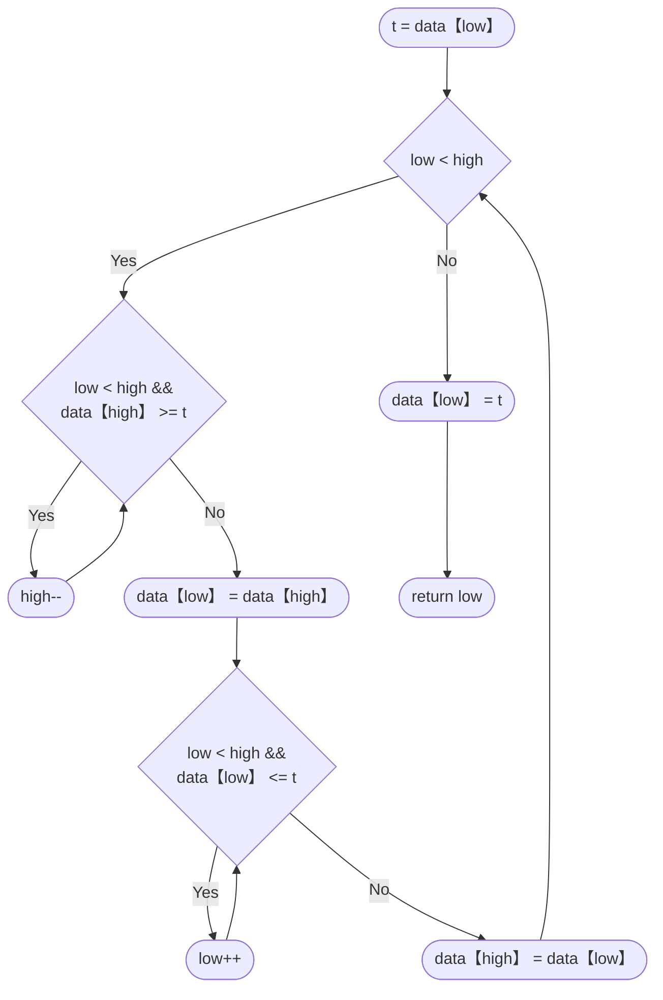

# 软件测试
## 选择题

| 题目                                                                                                                                                                                                                     | 答案                             |
| ---------------------------------------------------------------------------------------------------------------------------------------------------------------------------------------------------------------------- | ------------------------------ |
| 1. 在软件开发的过程中，若能推迟暴露其中的错误，则为修复和改正错误所花费的代价就会降低。                                                                                                                                                                          | 假                              |
| 2. 好的测试是用少量测试用例运行程序，发现被测程序尽可能多的错误。                                                                                                                                                                                     | 真                              |
| 3. 好的测试用例应能证明软件是正确的。                                                                                                                                                                                                   | 假                              |
| 4. 白盒测试仅与程序的内部结构有关，完全可以不考虑程序的功能要求                                                                                                                                                                                      | <font color="#d99694">真</font> |
| 5. 等价类划分方法将所有可能的输入数据划分成若干部分，然后从每一部分中选取 少数有代表性的数据作为测试用例                                                                                                                                                                 | 真                              |
| 6.  使用独立测试团队的最好理由是（ ）。<br>	A. 软件开发人员不需要做任何测试<br>	B. 测试人员在测试开始之前不参与项目<br>	C. 测试团队将更彻底地测试软件<br>	D. 开发人员与测试人员之间的争论会减少                                                                                                     | C.                             |
| 7.  类的行为应该基于（ ）进行测试。<br>	A. 数据流图<br>	B. 用例图<br>	C. 对象图<br>	D. 状态图                                                                                                                                                      | D                              |
| 6.  下面的（ ）说法是正确的。<br>	A. 恢复测试是以各种方式迫使软件失效从而检测软件是否能够继续执行的一种系统 测试<br>	B. 安全测试是检测系统中的保护机制是否可以保护系统免受非正常的攻击<br>	C.压力测试是检测在极限环境中使用系统时施加在用户上的压力<br>	D. 功能测试是根据软件需求规格说明和测试需求列表，验证产品的功能实现是否符 合需求规格。<br>	E. 安装测试是保证应用程序能够被成功地安装。 | ABDE                           |
## 1
理解下面的程序结构，请使用基本路径方法设计该程序测试用例
```c
#include <stdio.h>

int partition(int *data, int low, int high)
{
0	int t = 0;
1	t = data[low];
2	while (low < high) {
3		while (low < high && data[high] >= t)
4			high--;
5		data[low] = data[high];
6		while(low < high && data[low] <= t)
7			low++;
8		data[high] = data[low];
	}
9	data[low] = t;
10	return low;
}
```
- 控制流图

- 环路复杂度：4
	- V(G) = 边数 - 节点数 + 2 * 连通分量数
		- =11-9+2
- 分支条件：
	- low < high
	- data\[high\] >= t
	- data\[low\] <= t
- 基本路径集
	1. 0-1-2-3-4-5-6-7-8-9
	2. 0-1-2-3-4-5-6-8-9
	3. 0-1-2-3-5-6-7-8-9
	4. 0-1-9


| 路径  | 输入                            | 预期结果                      |
| --- | ----------------------------- | ------------------------- |
| 1   | data=\[2,1,0,3\],low=0,high=3 | data=\[0,1,2,3\],return 2 |
| 2   | data=\[0,1\],low=0,high=1     | data=\[0,1\], return 0    |
| 3   | data=[1,0],low=0,high=1       | data=\[0,1\], return 1    |
| 4   | data=\[1\],low=0,high=0       | data=\[1\], return 0      |

## 2
请使用等价类划分和边界值分析的方法，给出getNumDaysInMonth(int month, int year)方法的测试用例，其中getNumDaysInMonth方法根据给定的月份和年份返回该月份的总 天数。
（1）请给出划分的等价类
等价类划分
- 月份
	- 有效：整数1-12
		- 31天：1，3，5，7，8，10，12
		- 30天：4，6，9，11
		- 2月（28/29）
	- 无效：其他数
- 年份
	- 有效年：整数
		- 闰年
		- 普通年
	- 无效年：非整数

（2）测试用例设计

| 序号  | 输入参数        | 期望输出 |
| --- | ----------- | ---- |
| 1   | (2, 1900)   | 28   |
| 2   | (2, 2000)   | 29   |
| 3   | (4, 2023)   | 30   |
| 4   | (4, 2024)   | 30   |
| 5   | (12, 2007)  | 31   |
| 6   | (12, 1996)  | 31   |
| 7   | (-1, 2002)  | 无效   |
| 8   | (0, 1908)   | 无效   |
| 9   | (-2, -4)    | 无效   |
| 10  | (100, 3000) | 无效   |
| 11  | (13, 4000)  | 无效   |
| 12  | (25, -1)    | 无效   |


## 3
现在要对一个咨询公司的薪酬支付软件进行功能测试，该软件的规格说明如下
- 对于每周工作超过40小时的咨询人员，前40小时按照他们的小时薪酬计算，多余的小时 数按照双倍小时薪酬计算；对于每周工作不足40小时的咨询人员，按照他们的小时薪酬计算， 并生成一份缺勤报告；对于每周工作超过40小时的长期工作人员，直接按照他们的固定工资 计算。
(1)使用决策表（格式如下）描述上述的薪酬支付规则

| 规则  |      |            | 1           | 2    | 3    | 4    |
| --- | ---- | ---------- | ----------- | ---- | ---- | ---- |
| 条件桩 | 条件项1 | 每周工作超过40小时 | 是           | 否    | 否    | 是    |
|     | 条件项2 | 是长期工作人员    | 否           | 否    | 是    | 是    |
| 动作桩 | 动作项1 | 支付方式       | 前40小时时薪多余双倍 | 小时时薪 | 固定工资 | 固定工资 |
|     | 动作项2 | 是否生成缺勤报告   | 不生成         | 生成   |      | 不生成  |

(2) 根据上述决策表，使用下表列出自己设计的测试用例。

| 序号  | 输入参数                 | 期望输出           |
| --- | -------------------- | -------------- |
| 1   | 咨询人员，每周工作60小时，时薪100元 | 薪酬8000元        |
| 2   | 咨询人员，每周工作20小时，时薪100元 | 薪酬2000元，生成缺勤报告 |
| 3   | 长期工作人员，固定工资5000元     | 薪酬5000元        |

## 4
下面给出的是购买车票（PurchaseTicket）用例的正常流，除此之外还应包括无零钱找 （NoChange）、缺票（OutofOrder）、超时（TimeOut）和取消（Cancel）等四个备选流，请结合 场景法和其他方法设计测试用例。

| 用例名称   | 购买车票                                               |
|------------|--------------------------------------------------------|
| 前置条件   | 乘客站在售票机前，有足够的钱买车票。                    |
| 正常流     | 1. 乘客选择需要达到的地点，如果按下了多个地点按钮，售票机只考虑最后一次按下的地点。 |
|            | 2. 售票机显示出应付款数。                              |
|            | 3. 乘客投入钱。                                       |
|            | 4. 如果乘客在投入足够的钱之前选择了新的地点，售票机应该把所有的钱退还乘客。 |
|            | 5. 如果乘客投入的钱比应付款多，售票机应该退出多余的零钱。 |
|            | 6. 售票机给出车票。                                   |
|            | 7. 乘客拿走找零和车票。                               |
| 后置条件   | 乘客买到了他选择的车票。                               |
测试用例

| 测试用例编号 | 测试标题       | 预置条件             | 操作步骤                               | 预期输出                     |
| ------ | ---------- | ---------------- | ---------------------------------- | ------------------------ |
| 1      | 正常购票流程     | 乘客站在售票机前，有足够钱买车票 | 1. 选择地点<br>2. 投入足够的钱<br>3. 拿走找零和车票 | 售票机显示应付款数，成功出票，乘客拿到车票和找零 |
| 2      | 无零钱找       | 乘客站在售票机前，钱不够找零   | 1. 选择地点<br>2. 乘客投入钱                | 售票机显示错误信息，提示无零钱找并退款      |
| 3      | 缺票         | 售票机内无票           | 1. 选择地点<br>                        | 售票机显示无票信息，不允许乘客选择地点      |
| 4      | 超时         | 乘客操作超时           | 1. 选择地点<br>2. 长时间不投入钱              | 售票机取消交易，提示超时             |
| 5      | 取消         | 乘客想取消购票          | 1. 选择取消交易                          | 售票机取消交易，退还所有投入的钱         |
| 6      | 投入钱后选择新地点  | 乘客先投入钱，后选择新地点    | 1. 投入钱<br>2. 选择新地点                 | 售票机退还所有投入的钱，按照新的地点计算     |
| 7      | 多次选择地点后投入钱 | 乘客多次选择地点         | 1. 多次选择地点<br>2. 最后一次选择后投入足够的钱      | 售票机按最后一次选择的地点出票，并找零      |


## 5 下面的UML图显示了银行卡账户的服务功能：

![[Pasted image 20241212223540.png]]
- (1) 请使用Java或C++语言和测试驱动开发方法编写上述程序，并进行单元测试和代码覆盖分析；
- Account.h
```c
#include <string>  

class Account {

public:

    Account(const std::string& cardNo, long initBalance); 
    std::string getCardNo() const;
    long getBalance() const;  
    void debit(long amount);
    void credit(long amount);
private:
    std::string cardNo;
    long balance;
};
```
- Account.cpp
```c
#include "Account.h"

Account::Account(const std::string& cardNo, long initBalance): cardNo(cardNo), balance(initBalance) {}

std::string Account::getCardNo() const {
    return cardNo;
}

long Account::getBalance() const {
    return balance;
}

void Account::debit(long amount) {
    balance -= amount;
}

void Account::credit(long amount) {
    balance += amount;
}

```
- AccountService.h
```c
#include "Account.h"
#include "AccountManagement.h"

class AccountService {
public:
    AccountService(AccountManagement& accountMgmt);

    void withdraw(const std::string& cardNo, long amount);
    void deposit(const std::string& cardNo, long amount);
    void transfer(const std::string& fromCardNo, const std::string& toCardNo, long amount);
    long inquiry(const std::string& cardNo);

private:
    AccountManagement& accountMgmt;
};

```
- AccountService.cpp
```c
#include "AccountService.h"

AccountService::AccountService(AccountManagement& accountMgmt): accountMgmt(accountMgmt) {}

void AccountService::withdraw(const std::string& cardNo, long amount) {
    Account account = accountMgmt.findAccount(cardNo);
    account.debit(amount);
    accountMgmt.updateAccount(account);
}

void AccountService::deposit(const std::string& cardNo, long amount) {
    Account account = accountMgmt.findAccount(cardNo);
    account.credit(amount);
    accountMgmt.updateAccount(account);
}
void AccountService::transfer(const std::string& fromCardNo, const std::string& toCardNo, long amount) {
    Account fromAccount = accountMgmt.findAccount(fromCardNo);
    Account toAccount = accountMgmt.findAccount(toCardNo);
    fromAccount.debit(amount);
    toAccount.credit(amount);
    accountMgmt.updateAccount(fromAccount);
    accountMgmt.updateAccount(toAccount);
}

long AccountService::inquiry(const std::string& cardNo) {
    Account account = accountMgmt.findAccount(cardNo);
    return account.getBalance();
}

```
- AccountManagement.h
```c
#include "Account.h"
#include <string>

class AccountManagement {
public:
    virtual Account findAccount(const std::string& userID) = 0;
    virtual void updateAccount(const Account& account) = 0;
};

```
-  测试
- AccountTest.cpp
```c
#include "gtest/gtest.h"
#include "Account.h"

TEST(AccountTest, Initialization) {//测试初始化
    Account account("12345", 1000);
    EXPECT_EQ(account.getCardNo(), "12345");
    EXPECT_EQ(account.getBalance(), 1000);
}

TEST(AccountTest, Debit) {
    Account account("12345", 1000);
    account.debit(200);
    EXPECT_EQ(account.getBalance(), 800);
}

TEST(AccountTest, Credit) {
    Account account("12345", 1000);
    account.credit(200);
    EXPECT_EQ(account.getBalance(), 1200);
}

```
- AccountServiceTest.cpp
```c
#include "gtest/gtest.h"
#include "AccountService.h"
#include "AccountManagement.h"

class MockAccountManagement : public AccountManagement {
public:
    MOCK_METHOD1(findAccount, Account(const std::string&));
    MOCK_METHOD1(updateAccount, void(const Account&));
};

TEST(AccountServiceTest, Inquiry) {
    MockAccountManagement mockAccountMgmt;
    Account account("12345", 1000);

    EXPECT_CALL(mockAccountMgmt, findAccount("12345"))
    .WillOnce(testing::Return(account));

    AccountService service(mockAccountMgmt);
    long balance = service.inquiry("12345");

    EXPECT_EQ(balance, 1000);
}

TEST(AccountServiceTest, Withdraw) {
    MockAccountManagement mockAccountMgmt;
    Account account("12345", 1000);

    EXPECT_CALL(mockAccountMgmt, findAccount("12345"))
    .WillOnce(testing::Return(account));
    EXPECT_CALL(mockAccountMgmt, updateAccount(testing::An<const Account&>()));

    AccountService service(mockAccountMgmt);
    service.withdraw("12345", 200);

    EXPECT_EQ(account.getBalance(), 800);
}

TEST(AccountServiceTest, Deposit) {
    MockAccountManagement mockAccountMgmt;
    Account account("12345", 1000);

    EXPECT_CALL(mockAccountMgmt, findAccount("12345"))
    .WillOnce(testing::Return(account));
    EXPECT_CALL(mockAccountMgmt, updateAccount(testing::An<const Account&>()));

    AccountService service(mockAccountMgmt);
    service.deposit("12345", 200);

    EXPECT_EQ(account.getBalance(), 1200);
}

TEST(AccountServiceTest, Transfer) {
    MockAccountManagement mockAccountMgmt;
    Account fromAccount("12345", 1000);
    Account toAccount("67890", 500);

    EXPECT_CALL(mockAccountMgmt, findAccount("12345"))
    .WillOnce(testing::Return(fromAccount));
    EXPECT_CALL(mockAccountMgmt, findAccount("67890"))
    .WillOnce(testing::Return(toAccount));
    EXPECT_CALL(mockAccountMgmt, updateAccount(testing::An<const Account&>())).Times(2);

    AccountService service(mockAccountMgmt);
    service.transfer("12345", "67890", 300);

    EXPECT_EQ(fromAccount.getBalance(), 700);
    EXPECT_EQ(toAccount.getBalance(), 800);
}


```
- 代码覆盖分析
	- Account构造函数、getCardNo、getBalance、debit、credit方法均被覆盖；
	- AccountService构造函数、withdraw、deposit、transfer、inquiry方法均被覆盖；
	- 函数内无分支函数，每句都被覆盖到
- (2) 如果银行卡的转账服务增加一个新的需求“一次转账金额限定为3000元”，请修改 代码并重新进行单元测试和覆盖分析
- 更改AccountService::transfer
```c
void AccountService::transfer(const std::string& fromCardNo, const std::string& toCardNo, long amount) {
    if (amount > 3000) {
        throw std::invalid_argument("一次转账金额限定为3000元");
    }

    Account fromAccount = accountMgmt.findAccount(fromCardNo);
    Account toAccount = accountMgmt.findAccount(toCardNo);
    fromAccount.debit(amount);
    toAccount.credit(amount);
    accountMgmt.updateAccount(fromAccount);
    accountMgmt.updateAccount(toAccount);
}


```
- test增加超过限制的情况（原来测试的是没有超过的）
```c
TEST(AccountServiceTest, TransferExceedsLimit) {
    MockAccountManagement mockAccountMgmt;
    Account fromAccount("12345", 1000);
    Account toAccount("67890", 500);

    EXPECT_CALL(mockAccountMgmt, findAccount("12345"))   .WillOnce(testing::Return(fromAccount));
    EXPECT_CALL(mockAccountMgmt, findAccount("67890"))
    .WillOnce(testing::Return(toAccount));
    AccountService service(mockAccountMgmt);
    EXPECT_THROW(service.transfer("12345", "67890", 3500), std::invalid_argument);// 测试超过 3000 元限制的转账
}
```
- 覆盖分析：超限和没超限都已测试