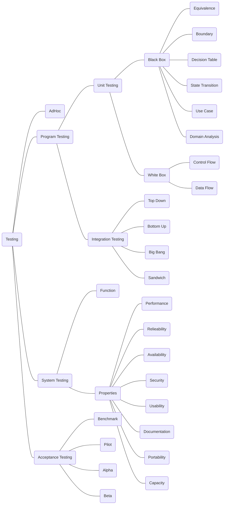
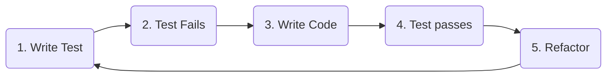

- 软件
	- 与硬件相互依存
	- 程序+数据+文档（程序运行维护的图文资料）
- 分类
	- 系统软件
	- 支撑软件
	- 应用软件
- 特征
	- 复杂性
	- 演化性
		- 不断的修改最终导致软件的退化，从而结束其生命周期
		- 软件的失效率曲线
	- 不可见性
- 软件危机
	- 大型软件开发困难：正确性难以保证
	- 软件**开发与维护**过程中多产生的一系列严重问题
		- 如何开发：以满足对软件日益增长的需求。
		- 如何维护:数量不断膨胀的已有软件。
- 软工三要素：方法，工具，过程
- 软工目标：在给定进度成本前提下，开发具有可修改性，有效性，可靠性，可理解性，可重用，可适应，可移植，可追踪，可互操作
	- 较低的开发成本
	-  按时完成开发任务并及时交付 •
	- 实现客户要求的功能 
	- 所开发软件具有良好的性能 
	- • 较高的可靠性、可扩展性、可移植性 
	- • 软件维护费用低
- 软件危机产生的原因
	- 客观原因
		- 软件是计算机系统中的逻辑部件而不是物理部件
		- 软件规模庞大，而且程序复杂性将随着程序规模的增加而呈指数上升。
	- 主观原因
		- 1. 对软件开发和维护有不少糊涂观念，采用了错误的方法和技术。
		- 对用户要求没有完整准确地认识就匆忙着手编写程序。
		- 一个软件从定义、开发、使用和维护，直到最终被废弃，要经历一个漫长的时期。
		- 一个软件产品必须由一个完整的配置组成，主要包括程序、文档和数据等成分。
		- 在软件开发的不同阶段进行修改需要付出的代价是很不相同的。
		- 轻视维护
## 软件开发过程
各阶段包括计划，开发，运行，维护
*   包括以下阶段： 
	* 计划时期
		*   **问题定义**：提出问题，技术探索，市场调查 => 可行性研究报告
	* 开发时期  
		* **需求分析**：收集用户需求，分析需求，建模 => 软件需求规格说明文档
		*  **软件设计**：体系结构设计，接口，组件的算法和数据结构，数据库 => 软件设计说明书
		*   **软件实现**：编写代码，审查，优化 => 源代码
		*   **软件测试**：单元测试，子系统测试，集成测试，验收测试：发现问题
	* 运行时期 
		* **软件维护**/软件演化：投入使用后的改进过程
* 软件生存周期模型：包括定义（计划，做什么）开发（怎么做）维护
	*   **瀑布模型**：将开发过程看成一系列独立、线性的活动，对需求变更的响应不灵活，文档太多，现已很少使用
		* 计划，需求分析，设计，实现，测试，运行维护
		* 每个阶段完成后不返回
		* 在每一步骤完成之后才开始下一步骤。
			* 原因：越早找到 bug，修复它的成本就越低。
			* 问题
				- 软件的优势在于它能够快速修改（change）和适应（adapt）；但瀑布模型无法做到这一点
				- 每个步骤用时很长，遇到问题时需要回溯到上一个步骤
				- 客户很难想清楚所有需求
	* 演化模型
	* 螺旋模型
		* 风险评估很重要，比较灵活，客户始终参与开发，不会使软件偏离正常方向。
	*   **原型化模型**，
		* 先得到只具有界面和部分功能的产品，以明确需求、帮助开发，可以快速响应
		* 需要迅速建造一个可运行的软件原型，它使用户和开发人员对系统的相关方面进行检查，以决定是否合适和恰当。
		* 需求定义、软件设计部分得出原型，测试阶段确认验证
		* 减少由于软件需求不明确带来的开发风险。这种模型适合预先不能确切定义需求的软件系统的开发。
	*   阶段化开发   ，构建、发布、用户使用循环进行    
		*   **增量模型**：
			* 优先实现一小部分功能，逐步增加模块；在每一个新的发布中逐步增加功能直到构造全部功能。
			* 使用增量模型时，把软件产品作为一系列的增量构件来设计、编码、集成和测试，适应需求的变更。
			* 能在较短时间内向用户提交可完成部分工作的产品
		*   **迭代模型**：优先实现基本的**整体功能**，逐步完善各个功能 ，一开始提交一个完整系统，在后续发布中补充完善各子系统功能。
	*   **可转换模型**，数学描述系统，经过形式化转换得到产品，严密准确，适用于嵌入式系统
*   敏捷开发   ，自适应，增量和迭代，强调：  
	* 价值驱动(瀑布模型：计划驱动)
	* Scrum偏重项目管理 Scrum迭代开发
	* XP偏重编程实践
	*   个体和交互 > 过程和工具
	*   可以工作的软件 > 面面俱到的文档
	*   客户合作（频繁与客户沟通） > 合同谈判
	*   响应变化 > 遵循计划  
	*   Build to Learn -> Show -> Serve -> Win
	* 敏捷估算
		* 把一些常见的“标准任务”给出一个“标准点数”，故事点
	* 简单设计
	* 结对编程
	* 测试驱动开发
		* 要求在编写任何代码之前，首先编写定义代码功能的测试用例，编写的代码要通过测试，并不断进行重构优化。
	* 持续集成

### 团队开发管理

*   技术与管理分离  
*   技术经理：技术上的决策
*   项目经理：过程管理和绩效评价
*   选择合适的沟通方式：  
*   着重及时反馈（面对面、电话）
*   着重信息的完整丰富（书面）
*   团队分工一般按照模块进行划分，比如前端、后端、数据库等，减少耦合
*   PM：人月工作量
### 敏捷开发与配置管理
*   Scrum  
    : feature list -> sprint planning meeting -> sprint (1-2 weeks) -> review     
*   角色  
	*   Product Owner
	*   Scrum Manager (tech lead)
	*   Team Membe 
*   活动     
	*   Planning Meeting
	*   Daily Meeting
	*   Review
	*   Retrospective 回顾 
*   制品     
	*   Product Backlog 产品订单
	*   Sprint Backlog 迭代订单
	*   Burndown Charts 燃尽图
	*   Working Software 可工作软件  
*   **用户故事 User Story**：站在用户角度来看待软件的功能点，角色 + 活动 + 价值
	* 编写产品积压工作 （backlog） 的最常见方法是通过用户故事。
*   配置管理：版本管理     
*   软件配置项，Software Configuration Item，SCI：包括代码、文档和产品
*   Git - Github      
### 敏捷开发

软件项目的“不可能三角”：同一个项目，在团队、效能水平一定的情况下，范围、时间、成本，三者只能取其二。
#### 敏捷开发的原则与特点

- Adaptive rather than predictive
  - 不要一开始就计划项目的绝大部分；应该增强软件开发的可修改性
- People-oriented rather than process-oriented
  - 合作共赢，享受合作开发的过程，利用人性；而非与其作对

#### 12 条原则

1. 我们的首要任务是通过尽早、持续地交付有价值的软件来满足客户的需求。
2. 欢迎不断变化的需求，即使是在开发后期。敏捷流程利用变化为客户带来竞争优势。
3. 频繁交付工作软件，从几周到几个月不等，优先选择较短的时间。
4. 4. 业务人员和开发人员必须在整个项目期间每天一起工作。
5. 围绕积极主动的个人开展项目。为他们提供所需的环境和支持，相信他们能完成工作。
6. 在开发团队内部传递信息的最有效方法是面对面交谈。
7. 工作软件是衡量进展的主要标准。
8. 敏捷过程促进可持续发展。发起人、开发人员和用户应能无限期地保持稳定的步伐。
9. 对卓越技术和良好设计的持续关注可提高敏捷性。
10. 10. 简化--最大限度地减少未完成工作的艺术--至关重要。
11. 最好的架构、需求和设计来自于自我组织的团队。
12. 团队定期反思如何提高效率，然后相应地调整自己的行为。
#### 特点

合作共赢（Teamwork）；所有人向同一个目标奋斗，没有任何一个个体是独自工作的。

### 敏捷开发中的用户故事

$$
\text{Initiative} = n \cdot \text{Epics} = nm \cdot \text{Stories/Tasks} = nml \cdot \text{Subtasks}
$$

Stories 通常在 1~2 周内完成，Epic 通常在 1~3 个月内完成，Initiative 通常在 3~12 个月内完成。

#### 用户故事表达：卡片

**格式**：作为一名 `<角色>`，我可以 `<活动>`，使得 `<业务价值>`。
As a `<type of user>`,I want to `<goals>` so that `<reason>`

**例子**：3c

- 用户故事卡片card：
	作为 Creator，我想从我的本地计算机上传视频，以便任何用户都可以查看它	
	- 写在一张普通的卡片上，通常是为了给一个物理限制，限制故事的可能长度。
- conversation
	“上传”按钮将是网站每个页面上的持久项
	视频不得超过 100MB 或超过 10 分钟。
	- 对用户故事提出问题，要求澄清确认
	- 可以重新评估您的用户故事，并在需要时将其拆分为多个故事。
- 验收标准：confirmation
	- 构造测试用例，测试计划
	- 每 $10$ 秒钟读取 DecaWatt 计量表的数据，在门户上显示 $15$ 分钟的增量，在室内屏上显示每⼀读数；
	- 随着新数据的产⽣读取 KiloWatt 计量表，并且每小时显示在门户上，在每次读取后显示在室内屏上。

#### INVEST 原则

- Independent（独立性）
  - 故事不依赖于其他故事，可以被单独地开发、测试甚至交付。
- Negotiable（可协商）
  - 故事不是详尽的需求说明书（系统应该完成的事），而是可协商的意向表达。
- Valuable（有价值）
  - 聚焦于由用户规定的价值，而非功能分解结构。
- Estimable（可估算）
  - 故事相对而言更容易估算，可以快速确定实现相关功能的工作量。
- Small（小型）
  - 故事代表有价值功能的小型增量，可以在一到两周内交付。
- Testable（可测试）
  - 清晰可测试。

### 敏捷开发中的 Scheduling

关键路径：项目用时的最长路径。

### 开发工具与敏捷开发概念的对应

|        Agile artifact | GitLab feature                     |
| --------------------: | :--------------------------------- |
|          User stories | Issues                             |
|                  Task | Task lists                         |
|                 Epics | Epics                              |
| Points and estimation | Issue weights                      |
|       Product backlog | Issue lists and prioritized labels |
|    Sprints/iterations | Milestones                         |
|       Burndown charts | Burndown charts                    |
|           Agile board | Issue boards                       |

### Release.Version.Revision

- Release Number：用户角度
- Version Number：开发者角度
- Revision Number：开发者角度
  - Change to a version that corrects only errors in the design/code, but does not affect the documented functionality.

### 版本控制

集中式版本控制的问题：每个版本都提交到中心，性能瓶颈，冲突解决

分布式版本控制的好处：在本地就可以做跟踪和回滚，大大减少提交的数量，对中心服务器的依赖减少；提升系统工作的性能
##  需求获取

*   需求工程师 Requirements Engineer，负责需求的获取、建模、分析
	* 而不是设计或创造新的工作模式。这属于系统设计师或开发人员的职责范围。
*   面谈、问卷、群体诱导、原型
*   用例模型，需求数据库
*   软件需求规格说明 Software Requirements Specification, SRS
*   需求是不断变化的
软件需求
	- 功能需求：控制⽉球⻋移动并到达指定地点；
	- 性能需求： MCS必须在1秒内完成最优路径规划；
	- 可靠性需求： MCS平均⽆故障⼯作时间必须⼤于24⼩时；
	- 约束性需求：MCS必须在10个⽉内通过验收测试；
- 重要性
	- 软件需求是整个软件项目的终极目标
	- 软件需求是是后续软件开发活动（设计、编码和测试）的主要基础
### 需求工程活动
- 需求抽取（Elicitation）
	- 目标： 主动与干系人协同工作，找出他们的需求，识别潜在的冲突，磋商解决矛盾，定义系统范围与边界
	- 实质：了解待解决的问题及其所属领域
	- 关键：确保该问题的解决是有商业价值
	- 抽取技术
		- 协同⼯作（Collaborative sessions）
		- ⾯谈（Interviewing techniques）
			- 什么时候？
				- 能够与他们见面，
				- 当“少数”人都知道“很多”，
				- 当真正的中小企业存在，
				- 当利益相关者可能不聚集在一起，
				- 当问题不需要互动，以得到一个最佳的答案
			- 优势：
				- 丰富的信息收集
				- 可以深入探究，并根据对方告诉你的内容调整后续问题
			- 缺点：
				  - 大量回答难以分析
				  - 难以比较不同的回答
				  - 面试技巧难以掌握
		- 问卷调查（Questionnaires）
			- 什么时候使用调查问卷？
				- 调查的人多
				- 当你想要一个指定问题的结果时，
				- 来验证有限访谈的结果
			- 优势
				- 可以快速收集大量人的信息
				- 可以远程管理
				- 可以收集态度，信念，特征
			- 缺点
				- 简单化（预设）类别提供的上下文很少
		- Group Session
			- 什么时候使用
				- 当许多人每个人都知道整体的一小部分时
				- 当问题需要交互来优化解决方案时
			- 优势
				- 与正式的采访相比，人与人之间更自然的互动
				- 可以衡量人们对刺激材料（如模型、故事板等）的反应
			- 缺点
				- 可能会创造不自然的群体（参与者不舒服）
				- 群体思维的危险
				- 可能只会对技术问题提供肤浅的回答
				- 需要一个训练有素的促进者
		- 观察法 （Ethnography）
			- 当有东西是隐藏的
			- 观察法不仅有利于了解正常的工作流程，也可能发现非正常场景
			- 优势
				- Contextualized：背景化
				- 揭示了其他方法无法揭示的细节
			- 缺点
				- 非常耗时的时间！
				- 所产生的“丰富的图片”很难分析
				- 不能说太多的关于提议的变化的结果
		- 原型法 （Prototyping）
		- ⽂档分析（Documentation）
		- 建模（Modeling）
		- ⾓⾊扮演（Roleplaying）
		- ⾮功能性需求列表（Checklists of NFRs）
	- 冲突识别与磋商 （Conflict Identification and Negotiation）
- 需求分析（Analysis）
	- 目标：对产品及其与环境的交互进⾏更深⼊的了解，识别系统需求，设计软件体系结构，建⽴需求与体系结构组件间的关联，在体系结构设计实现过程中进⼀步识别⽭盾冲突，并通过干系⼈之间的协调磋商解决问题。
	- 实质：概念建模———选择常⽤的建模语⾔，进⾏功能建模和信息建模
	- 关键：体系结构设计与需求分配
- 需求规约（Specification）
	- 系统与软件需求的**文档化**，以便于后续的需求及系统的正式评审，而准备的规范化文档。
	- 单个需求项的质量
		• 准确（Concise）		
		• 正确（Correct）		
		• 明确（Non-ambiguous）
		• 可行（Feasible）		
		• 可证（Verifiable）
		• 需求管理（Management）
		• 需求验证（Validation）
	- 整个需求集合的质量
		- 现实（Realistic）
		-  精确（Concise）
		- 全面（Complete）
		-  一致（Consistent）
- 需求验证
	- 对其他需求工程活动的质量的保证。通过数学的形式化工具或工程化的测试过程来确保系统满足干系人的要求。
	- 验证方法
		- 评审（Review）
		- 原型化（Prototyping）
		- 模型验证（Model validation）
		- 确认测试（Acceptance Tests）
- 需求管理
	- 贯穿从需求获取到软件系统下线的全过程。需求管理设计软件配置管理、需求跟踪、影响分析和版本控制。
	- 需求跟踪 （Requirements traceability）
		- 描述和追踪一条需求的来龙去脉的能力，包括向前追踪到软件制品，向后追踪到需求来源
	- 变更请求管理 （Change Requests）
		- 系统化的变更管理
	- 需求属性管理 （Requirements attributes）
#### srs Software Requirements Specification
  
- 是一份具有合同约束力的文件，清楚地说明了软件将做什么，以及必要时它不会做什么。
- 描述输入、输出和从输入到输出的转换方面的功能要求。
- 描述利益干系人协商并商定的非功能性需求。
- 由需求定义文档提供支持，该文档包含 SRS 中所有术语的明确定义。
### UML
- 自顶向下，逐步细化
- 需求分析 软件设计都用得到
![[Pasted image 20241023004505.png]]
- 静态
	- 逻辑视图
	- 用例图
	- 类图
	- 对象图
	- 组件图
	- 部署图
- 动态
	- 状态图
		- 状态，状态转移，事件触发状态转移，状态图之间发送消息
	- 时序图
	- 活动图
		- 用户（在一个泳道），用例，信号
		- 菱形：判断
		- 实心圆：开始
	- 协助图
	- 消息传递
- 组件视图：组件物理结构
- 并发视图
- 关系
	- 关联：表明n，1
	- 泛化
		- 实现（父类为接口类全是虚函数）k
	- 依赖
	- 聚集
		- 组合
- RUP：以用例为驱动，以系统为中心的迭代与增量过程
	- 初始，细化，构造，移交
#### 面向对象建模
- ooa Object-Oriented Analysis 面向对象的分析
	-   基本思想：通过使对象、类、方法等成为原子单元来简化软件开发，从中构建需求、设计和实现。
	- 此类技术侧重于应用程序域中存在的事物，并使用对象对它们进行建模。
	- 这些技术使用分类、泛化、聚合来构建对象组合
	- 操作（服务/活动）与对象相关
	-  状态更改受对对象执行的操作的影响。
##### 实体类控制类边界类
**实体类：**
         是用于对必须存储的信息和相关行为建模的类。实体对象（实体类的实例）用于保存和更新一些现象的有关信息，例如：事件、人员或者一些现实生活中的对象。实体类通常都是永久性的，它们所具有的属性和关系是长期需要的，有时甚至在系统的整个生存期都需要
        实体对象的抽象，通常来自域模型（现实世界），用来描述具体的实体，通常映射到数据库表格与文件中。

**边界类：**
    边界类是**系统内部与系统外部的业务主角之间进行交互建模的类**。边界类依赖于系统外部的环境，比如业务主角的操作习惯、外部的条件的限制等。它或者是系统为业务主角操作提供的一个GUI，或者系统与其他的系统之间进行一个交互的接口，所以当外部的GUI变化时，或者是通信协议有变化时，只需要修改边界类就可以了，不用再去修改控制类和实体类。业务主角通过它来与控制对象交互，实现用例的任务。
    边界类调用用例内的控制类对象，进行相关的操作。
    边界对象的抽象，通常是用来完成**参与者**（用户、外部系统）与**系统之间交互的对象**，例如：From、对话框、菜单、接口等。

一个系统可能会有多种边界类：

- **用户界面类** - 帮助与系统用户进行通信的类
- **系统接口类** - 帮助与其他系统进行通信的类
- **设备接口类** - 为用来监测外部事件的设备（如传感器）提供接口的类

**控制类：**
	控制对象的抽象，主要用来体现应用程序的执行逻辑，将其抽象出来，可以使变化不影响用户界面和数据库中的表。
    控制类用于对一个或几个用例所特有的控制行为进行建模，它描述的用例的业务逻辑的实现，控制类的设计与用例实现有着很大的关系。在有些情况下，一个用例可能对应多个控制类对象，或在一个控制类对象中对应着对个用例。它们之间没有固定的对应关系，而是根据具体情况进行分析判断，控制类有效将业务逻辑独立于实体数据和边界控制，专注于处理业务逻辑，控制类会将特有的操作和实体类分离，者有利于实体类的统一化和提高复用性。
    当业务主角通过边界类来执行用例的时候，产生一个控制类对象，在用例被执行完后，控制类对象会被销毁。

   - 控制类的特点：
	   - 独立于环境
	   - 和用例的实现关联
	   - 使用关联实体类，操作实体类对象
	   - 专注于业务逻辑的实现
    当然如果用例的逻辑较为简单，可以直接利用边界类来操作实体类，而不必再使用控制类。或者用例的逻辑较为固定，业务逻辑固定不会改变。也可以直接在边界类实现该逻辑。


将不同的Control抽象成一个工厂类，这样就可以根据用户输入的命令来创建相应的Control，同时有良好的扩展性，用JDBC来实现命令执行结果的存储。
*   类的层次结构：关联、泛化(is-a)，聚集、组合(has-a)、依赖
	*   Gen-Spec （泛化/特化） 结构将类组织成分类法。患者可以是住院患者，也可以是门诊患者。患者的医生属性在住院病人和门诊病人中都是遗传的。
* 类图
	* l类图以反映类的组成(属性、操作)，以及类之间的关系为主要目的，描述了软件系统的静态结构，是一种静态建模方法
	* ü从上到下分为三部分，分别是类名、属性和操作。类名是必须有的
	* 类如果有属性，则每一个属性都必须有一个名字，另外还可以有其它的描述信息，如可见性、数据类型、缺省值等
	* 类如果有操作，则每一个操作也都有一个名字，其它可选的信息包括可见性、参数的名字、参数类型、参数缺省值和操作的返回值的类型等
	* ![[Pasted image 20241024003124.png]]
* 类的关系：
	* 关联关系：描述了类的结构之间的关系。具有方向、名字、角色和多重性等信息。
		* 一个类（被箭头指）作为另一个类（菱形的那一边）的成员类型或函数参数类型
		* 一般关联
			* ![[Pasted image 20241024000435.png]]
		* 聚合关系
			* 特殊关联关系，指明一个聚集（整体）和组成部分之间的关系
			* 类图包含有事物和关系，类图不存在了，事物和关系还可用于其它的类图
			* 空心菱形和箭头
		* 组合关系
			* 语义更强的聚合，部分和整体具有相同的生命周期
			* 类与关联关系之间有组合关系，类不存在了，则相应的关联关系也不存在（即下图中button只被dialog使用）
			* ![[Pasted image 20241024000831.png]]
		* 泛化关系
			* 在面向对象中一般称为继承关系，存在于父类与子类、父接口与子接口之间
			* ![[Pasted image 20241024001415.png]]
		* 实现关系
			* 对应于类和接口之间的关系
			* ![[Pasted image 20241024001458.png]]
			* 代码:接口无成员，只有虚函数，其他类继承接口类并实现接口来函数
```c
class Shape

{

public:

  virtual void Draw() = 0;

};

class Circle : public Shape

{

public:

 void Draw();

private；

  Point ptCenter;

  int nRadius;

};
```
```java
public interface Shape{
public abstract void Draw();
}
public class Circle implements Shape{
public void Draw();
private Point ptCenter;
private int nRadius;}
```
- aa
	- 
		* 依赖关系
			* 描述了一个类的变化对依赖于它的类产生影响的情况。
			* 弱关联。对象A用到对象B，但是和B的关系不是太明显如函数中用到某个类
			* 例如绑定(bind)、友元(friend)等
			* bind：如模板类Stack/<T/>定义了栈相关的操作；IntStack将参数T与实际类型int绑定，使得所有操作都针对int类型的数据
			* ![[Pasted image 20241024001643.png]]
	![[Pasted image 20241024002731.png]]
	- 对象图
		- 对象图是类图的实例，几乎使用与类图完全相同的标识。它们的不同点在于对象图显示类的多个对象实例，而不是类名。
*   CRC卡片分拣法    
	* ![[Pasted image 20241023010829.png]]
	*   Class 类，Responsibility 责任（函数需要实现的功能），Collaboration 协作（填写需要合作的类名）
*   接口设计：多个分离的小接口要好于一个通用的大接口
*   UML类图：对类层次结构的建模，可以根据模型自动生成类的代码
二十一点游戏：
![[Pasted image 20241023011107.png]]
- 建模原则
	- 促进修改和重用
	- 经验丰富的分析师重用他们过去的经验
		- 他们重用组件(他们过去构建的模型)
		- 他们重用structure(他们过去构建的模型)
	- 聪明的分析师规划未来
		- 他们构建了自己的模型,使其易于修改
	- 抽象化
		- ·剥离细节,专注于重要的事情
	- 分解(分区)
		- 将问题划分为独立的部分,以便单独研究
	- 投影
		- 分离不同的关注点(视图)并分别描述
	- 模块化
		- 选择随时间稳定的结构,以定位变化
		- 已知在许多不同的应用程序中出现的模型结构他们在模型中创建可能可重用的组件
#### 面向行为建模
##### 用例图Use Case
 用例建模是获取需求的方式，是一个迭代的、逐步细化的过程：用例图 -> 用例提纲 -> 用例详细规约
*   用例 Use Case：系统的理想行为、功能，**谁 + 做什么**
*   用例要有合适的粒度
*   用例按优先级排序，以决定开发顺序
*   要考虑异常状况
*   用例不包括具体实现，相当于系统提供给用户的接口
*   CRUD，增查改删，Create Retrieve Update Delete，合并为一个维护用例
*   UML, Unified Modeling Language, 统一建模语言，可视化的软件建模方法
*   建模工具：IBM Rational Rose、JUDE、Enterprise Architect
![[Pasted image 20241222230744.png]]
1. 用例图的含义  
　　由参与者（Actor）、用例（Use Case）以及它们之间的关系构成的用于描述系统功能的动态视图称为用例图。要在用例图上显示某个用例，可绘制一个椭圆，然后将用例的名称放在椭圆的中心或椭圆下面的中间位置。  
　　要在用例图上绘制一个参与者（表示一个系统用户），可绘制一个人形符号。参与者和用例之间的关系使用带箭头或者不带箭头的线段来描述，箭头表示在这一关系中哪一方是对话的主动发起者，箭头所指方是对话的被动接受者。


　　在用例建模中，为了更加清楚的描述用例或者参与者，会使用到注释。


2. 用例图的作用

　　用例图是需求分析中的产物，主要作用是描述参与者和用例之间的关系，帮助开发人员可视化的了解系统的功能。借助于用例图，系统用户、系统分析人员、系统设计人员、领域专家能够以可视化的方式对问题进行探讨，减少了大量交流上的障碍，便于对问题达成共识。  
　　用例图可视化地表达了系统的需求，具有直观、规范等优点，克服了纯文字性说明的不足。  
　　用例方法是完全从外部来定义系统功能，它把需求和设计完全的分离开来。我们不用关心系统内部是如何完成各种功能的，系统对于我们来说就是一个黑箱子。

##### 用例图的构成要素  
1. 参与者
　　参与者（Actor）是指存在于系统外部并直接与系统进行交互的人、系统、子系统或类的外部实体的抽象。  
每个参与者可以参与一个或多个用例，每个用例也可以有一个或多个参与者。  
　　在用例图中使用一个人形图标来表示参与者，参与者的名字写在人形图标下面。

  
2. 参与者间的的关系

　　由于参与者实质上也是类，所以它拥有与类相同的关系描述，即参与者与参与者之间主要是泛化关系（或称为“继承”关系）。  
**泛化关系**的含义是把某些参与者的共同行为提取出来表示成通用行为，并描述成超类。泛化关系表示的是参与者之间的一般/特殊关系，在UML图中，使用带空心三角箭头的实线表示泛化关系。

  
3. 系统边界

　　在项目开发过程中，边界是一个非常重要的概念。这里说的系统边界是指系统与系统之间的界限。通常我们所说的系统可以认为是由一系列的相互作用的元素形成的具有特定功能的有机整体。  
　　系统同时又是相对的，一个系统本身又可以是另一个更大系统的组成部分，因此，系统与系统之间需要使用系统边界进行区分开来。我们把系统边界以外的同系统相关联的其他部分，称之为系统环境。

  
用例的重要元素  
1. 如何识别用例

　　任何用例都不能在缺少参与者的情况下独立存在。同样，任何参与者也必须要有与之关联的用例。所以识别用例的最好方法就是从分析系统参与者开始，在这个过程中往往会发现新的参与者。  
　　  
可以通过以下问题来寻找用例：  
　　 (1)参与者希望系统提供什么功能？  
　　 (2)参与者是否会读取、创建、修改、删除、存储系统的某种信息？如果是的话，参与者又是如何完成这些操作的？  
　　 (3)参与者是否会将外部的某些事件通知给系统？  
　　 (4)系统中发生的事件是否通知参与者？  
　　 (5)是否存在影响系统的外部事件。  
　　  
2.用例的粒度

　　用例的粒度指的是用例所包含的系统服务或功能单元的多少。用例的粒度越大，用例包含的功能越多，反之则包含的功能越少。  
　　如果用例的粒度很小，得到的用例数就会太多。反之，如果用例的粒度很大，那么得到的用例数就会很少。  
　　如果用例数目过多会造成用例模型过大和引入设计困难大大提高。 如果用例数目过少会造成用例的粒度太大，不便于进一步的充分分析。

　　比如：网站后台管理系统中的会员信息维护用例，管理员需要进行添加会员信息、修改会员信息、删除会员信息等操作。


　　我们还可以根据具体的操作把它抽象成3个用例，它展示的系统需求和单个用例是完全一样的。

  
3.用例规约

　　对于每一个用例，我们还需要有详细的描述信息，以便让别人对于整个系统有一个更加详细的了解，这些信息包含在用例规约之中。  
　　  
每一个用例的用例规约都应该包含以下内容：  
　　 - (1)**简要说明**:对用例作用和目的的简要描述。  
　　- (2)事件流:事件流包括基本流和备选流。基本流描述的是用例的基本流程，是指用例“正常”运行时的场景。  
　　 - (3)用例场景:同一个用例在实际执行的时候会有很多不同的情况发生，称之为用例场景，也可以说用例场景就是用例的实例。  
　　 - (4)特殊需求: 特殊需求指的是一个用例的非功能性需求和设计约束。特殊需求通常是非功能性需求，包括可靠性、性能、可用性和可扩展性等。例如法律或法规方面的需求、应用程序标准和所构建系统的质量属性等。  
　　-  (5)前置条件: 执行用例之前系统必须所处的状态。例如，前置条件是要求用户有访问的权限或是要求某个用例必须已经执行完。  
　　 - (6)后置条件:用例执行完毕后系统可能处于的一组状态。例如，要求在某个用例执行完后，必须执行另一个用例。

##### 用例之间的关系  
1. 包含
　　包含关系指用例可以简单地包含其他用例具有的行为，并把它所包含的用例行为作为自身行为的一部分。在UML中，包含关系是通过带箭头的虚线段加<>字样来表示，箭头由基础用例(Base)指向被包含用例(Inclusion)。


　　在处理包含关系时，具体的做法就是把几个用例的公共部分单独的抽象出来成为一个新的用例。主要有两种情况需要用到包含关系：  
　　第一，多个用例用到同一段的行为，则可以把这段共同的行为单独抽 象成为一个用例，然后让其他用例来包含这一用例。  
　　第二，某一个用例的功能过多、事件流过于复杂时，我们也可以把某一段事件流抽象成为一个被包含的用例，以达到简化描述的目的。  
　　  
　　  
2. 扩展

　　在一定条件下，把新的行为加入到已有的用例中，获得的新用例叫做扩展用例(Extension)，原有的用例叫做基础用例(Base)，从扩展用例到基础用例的关系就是扩展关系。  
　　一个基础用例可以拥有一个或者多个扩展用例，这些扩展用例可以一起使用。

  
3. 泛化
	1. 箭头指向父用例

　　用例的泛化指的是一个父用例可以被特化形成多个子用例，而父用例和子用例之间的关系就是泛化关系。  
　　在用例的泛化关系中，子用例继承了父用例所有的结构、行为和关系，子用例是父用例的一种特殊形式。  
　　子用例还可以添加、覆盖、改变继承的行为。在UML中，用例的泛化关系通过一个三角箭头从子用例指向父用例来表示。


　　泛化的示例：银行存款有两种方式，一种是银行柜台存款，一种是ATM机存款。在这里，银行柜台存款和ATM机存款都是存款的一种特殊方式，因此“存款”为父用例，“银行柜台存款”和“ATM机存款”为子用例。

  
使用Rose创建用例的步骤说明  
1. 需求分析

“学生信息管理系统”部分功能性需求包括以下内容：  
　　 （1）系统管理员登录后可以对班级的基本信息进行增加、删除、修改、查询等操作。学校领导登录后可以对班级基本信息进行查询操作。  
　　 （2）教师登录后可以对学生的考试成绩进行录入、删除、修改、查询等操作。学生登录后可以对考试成绩进行查询操作。  
　　 （3）学生登录后可以了解所有选修课程的具体信息，可以根据自己的需要选择不同课程。系统管理员登录后可以增加、修改、查询、删除选修课程。  
　　 （4）系统管理员可以对账号进行创建、设置、查看、删除等操作。  
　　  
2.识别参与者  
　　对于一个学校来说，最重要的就是教育学生成才，所以我们首先要考虑到的参与者就是学生。  
　　要给学生上课，必然就需要教师。教师负责教育学生、并且在日常管理中可以查询学生的基本信息、查询学生的考试成绩。  
　　作为一个学校，除了教师和学生，还有不可或缺的就是校领导。为了便于校领导掌握学校的基本情况，加强对学校的管理导.  
　　不管什么系统，基本都会有比较专业的人员来负责管理系统，本系统也不例外。系统管理员除了负责维护系统的日常运行，还要进行录入学生基本信息、维护选课信息等工作。  
　　  
3.构建用例模型

　　系统管理员直接参与的用例为登录、找回密码、查看班级基本信息、删除班级基本信息、修改班级基本信息和录入班级基本信息。校领导直接参与用例登录、找回密码和查看班级基本信息。当登录过程中发生忘记密码的情况，就需要使用找回密码的功能来找回密码，而在正常情况下用不到找回密码这个功能所以用例找回密码”和用例登录之间是扩展关系。


　　教师参与用例录入成绩、修改成绩、保存成绩、查询成绩、删除成绩和登录。学生参与用例登录和查询成绩。因为修改成绩和录入成绩的时候都要保存成绩，所以将保存成绩抽象出来作为单独的一个用例。用例录入成绩、修改成绩和用例保存成绩之间是包含关系，用例找回密码和用例登录之间是扩展关系。


　　学生作为参与者直接参与用例查看课程信息、按课程编号查看、按课程名查看、选择课程、删除已选课程、登录和找回密码。系统管理员参与用例登录、找回密码和“维护课程信息”。其中查看课程信息有两种方式，一种是按照课程名查看，另一种是按照课程编号查看。所以查看课程信息是父用例，而按照课程名查看和按照课程编号查看是子用例，他们之间的关系是泛化关系。用例找回密码和用例登录之间是扩展关系。


　　系统管理员参与用例创建新账号、设置账号、设置账号基本信息、设置账号权限、查看账号和删除账号。在设置帐号时，主要分为设置账号的基本信息和设置账号的权限，为了便于修改和维护，将这两个功能分别抽象为两个用例。所以用例设置账号基本信息、设置账号权限和用例设置账号之间是包含关系

#### 交互建模
- UML顺序图：对交互行为建模，消息传递序列，与用例相对应
*   UML状态图：对状态变化和触发状态变化的事件建模，对象的存在与否、不同的属性都体现为状态
* 活动图
**什么是活动图（Activity Diagram）**  
活动图是UML用于对系统的动态行为建模的另一种常用工具,它描述活动的顺序，展现从一个活动到另一个活动的控制流,活动图在本质上是一种流程图；活动图着重表现从一个活动到另一个活动的控制流
一排的活动课代表不同对象的操作可并发


活动图和状态图的区别
活动图着重表现从一个活动到另一个活动的控制流，是内部处理驱动的流程
状态图着重描述从一个状态到另一个状态的流程，主要有外部事件的参与

活动图和流程图的区别
流程图着重描述处理过程，它的主要控制结构是顺序、分支和循环，各个处理之间有严格的顺序和时间关系
活动图描述的则是对象活动的顺序关系所遵循的规则，它着重表现的是系统的行为，而非系统的处理过程
活动图能够表示并发活动的情形，流程图不能

- interaction diagrams (交互图)
	- 交互是指对象为实现某种目的而彼此传递消息的行为
	- 交互图描述对象之间如何进行协作
	- UML定义多种交互图：其中应用最广的为顺序图（也称为时序图 Sequence Diagram.）
		- 顺序图表达单个情景实例的行为。每个用例对应一个顺序图
		- 顺序图表达对象间如何协作完成用例所描述的功能
		- 顺序图用于表示为了完成用例而在系统边界输入输出的数据以及消息及对象间的消息传递。
	- 建模风格
		- 把注意力集中于关键的交互
		- 对于参数，优先考虑使用参数名而不是参数类型
		- 不要对明显的返回值建模。
		- 可以把返回值建模为方法调用的一部分
![[Pasted image 20241023005540.png]]
- 协作图
	- 协作图包含一组对象和链(link)，用于描述系统的行为是如何由系统的成员协作实现的。
	- 协作图是一种显示围绕角色组织的交互的图表，即协作中实例的槽及其链接。
	- 主要元素
		- Object(包括actor实例，多对象，主动对象)
			- multiobject(多对象)
				- 在协作中，多对象用于显示将整个对象集作为一个单元而不是其中的单个对象的操作。
			- Active Object
				- 主动对象是一组属性和一组方法的封装体，其中至少有一个方法不需要接收消息就能主动执行(称作主动方法)
				- 拥有控制线程并可以启动控制活动的对象。
				- UML中的表示：加粗的边框
		- Message
		- Link(链)
			- 协作图中用链(link)来连接对象，而消息显示在链的旁边
	- 协作图中重复和条件分支的表示
		• 和顺序图中的表示方法类似
		• 用*[i:=1..n]或*表示要重复发送的消息。
		• 用类似[x > 0]的条件语句表示消息的分支。
		• UML并没有规定[]中的表达式的格式，因此可以采用伪代码的格式或某种程序设计语言的语法格式
	- 建立collaboration图的步骤
		1. 确定交互过程的上下文(context)；
		2. 识别参与交互过程的对象；
		3. 如果需要，为每个对象设置初始特性；
		4. 确定对象之间的链(link)，以及沿着链的消息；
		5. 从引发这个交互过程的初始消息开始，将随后的每个消息附到相应的链上；
		6. 如果需要表示消息的嵌套，则用Dewey十进制表示法；
		7. 如果需要说明时间约束，则在消息旁边加上约束说明；
		8. 如果需要，可以为每个消息附上前置条件和后置条件。
	1. 建模风格：同顺序图+有箭头
	![[Pasted image 20241023005442.png]]
顺序图和协作图的比较
	• 顺序图强调消息的时间顺序，协作图强调参加交互的对象的组织，两者可以相互转换。
	• 顺序图不同于协作图的两个特征：
		• 顺序图有对象生命线
		• 顺序图有控制焦点
	• 协作图不同于顺序图的两个特征：
		• 协作图有路径
		• 协作图必须有消息顺序号
- 和协作图相比，顺序图：
	-  占用更多空间
	- 更易于遵循的算法
	-   更容易在一个对象中显示多线程
	- 更难可视化多个并发控制流
	- 不显示关联链接
## 软件设计
- 站在代码之上
- 抽象的思考
- 不仅仅是软件体系结构
- 两个阶段
	- 概要设计：软件结构（子系统），数据结构
	- 详细设计：数据结构 算法
### 软件设计元素
用户——>人机界面——>构件（算法+数据结构）——>接口（连接其他软硬件）
### 软件设计驱动力
- 需求分析
- ⾮功能需求
	- 质量、性能、安全性等
• 约束
	• 时间、成本、技术积累等
### 系统设计
系统设计是将分析模型转换到系统设计模型，即定义系统的设计目标，将系统划分成若干子系统，建立整个系统的体系结构，并选择合适的系统设计策略
- 确定系统设计目标
- 确定子系统
- 定义设计策略
- 编写系统设计文档
- 评审系统设计
#### 系统设计过程
- 建立系统总体结构
	• 定义系统的设计目标
	• 划分若干子系统
确定系统的物理部署
	• 选择软硬件平台
	• 将子系统映射到物理节点
定义设计策略
	• 确定数据存储策略
	• 确定访问控制策略
	• 设计全局控制流
#### 子系统设计
- 在求解域中，我们将整个系统分解成多个更小的部分，称为子系统。在面向对象系统中，它是由多个表达子求解域的类组成。
- 子系统的特征是由该子系统提供给其他子系统的服务来刻画的，一个服务是一组分担公共目的的相关操作
- 子系统提供给其他子系统的一组操作称为子系统接口，包括操作名、操作参数、类型及其返回值。
- 构件设计关注于应用程序接口（API），细化并扩展子系统接口，也包括各个操作参数的类型和返回值。
开始于体系结构模型
	• 类的模型：概念类和框架类
	• 总体的状态模型
	• 用例模型
引入设计类和设计模式
	• 连接概念类和框架类
	• 细化设计模型，确保一致和完整
详细设计类
	• 定义属性、操作、状态等
#### 系统分解原则
- 系统分解的目标：**高内聚、低耦合**
	- 耦合性是两个子系统之间依赖关系的强度。
		- 如果两个子系统是松散耦合的，二者相互独立，那么当其中一个发生变化时对另一个产生的影响就很小；如果两个子系统是紧密耦合的，其中一个发生变化就可能对另一个产生较大影响
	- 内聚性是子系统内部的依赖程度。
		- 如果某个子系统含有许多彼此相关的对象，并且它们执行类似的任务，那么它的内聚性比较高；如果某个子系统含有许多彼此不相关的对象，它的内聚性就比较低。
- 分解策略
	- 功能分解
	- 独立配置数据
	- 独立出特有的硬件构件
	- 独立出时间至上的构件
	- 将人机接口与实现模型分离
- 分层
	- 每一层可以访问下层，不能访问上层
	- 封闭式结构：每一层只能访问与其相邻的下一层
	- 开放式结构：每一层还可以访问下面更低的层次
	- 层次数目不应超过 7±2 层
- 划分
	- 系统被分解成相互对等的若干子系统
	- 每个子系统之间依赖较少，可以独立运行

#### 系统设计目标
性能准则：
	•响应时间：系统响应用户请求的时间
	•吞吐量：在一个固定时间内系统完成的任务量
	•存储量：系统运行需要的存储空间
可靠性准则：
	•健壮性：系统承受用户无效输入的能力
	•可靠性：指定操作与所观察行为之间的差别
	•可用性：系统用于完成正常任务的时间
	•容错性：在错误条件下系统的运行能力
	•安全性：系统抵御恶意攻击的能力
	•预防性：在出现错误和故障时系统避免威胁人类生命的能力
维护准则：
	•可扩展性：增加系统功能或新类的难易程度
	•可修改性：更改系统功能的难易程度
	•适应性：将系统应用到不同应用域的难易程度
	•可移植性：系统移植到不同平台的难易程度
	•可读性：通过阅读代码理解系统的难易程度
	•需求可追踪性：将代码映射到特定需求的难易程度
最终用户准则：
	•效用：系统对用户工作的支持程度
	•易用性：用户使用系统的难易程度
成本准则：
	•开发成本：开发初始系统的成本
	•部署成本：安装系统和培训用户的成本
	•升级成本：从原有系统导出数据的成本
	•维护成本：修复错误和增强系统的成本
	•管理成本：对系统进行管理的成本
>[!NOTE]
>设计目标定义了系统应该重点考虑的质量要求
>	性能、可靠性和最终用户准则通常可以从非功能需求或应用领域中推断出来
>	维护和成本准则需要由用户和开发人员识别
####   定义设计策略
- 确定数据存储策略
	- 数据文件：数据文件是由操作系统提供的存储形式，应用系统将数据按字节顺序存储，并定义如何以及何时检索数据。
	- 关系数据库：在关系数据库中，数据是以表的形式存储在预先定义好的成为Schema 的类型中。
	- 面向对象数据库：与关系数据库不同的是，面向对象数据库将对象和关系作为数据一起存储。
	- NoSQL数据库：一种不同于关系型数据库的数据库管理系统，强调Key-Value,Stores和文档数据库的优点。
- 确定访问控制策略
	- 哪些对象在参与者中共享？
	- 如何对参与者进行访问控制？
	-  系统如何识别参与者的身份？
	-  如何对系统中选定的数据进行加密
- 设计全局控制流
	- 控制流是系统中动作的先后次序。
	- 控制流问题需要在设计阶段考虑，其决策取决于操作者或随时间推移所产生的外部事件。
	- 控制流机制
		- **过程驱动**：在需要来自参与者的数据时，操作等待输入。
		- **事件驱动**：主循环等待外部事件，在外部事件到达时，系统根据与事件相关的信息将其分配给适当的对象。
		- 线程：系统创建任意数目的线程，每个线程对应不同的事件。如果某个线程需要额外的数据，就等待参与者的输入。
- 识别边界条件
	- 系统何时启动、初始化、关闭？
	- 如何处理主要故障（如软件错误、断电、断网等）？
	- 边界用例
		- 系统管理员
		- 启动与关闭配置构件
		- 异常处理
### 软件设计原则
#### 模块化
- 模块化（也称关注点分离）是将系统中各不相关的部分进行分离的原则，以便于各部分能够独立研究。
- 独立性：度量标准模块间低耦合，模块内高聚合形
#### 耦合性
从高到低
- 内容耦合：
	- 一个模块修改了另一个模块的内部数据项
		- 如：一个类的数据项是另一个类
	- 一个模块修改了另一个模块的代码
	- 一个模块内的分支转移到另一个模块中
- 公共耦合：所有模块通过从公共数据存储区访问数据而产生耦合
- 控制耦合：某个模块通过传递参数或返回代码来控制另一个模块的活动。
- 标记耦合：使用一个复杂的数据结构从一个模块向另一个模块传送参数，并且传送的是该结构本身
- 数据耦合：两个模块传递参数时如果只是数据值，而不是结构数据
- 非直接耦合
>[!NOTE]
>如果方法只带一个参数，那么数据耦合是松散的，选择数据耦合比标记耦合更好。如果用许多简单类型的参数（数据耦合）代替一个复杂的参数（标记耦合），总的耦合会高。
#### 内聚
#### 信息隐蔽
- 接口定义了一个软件单元的服务，并对外封装了单元的设计和实现的细节。
	- 要求：应将软件单元接口设计得尽可能简单，并将单元对于环境的假设和要求降至最低
- 信息隐藏以系统分解为特征，每个软件单元对其他所有单元都隐藏自己的设计决策，各个单元的性质通过其外部可见的接口来描述。
#### 抽象
- 抽象是一种忽略一些细节来关注其他细节的模型或表示
* 将实体建模为对象
#### 增量式开发：
- 在确定软件单元及其接口之后，可以根据单元之间的依赖关系进行增量式的开发。从满足增量开发的考虑，创建一个具有**高扇入和低扇出**的软件单元
- 高扇出意味着单元的职责过多,扇出指作为顶层模块控制的底层模块
#### 复用（Reuse）
- 是利用某些已开发的、对建立新系统有用的软件元素来生成新的软件系统。复用的好处在于提高生产效率，提高软件质量，改善软件系统的可维护性。
### 软件设计的五个原则

#### KISS = Keep It Simple and Stupid

**概念**

KISS 原则指的是在设计系统或解决问题时，应该保持设计的简单性和易懂性，避免过度复杂化。

**好处**

1. 提高可靠性和稳定性：简单的设计往往更加可靠，因为减少了复杂性所带来的潜在问题。
2. 降低维护成本：简单的设计更容易被理解和维护，减少了后期维护的负担。
3. 提高效率和灵活性：简单的设计通常更加高效,并且更容易进行修改和扩展。
4. 提高可读性和易用性：简单明了的设计更容易被使用者理解和掌握。
5. 更快的开发周期：简单设计的开发和测试过程通常更加快捷。

#### Modularity

**概念**

Dividing complex system into simpler components. 强内聚，松耦合。

**好处**

- 开发更容易进行规划
- 可以定义和交付软件增量
- 更容易适应变更
- 测试和调试可以更有效地进行
- 长期维护可以在没有严重副作用的情况下进行

#### Separation of Concerns（各司其职）

**概念**

“关注点分离”是一种软件设计原则，指的是将软件系统分解为相互独立的部分，每个部分负责特定的功能或职责。其主要包括：

1. 分解（Decomposition）
   - 将复杂的问题分解为多个相对独立的子问题或模块
   - 每个子问题或模块都应该是小规模的、简单的、可控的
2. 综合（Synthesis）
   - 将各个子问题或模块的解决方案组装成一个完整的系统解决方案
   - 各个模块之间通过定义良好的接口进行交互和协作

**好处**

可以提高软件的模块化、可维护性和可扩展性。各个模块专注于自己的核心职责，降低了整体复杂度，便于理解和修改。

#### Design for CHANGE

**概念**

将可能发生的变化纳入系统设计的考虑范畴。

具体而言，需要将可能发生变化的部分隔离到软件的特定模块中，使得变更仅限于这些小的模块，而不会影响到整个系统。

Modifiability：可修改性是指软件系统能够适应变更的程度，它与变更的成本直接相关。

**好处**

较高的可修改性有利于降低软件的长期运营成本，提高企业的敏捷性和竞争力。

#### Design for REUSE

**概念**

为了避免重复造轮子，我们需要遵循不重复自己（Don't Repeat Yourself, DRY）原则，避免重复劳动（Write Every Time, WET）。

软件开发是一项昂贵的工作，重用软件资产对于提高投资回报率（Return On Investment, ROI）至关重要。

可重用的软件资产包括：

- 设计、代码、测试用例
- 问题解决方案、设计解决方案
- 工具和流程
- 经验和最佳实践

**好处**

- 降低生产和维护成本
- 缩短交付周期
- 提高软件质量


### ⾯向对象设计原则
- 单一职责原则（Single Responsibility Principle，SRP）
	- 让⼀个类有且只有⼀种类型责任，当这个类需要承当其他类型的责任的时候，就需要分解这个类。
	- 该原则可以看作是⾼内聚、低耦合在⾯向对象原则上的引申，将职责定义为引起变化的原因，以提⾼内聚性来减少引起变化的原因。
- 开放封闭原则（Open-Closed Principle，OCP）
	- 模块的⾏为是可扩展的，即可以改变模块的功能。
	- 对模块⾏为进⾏扩展时，不需要改动源代码或⼆进制代码。
	- 在设计一个软件模块（类、方法）时，应该在不修改原有代码（修改封闭）的基础上扩展其功能（扩张开放）。
	- 实现方法
		- 将那些不变的部分加以抽象成不变的接口，这些不变的接口可以应对未来的扩展；
		- 接口的最小功能设计：原有的接口要么可以应对未来的扩展，不足的部分可以通过定义新的接口来实现；
		- 模块之间的调用通过抽象接口来实现，即使实现层发生变化也无需修改调用方的代码。
- Liskov替换原则（Liskov Substitution Principle，LSP）
	- 子类型必须能够完全替换其父类型。
	- 契约式设计（Design by Contract）
		• 契约式设计把类及其客户之间的关系看作是一个正式的协议，明确各方的权利和义务。
		• 契约是通过每个方法声明的前置条件（preconditions）和后置条件（postconditions）来指定的。
		• 一个方法得以执行，其前置条件必须为真；执行完毕后，该方法应保证后置条件为真。
		• 规则：在重新声明派生类函数时，只能使用相等或者更弱的前置条件来替换原始前置条件，只能使用相等或者更强的后置条件来替换原始后置条件。
	- 重构方法：创建一个新的抽象类C，将其作为两个具体类的超类，将A、B的共同行为移动到C中来解决问题
- 接口分离原则
- 依赖倒置原则
	- 依赖于抽象
	- 任何变量都不应该持有一个指向具体类的指针或引用
	- 任何类都不应该从具体类派生
	- 任何方法都不应该覆写它的任何基类中已经实现的方法


### 软件系统设计

*   目标：可复用、可扩展、简单、有效
*   构件组合成系统
	*   构件提供服务，通过接口与其他构件进行交互
*   连接件是负责构件之间交互的专用构件，如管道  
	*   连接机制：过程调用、事件、进程、同步、并发、API等
	*   连接协议：参数个数类型、消息格式等
*   设计的趋势：分布式、低耦合、开放
*   设计原则：抽象、封装、模块化  
	*   高内聚（模块内元素间依赖程度高）
	*   低耦合（模块之间依赖性低）
	*   层次化（以安卓为例，从下到上的层级为：Linux内核 -> 系统运行库 -> 应用框架 -> 应用
	*   复用，是多个层次的概念，包括代码、体系结构、框架、设计模式
*   **体系结构**风格，构件和连接件的组织方式，常见风格如下：  
	*   主程序 - 子程序，树形结构，如C程序
	*   面向对象，网状结构，如CPP/JAVA程序
	*   管道 - 过滤器，通过输入和输出串联，线性结构，如媒体播放器
	*   仓库结构，以数据为中心，放射状结构，如剪贴板、编译器、数据库
* 设计模式
	* 单例模式：
		* 用于确保整个应用程序中只有一个类实例且这个实例所占资源在整个应用程序中是共享时的程序设计方法
	* 创建型模式
		* 创建型模式描述了实例化对象的相关技术，使用继承来改变被实例化的类，而一个对象创建型模式将实例化委托给另一个对象。
	* 结构型模式
		* 结构型模式描述了在软件系统中组织类和对象的常用方法，采用继承机制来组合接口或实现。
	* 行为模式
		* 行为模式负责分配对象的职责
	* 抽象的工厂模式
		* 定义一个用于创建对象的接口，但让子类决定实例化哪个类。Factory 方法允许类将实例化推迟到子类。
		* ![[Pasted image 20241223000321.png]]
	* 访客模式
		* 定义visitor类封装要对对象结构的元素执行的操作。Visitor 允许您定义新操作，而无需更改其操作所操作的元素的类。
		* 抽象语法树的语义分析
		* ![[Pasted image 20241223000123.png]]
	* 策略模式
		* 隔离我们可能使用的算法中的变体
		* 定义一个类，封装每个算法，并使它们可互换。Strategy 让算法独立于使用它的客户而变化。
		* 核心：封装变体
		* 这意味着为可能发生变化的事物定义抽象类
		* ![[Pasted image 20241223000244.png]]
	* 观察者模式
		* 定义对象之间的一对多依赖关系，这样当一个对象改变状态时，它的所有依赖关系都会得到通知并自动更新”
		* 一个主题可以有任意数量的依赖观察者。
*   层次结构  
	*   客户机 - 服务器
		* 胖客产户机:应用软件都安装在客户机上,服务影只是把原始印数据传差过来,不进行网络传输
		* 瘦客机: 接入局域网,将鼠标、键盘等输入传速到服始,再把处理结果传回显示
	*   表示层 -（功能层）- 数据层  
	* 分层体系结构
		*  表示层
		* 持久层
		* 实体层
		* 控制层
	*   MVC结构：Model 模型、视图 View、控制器 Controller，前端给后端AJAX，后端返回给前端JSON     
	*   REST，REpresentational State Transfer 
*   事件风格，以代码调试为例      
	*   调试器设置断点，作为事件源
	*   IDE作为事件管理器，事件触发时发出消息
	*   文本编辑器、编译器、变量监视器对断点事件进行响应，相当于event handler
*   具体实现分为发布订阅模式和观察者模式
*   软件的设计包括交互界面设计、系统设计、模块设计等
	*   系统设计要考虑响应时间和吞吐量的权衡、节省内存与提高速度的权衡
*   RESTful API  
	*   过去的做法是，后端根据网页模板生成响应发送给前端，但会造成前后端的耦合
	*   更好的做法是，把模板从后端剥离，通过GET、PUT、POST、DELETE的方式，后端发送给前端JSON。这样就实现了前后端更好的分离，web和移动端app可以按照相同的方式与后端通信，通用性更好
	*   AJAX需要前后端有相同的域名和端口，否则会产生跨域，带来安全性问题；可以通过NGINX托管的方式解决，并且支持多个RESTful后端，提高可扩展性
*   Celery，异步任务和定时任务框架
	*   内存型数据库，通过把数据缓存到内存中，以提高速度，如redis、memcashed
*   数据库的选择  
	*   关系型，规整的表格；key-value型，灵活的内容
	*   事务，即对数据库的一次操作确保原子性，完全执行或不执行
	*   一致性，A发照片，好友都能看到；理想情况要求实时，现实中允许一定延迟
	*   主要的数据库类型：     
		*   MySQL，关系型数据库，支持事务操作，安全性高
		*   MongoDB，非关系型数据库，结构灵活，数据模型易扩展易修改，分布式，不支持事务操作，安全性一般
		*   Redis，内存数据库，速度快，数据安全性差
		*   需要事务操作 - MySQL，发展中的业务 - MongoDB，频繁读取 - Redis 
###  交互设计
*   可用性：低学习成本、低记忆成本、高交互效率、高满意度
*   Steve Jobs 黄金法则
*   人的因素：物理、感知、认知
*   ISO 9241 可用性标准
*   所见即所得 What you see is what you get, WYSIWYG
*   WIMP, Windows - Icons - Menu - Pointing devices
*   Gestalt 格式塔理论，完形心理学，意识对图像的加工  
*   闭合率，自动补全
*   连续率，自动外延
*   相似率，相似的元素视为一个整体
*   接近率，靠近的元素视为一个整体
*   对称率，对称元素视为一个整体
*   前景背景分离，自动区分主要对象和背景
*   一致性，遵从人们的习惯，同样的功能 - 同样的外观 - 同样的操作
*   直接映射，虚拟元素与现实元素具有同样的操作
*   有效反馈，提供充足的信息
*   KLM效率模型，Keystroke Level Model  
*   操作：按键，鼠标点击、双击、拖拽，以及思考
*   通过实验得到每种操作的平均操作时间，得出总时间，用来评价设计的好坏
*   Fitts定律：移动距离越大，目标越小，则鼠标点击花费的时间越长  
*   设计时，移动距离尽量小，点击目标尽量大
*   屏幕边缘的元素相当于被放大了
*   设计 - 原型 - 评估，迭代过程
## 软件测试
- 软件测试就是为程序能够按预期设想运行而建立足够的信心。
	- Verification（验证）：Did you build the thing right? 符合标准了吗？
	- Validation（确认）：Did you build the right thing? 标准满足用户需求了吗？
*   测试对象角度分类：
	* 单元测试 Unit Testing，是对软件的最小可测试单元进行检查和验证
		*   在开发单元代码前，编写单元测试代码
		* 白盒测试
	* 集成测试
		* 是在单元测试的基础上，将所有模块按照总体设计的要求组装成为子系统或系统进行的测试。其目的是发现各单元接口之间存在的问题
		* 集成测试的对象是模块间的接口，其目的是找出在模块接口上，包括系统体系结构上的问题。
		* 集成测试策略
			* 爆炸式集成：将所有通过单元测试的模块一次性地集成到一起进行测试，也称为一次性组装或整体拼装。
			* 递增式集成：将要测试的模块逐渐集成到已经测试好的模块里面，边集成边测试，测完一部分再连接一部分。
			* 基于功能分解的集成：
				* 自顶向下集成，
					* 该方法需要**桩模块**，可以尽早地验证系统的主要功能
				* 自底向上集成，
					* 该方法需要**驱动模块**，可以尽早地验证底层模块的行为，但不能及时发现高层模块设计上的错误；适合底层模块接口比较稳定、高层模块接口变更比较频繁的系统。
				* 三明治式集成：
					* 该方法具有自顶向下和自底向上两种集成策略的优点，运用一定技巧可以减少桩模块和驱动模块的开发，在被集成之前中间层不能尽早得到充分的测试；适用于大多数系统。
			* 驱动模块：用以模拟被测模块的上级模块，在集成测试中接受测试数据，把相关的数据传送给被测模块，启动被测模块并打印出相应的结果。
			* 桩模块：用以模拟被测模块工作过程中所调用的模块，它由被测模块调用，以便于检验被测模块与其下级模块的接口。
			* 持续集成
				* 是一种软件开发实践，团队开发成员经常集成自己的工作，通常每个成员每天至少集成一次，即每天可能会发生多次集成。
				* 开发人员每天至少向版本控制库中提交一次代码，至少从版本控制库中更新一次代码到本地机器
			* 回归测试
				* 回归测试是阶段性开展的工作，它选用的版本应由构建服务器自动生成，即自动取最新源码并自动构建。
				* 有选择的重新测试系统，组件，已验证修改没有导致不希望的后果
			* 冒烟测试
				* 以每天为单位开展自动测试，运行一些基础用例。
	* 功能测试
		* 是在已知产品所应具有的功能基础上，从用户角度来进行功能验证，以确认每个功能是否都能正常使用。
	* 系统测试
		* 是在实际运行环境或模拟实际运行环境下，针对系统的非功能特性所进行的测试，包括负载测试、性能测试、恢复测试、安全测试和可靠性测试等。
	* 验收测试
		* 是在软件产品完成了功能测试和系统测试之后、产品发布之前所进行的软件测试活动，其目的是验证软件的功能和性能是否能够满足**用户所期望**的要求。
	* 安装测试
		* 是系统验收之后，需要在目标环境中进行安装，其目的是保证应用程序能够被成功地安装。

| 测试类型 | 对象                      | 目的                                                 | 测试依据                   | 测试方法                               |
| ---- | ----------------------- | -------------------------------------------------- | ---------------------- | ---------------------------------- |
| 单元测试 | 模块内部  <br>的程序           | 消除局部模块  <br>逻辑和功能上的  <br>错误或缺陷                     | 模块逻辑设计  <br>模块外部说明     | 白盒测试                               |
| 集成测试 | 模块间的集成  <br>和调用关系       | 找出和软件设计相关  <br>的程序结构、模块调  <br>用关系以及模块间接  <br>口方面问题 | 程序结构                   | 结合使用白盒测试  <br>和黑盒测试,较多  <br>采用黑盒测试 |
| 系统测试 | 整个系统包括硬件、支持软  <br>件、人员等 | 对整个系统进行一系列整体的、有效  <br>性测试                          | 系统结构设计目标说明书  <br>需求说明书 | 黑盒测试                               |
*   测试工具：     
	*   一系列xUnit，如Python - PyUnit，类和函数等简单对象的测试
	*   Mock测试，虚拟一个对象，比较复杂的、交互行为的测试 
*   测试用例：一组**输入值**和**预期结果**
	* 输入数据：交由待测试程序代码进行处理的数据
	- 前置条件/前缀值：程序处理输入数据的运行上下文，即要满足前置条件
	- 测试步骤/后缀值：程序代码对输入数据的处理可能涉及到一系列的步骤，其中的某些步骤需要用户的进一步输入,测试用例值被发送以后，需要被发送到软件的任何输入
	- 预期输出：程序代码的预期输出结果
	- 得到什么
		- 验证值：查看测试用例值结果所要用到的值
		- 结束命令：终止程序或返回到稳定状态所要用到的值
- 测试技术分类
	*   黑盒测试   ，将测试对象看做黑盒子，不考虑内部结构，只关注输入输出     
		*   **等价类划分**，将输入域划分为若干互不相交的子域，每个子域称为一个等价类；从同一个等价类中选取任何一个输入值，会得到相同的结果
		*   要考虑不合理的输入
		*   **边界值分析**，对输入或输出的边界值进行测试，作为等价类划分的补充
	*   白盒测试    ，根据程序逻辑设计测试用例  
		*   **控制流图** CFG，Control Flow Graph，程序的流程图，根据路径设计输入值
* 程序执行角度分类
	* 静态测试：通过人工分析或程序正确性证明的方式来确认程序正确性。
	* 动态测试：通过动态分析和程序测试等方法来检查程序执行状态，以确认程序是否有问题。
* 测试人员角度分类
	* 手工测试：手工地输入测试数据并记录测试结果。
	* 自动化测试：是通过所开发的软件测试工具、脚本等手段，
	* 自动化测试只是对手工测试的一种补充，但绝不能代替手工测试，二者有各自的特点。
	* 在系统功能逻辑测试、验收测试、适用性测试、涉及物理交互性测试时，多采用黑盒测试的手工测试方法；
	* 单元测试、集成测试、系统负载或性能、稳定性、可靠性测试等比较适合采用自动化测试；
![[Pasted image 20241222020037.png]]
![[Pasted image 20241222011819.png]]
### 白盒测试：控制流测试

#### 语句覆盖（$C_0$）

所有语句都要覆盖到。程序中的每个可执行语句至少被执行一次。
在控制流图(流程图)中，即为每个点都被遍历到。
#### 判定覆盖/分支覆盖（$C_1$）

- 分支整体取值为 `true` 和 `false` 都要覆盖到；如果为 `switch` 语句，则每一个 `case` 都需要被覆盖到。
- 在控制流图中，即为每条边都被遍历到。
- 程序中每个判断的取真分支和取假分支至少经历一次，即判断真假值均被满足。
- 判定覆盖具有比语句覆盖更强的测试能力，但仍是弱的逻辑覆盖。
#### 条件覆盖
- 每个判断中每个条件的可能取值至少满足一次。
- 条件覆盖只能保证每个条件至少有一次为真，而不考虑整个结果。一个判断语句可能由多个条件并或在一起，测试用例中只要单个条件的真假都有就可以，不必判断语句的真假都有
- 条件覆盖不一定包含判定覆盖
#### 判定条件覆盖
- 判断条件中的所有条件可能取值至少执行一次，同时所有判断的可能结果至少执行一次。
- 判定条件覆盖能够同时满足判定、条件两种覆盖标准。
- 没有考虑判定语句的各种组合情况。
#### 条件组合覆盖
- 判断中每个条件的所有可能取值**组合**至少执行一次，并且每个判断本身的结果也至少执行一次。
- 条件组合覆盖准则满足判定覆盖、条件覆盖和判定条件覆盖准则。
- 覆盖了所有条件组合，但不一定覆盖所有判断组合，覆盖路径有限，
![[Pasted image 20241222005446.png]]
#### 路径覆盖
- 覆盖程序中的所有可能的执行路径。
- 基本路径测试是在程序控制流图的基础上，通过分析控制构造的环路复杂性，导出基本可执行路径集合，从而设计测试用例的方法。
- 具体测试步骤如下：
	- 绘制程序控制流图：描述程序控制流的一种图示方法；
	- 计算程序环路复杂度：环路复杂度是一种为程序逻辑复杂性提供的软件度量，可用于计算程序的基本独立路径数。
		- V(G) ＝ 区域数目
		- V(G) ＝ 边数 － 节点数 ＋ 2
			- 2为 连通分量数，即一条线连接2个点
		- V(G) ＝ 判断节点数 ＋ 1
	- 确定基本路径：通过程序的控制流图导出基本路径集。
	- 设计测试用例：确保基本路径集中的每一条路径被执行一次。
#### 循环测试
- 目的：检查循环结构的有效性
- 类型：
	- 简单循环、
		- 完全跳过循环、只循环 1 次、只循环 2 次、循环 m（ m < n ）次、分别循环 n-1, n, n+1 次
	- 嵌套循环、
		- 从最内层循环开始，所有外层循环次数设为最小值；对最内层循环按照简单循环方法进行测试；由内向外进行下一个循环的测试，本层循环的所有外层循环仍取最小值，而由本层循环嵌套的循环取某些“典型”值；重复上一步的过程，直到测试完所有循环。
	- 串接循环
		- 独立循环：分别采用简单循环的测试方法；依赖性循环：采用嵌套循环的测试方法。
	- 非结构循环
- Z路径覆盖下的循环测试
	- 这是路径覆盖的一种变体，将程序中的循环结构简化为选择结构的一种路径覆盖。
	- 循环简化的目的是限制循环的次数，无论循环的形式和循环体实际执行的次数，简化后的循环测试只考虑执行循环体一次和零次（不执行）两种情况。
### 黑盒测试：等价类测试
- 黑盒测试并不是白盒测试的替代品，而是用于辅助白盒测试发现其他类型错误。通常由独立测试人员根据用户需求文档来进行，但不一定要求用户参与。把不可穷举的数据，变成可穷举的类。
#### 等价类
- 等价类是本质互斥的
- 等价类中的数据遵循“类似的行为”
- 测试数据由等价类派生而成
- 等价类划分的原则是用同一等价类中的任意输入对软件进行测试，软件都输出相同的结果。
- 同一输入域的等价类划分可能不唯一。
- 等价类之间互不相交，构成输入域的一个划分
- **有效等价类**
	- 是对规格说明有意义、合理的输入数据构成的集合。利用有效等价类，能够检验程序是否实现了规格说明中预先规定的功能和性能。
	- 所有有效等价类的代表值都集成到测试用例中，即覆盖有效等价类的所有组合。任何一个组合都将设计成一个有效的测试用例，也称正面测试用例。
- **无效等价类**
	- 是对规格说明无意义、不合理的输入数据构成的集合。利用无效等价类，可以发现程序异常处理的情况，检查被测对象的功能和性能的实现是否有不符合规格说明要求的地方。
	- 无效等价类的代表值只能和其他有效等价类的代表值（随意）进行组合。因此，每个无效等价类将产生一个额外的无效测试用例，也称负面测试用例。
- 选取等价类的测试用例
	- 按使用频率
	- 优先考虑包含边界值或者边界值组合的测试用例。
	- 将一个等价类的每个代表值和其他等价类的每个代表值进行组合来设计测试用例（即双向组合代替完全组合）
	- 保证满足最小原则：一个等价类的每个代表值至少在一个测试用例中出现。
	- 无效等价类的代表值不与其他无效等价类代表值进行组合。
- 标准等价类测试：不考虑无效数据值，测试用例使用每个有效等价类中的一个值。
- 健壮等价类测试：主要是考虑无效等价类，即对有效输入，测试用例从每个有效等价类中取一个值； 对无效输入，一个测试用例有一个无效值，其他值均取有效值。
- 边界值分析
	- 是对输入或输出的边界值进行测试的一种方法，它通常作为等价类划分法的补充，这种情况下的测试用例来自等价类的边界。
	- 对程序中的每个变量重复：每次保留一个变量，让其余的变量取正常值，被保留的变量依次取 min、min+、nom、max- 和 max。
- 因果图
	- 因果图是一种利用图解法分析输入的各种组合情况，从而设计测试用例的方法，适合于检查程序输入条件的各种组合情况。
![[Pasted image 20241222013343.png]]
![[Pasted image 20241222013421.png]]
- 决策表
	- 确定条件桩(分析几个判断条件）和动作桩（测试用例，满足各种判断条件的组合）；
	- 确定规则的个数。假如有n个条件，每个条件有两个取值（0，1），故有2n种规则；
	- 填入条件项和动作项，得到初始的决策表；
	- 简化合并相似的规则，得到优化的决策表；
	- 每列规则设计一个测试用例。
- 测试表
	- 输入参数，期望输出
- 场景法
	- 通过运用场景来对系统的功能点或业务流程的描述
	- 场景  需要判断的条件 预期结果
- 解决组合太多的问题
	- 基于正交矩阵的测试用例设计
	- 每一行为一组测试用例
	- 列标题为需要组合的条件
	- 识别测试对象的参数，确定每个参数的取值个数，选择一个合适的正交矩阵
	- 表示：四列的表$L_n(a*b*c*d)$
		- n为测试用例组合数
		- a,b,c,d为每一列几个变化的条件（大于所需）
		- $a*b*c*d>n$删去一些行,下图中所有没填字母的都可删去
![[Pasted image 20241222015539.png]]

#### 弱测试和强测试

- 弱测试
  - 每行都覆盖到，每列都覆盖到
- 强测试
  - 每行且每列都覆盖到
- General Testing
  - 只有 valid 的测试点被覆盖到
- Robust Testing
  - 无论 valid 还是 invalid 的测试点都要被覆盖到
### 系统测试

*   正常的输入 + 异常、边界、破坏性的输入
*   流程：单元测试 - 集成测试 - 系统测试（功能测试 + 性能测试）- 验收测试（需求）- 安装测试（用户实际使用环境）
*   性能测试：大数据量、高并发、兼容性、安全性，主要因素：  
*   用户数：注册用户、在线用户、并发用户
*   响应时间
*   吞吐量
*   资源利用率
*   测试方法：长时间高负载、破坏性、峰谷交替，注意是否有内存泄漏、崩溃后恢复能力
*   HP LoadRunner、Apache JMeter
*   验收测试：  
*   alpha测试：公司内部人员模拟用户进行测试
*   beta测试：用户测试
### 软件测试方法分类



### 软件测试中的错误率恒定定律与规模代价平方定律

为了减少错误修复的成本，要尽可能早地发现错误，并在尽量小的范围内定位并修复错误。

#### 错误率恒定定律

对某一个程序员来说，不考虑其水平的成长，错误产出比在很长一段时间内（项目周期内）是个常数。

#### 规模代价平方定律

定位并修复一个 bug 所需的代价正比于目标代码规模的平方。

> 假设每 $100$ 行有 $10$ 个 bug，则每 $1000$ 行代码有 $100$ 个 bug。
>
> 假设找 $100$ 行代码中的 $1$ 个 bug 需要 $1$ 小时，则找 $1000$ 行代码中的 $1$ 个 bug 需要 $10^2 = 100$ 小时。
>
> 找 $1000$ 行代码中的 $50$ 个 bug：$50 \times 100 = 5000$ 小时。

### 测试驱动开发（Test Driven Development）循环



- Each new feature begins with writing a test.
- 在单测通过之前，不能写生产代码
- 新的单测写到让现有代码通不过即可
- 新的生产代码写到让现有单测通过即可

TDD uses same skills & techniques as conventional debugging - but more productive.

Writing tests before code takes more time up-front, but often less time overall.

### 软件测试的原则（FIRST 原则）

- Fast: Run (subset of) tests quickly (since you'll be running them all the time).
- Independent: No tests depend on others, so can run any subset in any order.
- Repeatable: Consistent results every run (to isolate bugs and enable automation).
- Self-checking: Test can automatically detect if passed (no human checking of output).
- Timely: Written about the same time as code under test (with TDD, written first!).
## 交付与维护

*   软件部署、客户培训、项目验收，完成交付之后进入维护阶段
*   开发人员每天向代码库提交代码，集成服务器自动化的编译、静态检查、单元测试、打包、在预演环境和端对端环境进行功能测试、最终发布
*   单一主干、分支提测形成发布版本
*   软件在使用中不断变化，复杂性增加，结构恶化
*   维护 vs 重构  
*   维护的目的：改正、适应、增加功能，成本高于开发
*   重构：不改变软件功能，将代码还原为文档，逆向工程
## 补遗

\- 软件部署模式：面向单机（脚本编程实现安装和注册）、集中式服务器（用户访问量小500下）、集群式服务器（并发访问量大10000上，对系统稳定和性能要求高的分布式平台部署）。

\- 软件维护类型：改正型（修改缺陷或不足）、适应性（修改适应系统软硬件环境变化）、完善性（增删功能以适应业务变化）。

\> 维护成本：业务应用系统，维护费用与开发费用大体相当，嵌入式实时系统的维护费用是开发成本的四倍以上。

\- 软件再工程：重新构造或编写现有系统的部分或全部，不改变其功能。目的是使系统更易于维护，需要再构造和再文档化。

\- 逆向工程：是以复原软件的规格说明和设计为目标的软件分析过程。